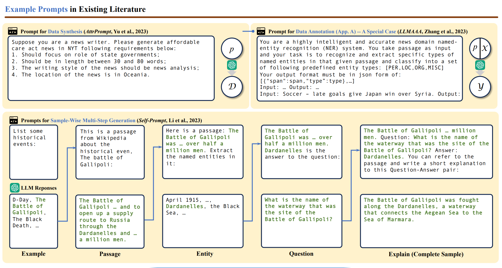
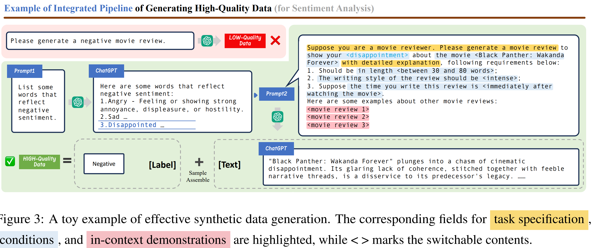
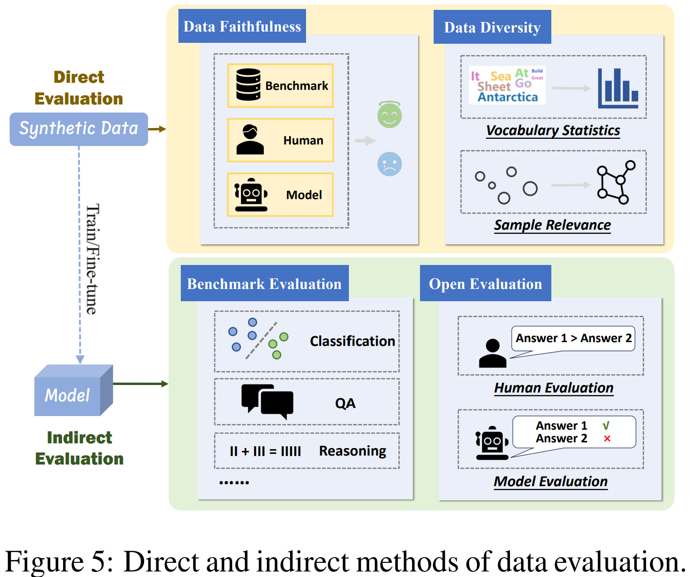

# On LLMs-Driven Synthetic Data Generation, Curation, and Evaluation: A Survey

大量高质量数据是构建健壮自然语言处理模型的基础，高质量数据通常指的是携带丰富监督信号（通常以标签形式出现）的多样化数据，这些信号与人类意图紧密对齐。

然而，由于高昂的成本、数据稀缺、隐私问题等原因，依靠人类数据来实现这种依赖有时可能具有挑战性甚至不现实，此外人类生成的数据本质上容易受到偏见和错误的影响，可能甚至不是模型训练或评估的最佳选择。

问题在于：**是否存在其他更有效、更具扩展性的数据收集方法，能够克服当前的局限性**？

由LLMs生成的合成数据成为人类生成数据的可行替代或补充。具体来说，合成数据旨在模仿真实世界数据的特征和模式：

- 一方面，通过广泛预训练，LLMs获得了大量的知识库，并表现出卓越的语言理解能力，这为生成忠实数据奠定了基础。
- 另一方面，LLMs深刻的指令遵循能力使得在生成过程中具有更好的可控性和适应性，有助于为特定应用创建定制化的数据集，并实现更灵活的过程设计

生成同时具有高正确性和足够多样性的合成数据集需要精心设计的过程，并涉及许多技巧。

## 预备知识

记大模型为 $$\mathcal{M}$$ 。我们不是从头创建新数据集，而是更多地使用少量种子样本或未标记输入进行数据增强，我们统一将其记为 $$\mathcal{D}_{\text{sup}}$$，虽然是可选的，但当它可用时，通常可以提供有价值的支持信息。整体生成任务可以表述为
$$
\mathcal{D}_{\text{gen}} \leftarrow \mathcal{M}_{p}(\mathcal{T}, \mathcal{D}_{\text{sup}})
$$
其中，$$\mathcal{D}_{\text{gen}}$$ 表示最终生成的数据集，$$p$$ 指的是用于模型推断的提示词。$$\mathcal{T}$$ 指定了生成任务，如重写、问答、注释等。

我们的目标是生成与评估指标紧密对齐的数据。虽然不同下游任务的高质量数据标准可能有所不同，但在大多数现有文献中被认为具有挑战性的有两个一般要求：

- 忠实性。为了提供有效的监督，生成的数据首先必须在逻辑和语法上连贯。然而，大型语言模型的固有问题，如幻觉、知识分布的厚尾现象，可能会向生成结果中引入显著的噪声，表现为事实错误、错误的标签或不相关内容。当生成长篇幅、复杂或特定领域的数据时，这些问题变得更加明显。
- 多样性。多样性捕捉了生成数据之间的变化，反映了文本长度、主题甚至写作风格的差异。这对于生成模仿现实世界数据多样性的合成样本至关重要，从而防止在模型训练或评估过程中的过拟合和偏见。然而，由于大型语言模型（LLMs）的固有能力限制，未控制的生成内容往往单调，限制了其在下游任务中的应用。

现有关于大型语言模型驱动的合成数据生成的研究通常涵盖三个主要主题：生成、策划和评估。在这些方面采用了多种方法协同实现最佳的数据生成。

## 数据生成

### 提示词工程

大型语言模型在合成数据生成方面的最大优势之一是其遵循指令的能力，这有助于实现高度的可控性。因此，许多方法尝试用启发式提示来指导大型语言模型，以提高合成数据的忠实度和多样性

根据经验，一个有效的提示通常包含三个关键元素：任务说明 $$e_{\text{task}}$$ 、生成条件 $$e_{\text{condition}}$$、和上下文演示 $$e_{\text{demo}}$$ ，然后将这些元素与模板E一起包装成自然指令的形式：
$$
p(\mathcal{T},\mathcal{D}) \leftarrow E\left(e_{\text{task}}, e_{\text{condition}}, e_{\text{demo}}\right)
$$
接下来，我们将详细说明如何适当设计提示的每个部分，以适应各种场景。

------

**任务规范Task Specification**

在传统的众包注释场景中，招募的工人通常会收到一个 codebook，其中指定了必要的上下文，如任务目的、数据解释和其他背景知识，以便他们更好地理解自己的工作。同样，这种任务规范对于设定大型语言模型驱动数据生成的正确上下文至关重要。

- 证据显示，一个简单的序言如“假设你是一个{*xxx*}”，可以通过设定适当的数据生成场景并允许大型语言模型更好地扮演角色，显著提高大型语言模型的表现
- Yoo等人（2021年）用文本类型、标签类型和标签-标记词汇表解释器三元组定义了任务规范。当需要额外领域专业知识来解决上下文理解及数据生成中的术语复杂性等问题时，这种描述标题尤为重要。
- 徐等人（2023b）利用外部知识图谱和大型语言模型获取领域主题，用于情境化提示，有效提高了生成数据的忠实度和复杂性。

------

**条件性提示Conditional Prompting**

在使用大型语言模型（LLMs）时的一个关键挑战是合成数据生成确保足够的多样性，因为直接提示大型语言模型（LLMs）为特定任务生成数据通常会导致高度重复的输出，即使解码温度很高。

为了解决这个问题，一种广泛采用的策略是条件提示，它明确且具体地向LLMs传达所需数据的特定类型。条件提示的核心在于通过制定一系列条件-值对来描述目标数据：
$$
e_{\text{condition}} = \left\{ (c_1, v_1), (c_2, v_2), \cdots, (c_n, v_n) \right\}
$$
这有效地表征了合成数据所需的属性和特征。通过不同属性的组合，我们可以在生成的样本中自动实现一定程度的“人为定义”的多样性。条件提示不仅允许更好地控制生成数据集的多样性和覆盖范围，而且还能将内容精炼到更狭窄、更专注的范围内，这更有可能与我们的具体期望和要求一致。当前关于条件提示的研究主要集中在以下两个主题：

1. 条件作用范围。作为 $$e_{\text{condition}}$$ 的核心，由 $$\{c_1,...c_n\}$$ 定义的条件作用范围描绘了用于表征目标数据的维度。
   1. 早期研究（高等人，2023a年；叶等人，2022a,b年）采用了基本的输出-条件提示策略，利用与分类任务相关联的具体标签作为条件变量。其背后的理由主要是为了保持类别平衡和覆盖范围。然而，这种策略不适用于缺乏明确类别标签的数据。
   2. 余等人（2023b年）随后的研究表明，使用更细粒度属性（例如，主题、长度和风格（徐等人，2023b年））的条件提示，由于可能的属性组合数量庞大，可以导致更多样化的生成，并且也适用于开放式数据。
   3. Eldan和Li（2023年）还将每一代的条件设定为将三个随机选取的单词纳入生成的文章中。
   4. 通过向提示中加入“creative randomness”，将焦点从输出的启发式特征转移到更加结构化且有目标的条件机制上（Eldan和Li，2023年）。
2. 条件赋值。在定义了条件范围之后，我们需要为每个条件分配具体的值。
   1. 尽管从已知的类别或标签中抽样的策略看似简单直接（Ye等人，2022a年），但在某些情况下这样的实例池是不可用的。
   2. 为了解决这个问题，Josifoski等人（2023年）积极地从外部知识图谱中重新检索条件实例
   3. Xu等人（2023b年）；Ding等人（2023b年）则利用大型语言模型生成多样化的条件提示实例。具体来说，Ding等人（2023b年）构建了一个概念树，深入探讨不同的子主题，确保采样到的条件值的覆盖范围，进而有助于生成更多样化的数据。
   4. 提示模板 $$E$$ 也可以被视为一种特殊类型的条件。已经证明，在整个生成过程中融入具有一定随机性的模板可以提高生成内容的多样性（Meng等人，2022年）。

------

**上下文学习In-Context Learning**

仅通过任务说明和条件提示来获得LLMs的有利响应仍然具有挑战性，在这种情况下，一种直接而有效的策略是提供几个示例，这可以作为隐式人类指导的一种形式。一些示例可以向它们提供关于现实世界数据中展现出的模式的洞察力，从而显著提高生成数据的忠实度

- 在小样本设置中，支持集 $$\mathcal{D}_{\text{sup}}$$ 中有标记样本可用，这些样本可以直接用作ICL的示例
- 在没有真实数据的情况下，像自我指导和自我提示这样的方法则利用LLMs生成的合成示例进行ICL。这使得模型即使在没有标记数据的情况下也能从自己的预测或其他教师模型中学习。

然而，鉴于提示长度和数据不一致性的限制，上下文样本的质量显著影响上下文学习的有效性。

- 苏达拉里亚贾等人（2024年）认为，像自我指导那样从种子样本池中随机选择上下文示例，会导致生成数据缺乏多样性和质量。因此选择专注于特定方面的例子，以更好地激发 LLM 所固有的长尾知识
- 刘等人（2022b）和苏等人（2023年）基于其在嵌入空间中的余弦相似度，优先考虑一致性样本作为示范例子。
- 叶等人（2022b）使用量化的影响分数选择最具信息量的样本，以引导生成过程。
- 为了增强上下文例子的信息性，何等人（2023年）在将每个样本整合到提示中之前，提示LLMs为每个样本提供解释。

### 多步骤生成

在大多数情况下，由于缺乏足够的推理能力，期望LLMs在单一参考中生成整个所需的数据集是不现实的，特别是当目标数据具有复杂结构或语义时。为了解决这个问题，一个常见的策略是多步骤生成，通过这种方式，整体生成过程被手动分解为一系列更简单的子任务$$\mathcal{T}_{1:k}$$ ，以强制LLMs按计划逐步生成数据：
$$
\mathcal{D}_{i} \leftarrow \mathcal{M}_{p_{i}}^{i}\left(\mathcal{T}_{i},\mathcal{D}_{0:i-1}\right),\quad i=1,2,\cdots,k
$$
其中，$$\mathcal{D}_0=\mathcal{D}_{\text{sup}}$$。每个中间输出  $$\mathcal{D}_i$$ 是使用模型 $$\mathcal{M}^i$$ 生成的，由 $$p_i$$ 提示，针对子任务 $$\mathcal{T}_{i}$$ 。这些输出随后可能被用于后续生成。通过手动调度生成过程，我们隐式地将大型语言模型（LLM）的推理路径与人类先验知识对齐。具体来说，任务分解有两种常见策略：样本级分解和数据集级分解，主要目的是在不同规模上提高合成数据的质量。

------

**样本级分解Sample-Wise Decomposition**

多步生成的一个典型用例是解决处理多文本数据（如对话和实体关系三元组）时的长文本处理和逻辑推理挑战。在这种情况下，一种直接的方法是将样本分成较小的块，并一次只生成每个样本的一部分，这样，$$\mathcal{D}_{i:k}$$ 可以被视为 $$\mathcal{D}_{\text{gen}}$$ 的不同部分：
$$
\mathcal{D}_{\text{gen}} = \left(\mathcal{D}_{1}, \mathcal{D}_{2}, \cdots, \mathcal{D}_{k}\right)
$$

- 生成过程的每次迭代都可以基于之前生成的内容来进行条件控制。例如，丁等人（2023b）提示 LLM 在充当助手和用户之间交替，基于上下文互相回复，最终生成完整的对话记录。通过这种方式，每个内部组件 $$\mathcal{D}_i$$ 之间的一致性可以通过分离的指示得到有针对性的加强，从而使模型更容易遵循要求并生成更忠实于数据的内容
- 应当注意，$$\mathcal{D}_{i:k}$$ 不一定构成最终 $$\mathcal{D}_{\text{gen}}$$ 的一部分，相反，显式输出一些中间推理步骤也可以改善复杂数据的生成
- 思维链（CoT）提示作为提高大型语言模型生成内容忠实度的最受欢迎策略之一而脱颖而出

尽管如此，目前关于探索此类潜在元数据的研究仍然不足，从推理的角度来看，对样本进行任务分解仍然是一个未解决的问题，留待未来研究。

------

**数据集级分解Dataset-Wise Decomposition**

生成一系列数据，最终形成一个具有良好多样性和领域覆盖的数据集，需要长期的调度。为此，数据集级别的任务分解动态地调整多步生成每个阶段所使用的条件，以确保整个数据集朝着正确的方向增长：
$$
\mathcal{D}_{\text{gen}} = \bigcup_{i=1}^{k} \mathcal{D}_{i}
$$

- S3（王等人，2023b）根据下游模型在先前生成数据上的表现，针对每次迭代中最常误标记的类别
- Honovich等人（2023b）；邵等人（2023）采用先生成再扩展的模式，据此提升整个数据集的多样性。
- 一些其他方法也利用特定的数据结构来模拟数据生成的路径。例如，探索指导（Wan等人，2023）将领域空间建模为树状结构，并随着树的遍历不断精炼生成的数据，以促进生成数据的专门化和领域覆盖。

## Data Curation

在前述步骤之后，人们可能会过度生成溢出且理论上无限的数据 $$\mathcal{D}_{\text{gen}}$$ 。然而，这些数据集通常包含相当一部分噪声、无价值甚至有毒的样本，这主要源于两个原因。

1. 大型语言模型由于幻觉问题不可避免地会产生带有错误标签的损坏样本。
2. 含有模糊描述的无效提示可能会欺骗模型生成不相关或冗余的样本。

因此，未经适当处理直接使用这些低质量数据可能会有显著的负面影响。为解决这一问题，已研究了许多数据策展方法，主要归为两大类：高质量样本过滤和标签增强

### 高质量样本过滤

样本过滤旨在剔除不需要的低质量样本，以获得更有用的子集 $$\mathcal{D}_{\text{curated}} \subset \mathcal{D}_{\text{gen}}$$。这些方法通常设计启发式标准或重新加权函数来对样本进行重新排序以便过滤。

**启发式指标Heuristic Metrics**

对于基于启发式指标的方法，关键步骤是根据学习动态设计适当的标准，如置信度分数（Seedat等人，2023年）、影响函数（Ye等人，2022b年）和生成能力（Meng等人，2022年）。

- SuperGen（Meng等人，2022年）利用估计的生成概率来识别与期望标签最相关的样本。
- Seedat等人（2023年）丢弃既低置信度又低不确定性的样本。
- 其他一些方法假设干净样本在不同条件下容易保持相似的预测，并使用跨条件一致性进行过滤。具体来说，这种一致性可以是在大型语言模型（LLM）和下游分类器之间（Yu等人，2023c年）、在多次执行之间（Ye等人，2023年），或者在相邻数据点之间（Seedat等人，2023年）。
- Chen等人（2023b年）利用大型语言模型强大的文本理解能力来评估不同样本的质量，并过滤掉得分较低的样本。

Alpagasus（Chen等人，2023b年），在一个虽然较小但经过精心策划的数据集上进行训练，在多个基准测试中超越了原始的Alpaca（Taori等人，2023年），这强调了数据策划的重要性。

------

**样本重加权Sample Re-Weighting**

另一方面，重加权方法认为所有数据都有价值，但重要性各不相同。因此，它们在下游应用中为正确标注或有影响力的样本分配更大的权重。

- SunGen（Gao等人，2023a）提出了一种无需人工注释的自适应双层加权算法
- FewGen（孟等人，2023年）设计了一个具有辨别力的元学习目标，以调整样本权重并明确不同标签之间的细微差别。

### 标签增强

标签增强方法努力纠正生成样本中潜在的错误或不准确的注释。由于确认偏见，大型语言模型识别自己的错误是不现实的。为了解决这个问题，最近的研究要么依赖人类干预，要么结合学生模型进行无人类知识蒸馏。

**人类干预Human Intervention**

一个直接的标签精炼策略是让人工重新注释损坏的样本

- 王等人（2021年）提议主动选择置信度最低的样本供人类重新标记
- 帕加基斯等人（2023年）和刘等人（2022a年）进一步强调了人工审查的重要性，并建议比较同一代码本指导的人类和大型语言模型的注释。

尽管这些方法简单，但可能导致相当高的标注成本，并且在实际部署中可能不现实。

------

**辅助模型Auxiliary Model**

为了降低标注成本，开发了一种更为实用的无人类范式，涉及辅助学生模型进行知识蒸馏和标签精炼，这些方法依赖于学生模型的弱监督能力，并假设从大型语言模型（LLM）教师中提炼出的学生模型能够产生更优质的标签。

- 开创性工作FreeAL（肖等人，2023年）提出了一个协作框架，在该框架中，利用学生模型从弱注释中提炼出高质量的任务相关知识，并相应地反馈给LLM进行标签精炼。
- MCKD（赵等人，2023a年）设计了一个多阶段蒸馏流程，采用数据分割训练和跨分区标注以避免在噪声标签上的过拟合。

随着大型语言模型能力的提升和可用性的增加，辅助学生模型的整合将扮演更加关键的角色，作为一种性价比高的替代方案，以减少人为干预。

## 数据评估

在使用生成数据之前，评估数据的质量和应用效果非常重要，以确保其对下游任务的价值。当前主流的评估方法大致可以分为两类：直接评估和间接评估，分别通过单独评估 $$\mathcal{D}_{\text{gen}}$$ 的质量和其对于下游任务的有效性来评价。

### 直接评估

**数据忠实度Data Faithfulness**

理想情况下，如果现有数据集提供真实标注，可以轻松实现对大型语言模型生成结果的自动评估（朱等人，2023年）。然而，对于开放式数据，需要人类评估。一个直接的想法是向人类专家提供一些生成的样本，然后由他们判断其正确性，根据这些判断我们可以估计整体生成质量（王等人，2023e年）。理论上，样本量越大，估计结果越准确，但相应的劳动成本也会增加。为此，可以利用可靠的辅助模型来进行更全面且具有成本效益的生成数据评估，以替代人类专家（钟等人，2023b年）。考虑到大多数模型只能处理有限长度的文本内容，适当的信息提取可以减少辅助模型的负担，并有助于更精确地预测样本是否包含事实错误（李等人，2022年）。

**数据多样性Data Diversity**

数据多样性的量化主要采用词汇统计和样本相关性计算。

- 词汇统计（余等人，2023b年），如词汇量和N-gram频率，提供了一种直接且直观的方法。然而，它们难以捕捉数据集的语义信息。
- 样本相关性的计算有效地弥补了这一限制。样本相关性的最常见度量是基于余弦相似度（张等人，2023b）和样本距离（钟等人，2023b），这些指标可以更好地捕捉数据集的上下文和语义多样性。

此外，这些指标还可以用于选择与先前生成的样本更具差异性的上下文演示 $$e_{\text{demo}}$$（王等人，2023e），从而产生更多样化的生成结果。

### 间接评估

**基准测试评估Benchmark Evaluation**

在生成的数据上训练的下游模型的性能也能在一定程度上反映生成质量。具体来说，可以从多个维度评估合成数据的影响，除了下游模型的专业能力之外。例如，TruthfulQA能够评估模型识别真实声明的能力（孙等人，2023年）；NIV2被用来评估模型在多项任务中的语言理解和推理能力（王等人，2023e）。

**开放评估Open Evaluation**

对于开放式基准测试，由于缺乏标准化答案，需要人类或辅助模型进行评估。为了充分利用辅助模型的偏好输出，设计了多种评估策略，如响应排序（徐等人，2023a）、四级评分系统（王等人，2023e）和Elo得分（白等人，2022年）。

为了进一步降低评估成本，孙等人（2023年）；徐等人（2023a）利用Vicuna提出的基于GPT-4的自动评估框架进行评估。然而，一般的大型语言模型可能缺乏针对特定领域任务所需的足够知识，这限制了它们提供有效评估的能力（Bran等人，2023年）。因此，收集人类评估数据以微调开源模型用于评估目的，在现实世界的场景中是一种重要做法（He等人，2023年）。其他技术如（Peng等人，2024年，2023年）仍有待进一步探索。

## 未来方向

### 复杂任务分解

当前的多步骤生成算法依赖于模型对任务要求的理解，要求其在有限信息的情况下进行复杂的逻辑推理。然而，在现实世界的复杂场景中，这些有限的信息可能不足以有效支持决策制定。例如，生成数学习题-解答对的生成涉及多个推理步骤，并可能需要使用计算器工具进行验证。

迄今为止，关于如何激活大型语言模型的推理和规划能力以自主生成合成数据的系统研究仍然缺乏。受到像HuggingGPT（Shen等人，2023年）和MetaGPT（Hong等人，2023年）这样流行的大型语言模型代理的启发，我们相信开发一个用于工业应用的数据生成代理也将非常有价值。

### 知识增强

最近的研究发现，大型语言模型的知识是长尾且带有偏见的（Navigli等人，2023年；Fei等人，2023年）。由于缺乏特定领域的知识，大型语言模型倾向于生成有偏见、单调甚至不忠实于事实的数据。尽管我们在前面的章节中介绍了如何通过任务规范和条件提示来温和地引导数据生成，但这些方法仍然存在强烈的限制，不利于可扩展的实现。

相反，我们认为直接在成熟的领域知识库上开发自动化条件控制将显著提高知识增强的效率。例如，我们可以在大型语言模型（LLMs）和外部知识图谱之间建立某些联系（纪等人，2022年），或者从网站检索增强信息（高等人，2023b年），这对于整个生成过程中数据特征的定义、分解和推理都是有帮助的。此外，随着领域知识的增强，我们可能还能更好地评估生成数据的质量，甚至开发自动评估系统。总体而言，我们认为知识驱动的数据生成将成为未来研究的一个关键重点。

### 大型与小型语言模型之间的协同作用

我们之前介绍了使用小型特定领域模型进行数据策展的方法。特别是，FreeAL（肖等人，2023年）展示了低成本数据策展的可行性，其中大型和小型模型之间进行了整合协作。在数据生成过程中利用自动化性能评估提供的实时反馈来指导后续生成提示中的相应调整，这一想法指向了一个重要的研究方向。

然而，目前阶段对小型语言模型的利用仅仅是基于预测信心。在未来，我们期待看到大型模型与小型模型之间更多元化的协作模式，以提高生成数据的质量，例如，使用各种输出信息、新的协作架构设计等等。

### 人机协作

数据作为模型智能的来源，理论上没有人类干预是不可能完全生成的。否则，携带噪声、有毒信息的野性合成数据很容易“毒害”模型，甚至导致模型崩溃。由于大型语言模型的固有能力偏见，它们几乎无法自我意识到其生成数据中的偏见，并最终偏离我们的意图。因此，设计一个涉及少量必要的人类知识用于注释和验证的友好交互系统至关重要且不可替代。迄今为止，仍然缺乏一个通用框架来标准化和系统化数据生产过程中所涉及的人机协作。

我们相信，这样一个系统的适当设计必须基于对人类干预的优势和局限性的透彻理解，并应遵循以人为中心的原则。为了实现可持续和高效的人类参与，我们需要全面考虑各种因素，如可行性、成本，乃至劳动心理学。具体例子如下：

- 应确保大型语言模型提供的信息具有可读性和可解释性，以减少人类理解的障碍
- 应进行上游知识的丰富或过滤，以提高人力资源利用的效率，并减少在成本效益低的任务上的消耗；
- 纳入令人愉快的互动功能不仅可以减轻机械数据处理任务对人类的负面影响，还可以吸引更广泛的受众。

## 其他主题

### 标注

尽管标注可以被视为一种特殊类型的合成，但也有专门适用于数据标注的方法。其中，选择性注释是最重要的实践之一。选择性注释代表了昂贵且精确的人类注释与经济但相对粗糙的基于大型语言模型（LLM）的注释之间的最佳权衡

选择性注释的关键在于在人类和大型语言模型之间定义一个“性价比”高的样本分布。

- （Zhang等人，2023b；Bansal和Sharma，2023年）涵盖了一些针对基于大型语言模型的注释的常见选择策略，包括随机选择、最大熵选择、最小置信度选择和k均值选择，以便进行彻底比较。结果显示，基于不确定性的方法，即最大熵和最小置信度，表现明显优于随机基线，收敛速度更快，且训练在注释数据上的下游模型性能更好。
- （2023a年）也利用不确定性来估计大型语言模型的注释能力，以有效分配人类和大型语言模型之间的注释工作。
- （2023年）则提出了一种新颖的无监督的基于图的的选择性注释方法，名为 vote-k，以选择多样且有代表性的样本进行注释。

### Tuning Techniques

另一大量研究涉及调整技术，如模型微调和软提示，这些方法在其他领域已经得到了广泛研究，并且可以在相关文献中详细查阅。尽管它们在提升生成性能方面效果显著，但大多数现有方法都是基于 LLM 的可访问性建立的，它们在黑盒模型上的应用还有待进一步探索。

### 应用

大型语言模型驱动的合成数据生成已成为传统依赖人工数据收集的新替代方案，并在各种应用中展现了巨大潜力，包括通用任务、特定领域任务和跨模态任务。

- 通用任务。随着大型语言模型能力的飞速提升，这一生成流程已被广泛应用于各种基础自然语言处理研究，包括文本分类（叶等人，2022b年；于等人，2023c年；萨胡等人，2022年）、命名实体识别（肖等人，2023年）、问答（李和卡利森-伯奇，2023年）、关系抽取（何等人，2023年）和自然语言推理（张等人，2023b年）。这些研究进一步支持了多种应用，如情感识别（高等人，2023a年；叶等人，2022b年）、在线翻译（欧阳等人，2023年）、立场检测（李等人，2023a年）和垃圾信息识别（史密斯等人，2022年）。
- 特定领域任务。一些特定领域的任务也对该流程提出了显著需求，在这些任务中，人工注释可能极为昂贵且不切实际，例如医疗诊断（唐等人，2023年）、药物发现（肖等人，2023年）、临床试验信息抽取（徐等人，2023年）。2023b）、工业广告（张等人，2022年）以及表格数据分析（西达特等人，2023年）。
- 多模态任务。由于简单性和低成本，这一生成范式在包括文本-图像检索（克里萨洛拉等人，2023年）、聊天理解（韩等人，2023年）、视觉问答（韩与加德特，2023年）和多模态指令调整（刘等人，2023年）在内的多模态任务中也展现出了显著的前景。
