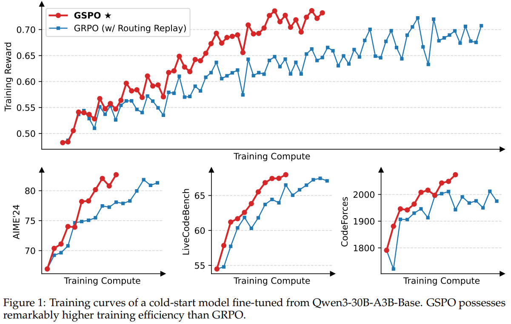

# Group Sequence Policy Optimization

当前最先进的RL算法，以GRPO为例，研究显示，在训练巨型语言模型时会出现严重的稳定性问题，通常会导致灾难性的、不可逆的模型崩溃。这种不稳定性阻碍了通过持续强化学习（RL）训练来推动语言模型能力边界的努力。

本文确定了GRPO的不稳定性源于其算法设计中对重要性采样权重的根本误用和失效。这引入了高方差的训练噪声，随着响应长度的增加逐渐累积，并通过剪辑机制进一步放大，最终导致模型崩溃。

为了解决这些核心限制，我们提出了组序列策略优化（GSPO），这是一种用于训练大型语言模型的新强化学习算法。GSPO的关键创新在于其基于序列似然对重要性比的理论定义，与重要性采样的基本原则一致。此外，GSPO计算标准化奖励作为对查询的多个响应的优势，确保序列级奖励与优化之间的对齐。

我们的实证评估展示了GSPO在训练稳定性、效率和性能方面显著优于GRPO。至关重要的是，GSPO从根本上解决了大型专家混合（MoE）模型在RL训练中的稳定性挑战，消除了对复杂稳定策略的需求，并显示出简化RL基础设施的潜力

## 背景

令 $$\pi_{\theta}$$ 为参数θ定义的自回归语言模型，用x表示一个查询，D表示查询集。给定一个对查询x的响应y，其在策略 $$\pi_{\theta}$$ 下的似然性表示为
$$
\pi_{\theta}(y\mid x)=\prod_{t=1}^{|y|}\pi_{\theta}\left(y_{t}\mid x,y_{<t}\right)
$$
其中|y|表示y中的标记数量。查询-响应对(x, y)可以被验证器r打分，得到一个奖励r(x, y)∈[0,1]。

PPO 利用从旧策略  $$\pi_{\theta_{old}}$$ 生成的样本，通过剪辑机制将策略更新限制在旧策略的一个近端区域内。具体来说，PPO采用以下目标进行策略优化（为简洁起见，此处省略了KL正则化项，因为它不是本文的重点）
$$
\mathcal{J}_{\text{PPO}}(\theta)=\mathbb{E}_{x \sim D, y \sim \pi_{\theta_{\text{old}}}(\cdot \mid x)}\left[\frac{1}{|y|} \sum_{t=1}^{|y|} \min \left( w_{t}(\theta) \widehat{A}_{t}, \operatorname{clip}\left( w_{t}(\theta), 1-\varepsilon, 1+\varepsilon\right) \widehat{A}_{t}\right) \right] \\
w_{t}(\theta)=\frac{\pi_{\theta}\left(y_{t}\mid x,y_{<t}\right)}{\pi_{\theta_{\text{old}}}\left(y_{t}\mid x,y_{<t}\right)}
$$
其中，token $$y_t$$ 的重要性比率定义为 $$w_{t}(\theta)$$， $$y_t$$ 的优势 $$\widehat{A}_{t}$$ 通过另一个价值模型估计，而 *ε* 是重要性比率的裁剪范围。实践中，PPO 的核心挑战在于其对价值模型的严重依赖。具体来说，价值模型通常与策略模型大小相似，引入了相当大的内存和计算负担。此外，算法的有效性取决于其价值估计的可靠性。虽然获取一个可靠的价值模型本质上具有挑战性，但确保其对更长响应和更复杂任务的可扩展性呈现出更大的挑战。

GRPO 通过计算一组对同一查询的响应中每个响应相对于优势来绕过对价值模型的需求。具体来说，GRPO 优化以下目标：
$$
\mathcal{J}_{\text{GRPO}}(\theta) = \mathbb{E}_{x \sim \mathcal{D}, \{y_i\}_{i=1}^{G} \sim \pi_{\theta_{\text{old}}}(\cdot|x)} \left[ \frac{1}{G} \sum_{i=1}^{G} \frac{1}{|y_i|} \sum_{t=1}^{|y_i|} \min \left( w_{i,t}(\theta) \widehat{A}_{i,t}, \operatorname{clip} \left( w_{i,t}(\theta), 1-\varepsilon, 1+\varepsilon \right) \widehat{A}_{i,t} \right) \right]
$$

$$
w_{i,t}(\theta)=\frac{\pi_\theta(y_{i,t}\mid x,y_{i,<t})}{\pi_{\theta_{\text{old}}}(y_{i,t}\mid x,y_{i,<t})},\quad\widehat{A}_{i,t}=\widehat{A}_{i}=\frac{r(x,y_{i})-\operatorname{mean}\left(\{r(x,y_{i})\}_{i=1}^{G}\right)}{\operatorname{std}\left(\{r(x,y_{i})\}_{i=1}^{G}\right)}
$$

其中，G是对每个查询x生成的响应数量（即组大小）， $$y_i$$ 的所有 token 共享相同的优势  $$\widehat{A}_{i}$$

## 动机

模型规模、稀疏性（例如，在专家混合模型中）和响应长度的增长需要大的 rollout batch size，以在强化学习期间最大化硬件利用率。为了提高样本效率，标准的做法是将大批量的展开数据划分为多个小批量进行梯度更新。这个过程不可避免地引入了一个偏离策略的学习环境，其中响应y是从旧策略 $$\pi_{\theta_{old}}$$ 而非当前正在优化的策略 $$\pi_{\theta}$$ 中抽样的。这也解释了为什么在PPO和GRPO中使用clip机制是必要的，该机制防止了过于“ off-policy ”的样本参与梯度估计。

虽然像 clip 这样的机制旨在管理这种偏离策略的差异，我们在GRPO中发现了一个更根本的问题：它的目标是不适定的。当在长响应任务上训练大型模型时，这个问题变得尤为严重，导致灾难性的模型崩溃。GRPO目标的不定性源于对重要性采样权重的误用。重要性采样的原理是通过对从行为分布  $$\pi_{\text{beh}}$$ 中抽取的样本重新加权，来估计目标分布 $$\pi_{\text{tar}}$$ 下函数f的期望值：
$$
\mathbb{E}_{z \sim \pi_{\text{tar}}}[f(z)]=\mathbb{E}_{z \sim \pi_{\text{beh}}}\left[\frac{\pi_{\text{tar}}(z)}{\pi_{\text{beh}}(z)} f(z)\right]
$$
至关重要的是，这依赖于对来自行为分布 $$\pi_{\text{beh}}$$ 的多个样本 (*N*≫1) 进行平均，以便有效地纠正分布不匹配。相比之下，GRPO 在每个标记位置 t 应用重要性权重只基于下一个标记分布 $$\pi_{\theta_{\text{old}}}(\cdot \mid x,y_{i,<t})$$ 的单个样本 $$y_{i,t}$$ ，它未能执行预期的分布校正作用。相反，它向训练梯度引入了高方差噪声，这种噪声在长序列中累积，并且被 clip 机制加剧。我们根据经验观察到，这可能导致模型崩溃，而这种崩溃通常是不可逆的。一旦发生崩溃，即使恢复到之前的检查点并仔细调整超参数（例如，clip范围）、延长生成长度或切换强化学习查询，恢复训练也是无效的。

上述观察表明GRPO设计中的一个根本问题。标记级重要性权重的失败指向了一个核心原则：优化目标的单位应与奖励的单位相匹配。**由于奖励是授予整个序列的，因此在标记级别应用偏离策略的校正似乎是有问题的**。这激励我们放弃令牌级别的目标，探索使用重要性权重，并**在序列级别直接进行优化**。

## 方法

虽然在GRPO中 token 级的重要性权重存在问题，但我们观察到在语言生成的背景下，序列级的重要性权重 $$\frac{\pi_{\theta}(y\mid x)}{\pi_{\theta_{\text{old}}}(y\mid x)}$$ 具有明确的理论意义：它反映了从 $$\pi_{\theta_{\text{old}}}(\cdot \mid x)$$ 中抽样的响应y与 $$\pi_{\theta}(\cdot \mid x)$$ 的偏差有多远，这与序列级奖励自然对齐，并且还可以作为剪辑机制的有意义指标。基于这一直接的观察，我们提出了组序列策略优化（GSPO）算法。GSPO采用以下序列级优化目标：
$$
\mathcal{J}_{\text{GSPO}}(\theta)=\mathbb{E}_{x\sim\mathcal{D},\{y_{i}\}_{i=1}^{G}\sim\pi_{\theta_{\text{old}}}(\cdot\mid x)}\left[\frac{1}{G}\sum_{i=1}^{G}\min\left(s_{i}(\theta)\widehat{A}_{i},\text{clip}\left(s_{i}(\theta),1-\varepsilon,1+\varepsilon\right)\widehat{A}_{i}\right)\right]
$$
采用基于小组的优势估计，并基于序列似然定义重要性比率
$$
\widehat{A_{i}}=\frac{r\left(x, y_{i}\right)-\operatorname{mean}\left(\left\{r\left(x, y_{i}\right)\right\}_{i=1}^{G}\right)}{\operatorname{std}\left(\left\{r\left(x, y_{i}\right)\right\}_{i=1}^{G}\right)}
$$

$$
s_{i}(\theta)=\left(\frac{\pi_{\theta}\left(y_{i}\mid x\right)}{\pi_{\theta_{\text{old}}}\left(y_{i}\mid x\right)}\right)^{\frac{1}{\left|y_{i}\right|}}=\exp \left(\frac{1}{\left|y_{i}\right|} \sum_{t=1}^{\left|y_{i}\right|} \log \frac{\pi_{\theta}\left(y_{i, t} \mid x, y_{i,<t}\right)}{\pi_{\theta_{\text{old}}}\left(y_{i, t} \mid x, y_{i,<t}\right)}\right)
$$

因此，GPSO在梯度估计中应用剪辑整个响应而不是单个标记，以排除过于“off-policy”的样本，这既符合序列级奖励也符合优化。请注意，我们在 $$s_{i}(\theta)$$ 中采用长度规范化来减少方差，并将 $$s_{i}(\theta)$$ 控制在统一的数值范围内。否则，一些标记的可能性变化可能导致序列级重要性比率的剧烈波动，不同长度的响应的重要性比率需要不同的剪辑范围。我们还注意到，由于重要性比率的定义不同，GPSO和先前算法（例如GRPO）中的剪辑范围通常在数量级上有差异。

推导GPSO目标的梯度（为简洁起见省略了剪辑）
$$
\nabla_{\boldsymbol{\theta}} \mathcal{J}_{\mathrm{GSPO}}(\boldsymbol{\theta})=\mathbb{E}_{x\sim\mathcal{D},\left\{y_{i}\right\}_{i=1}^{G}\sim\pi_{\theta_{\text{old}}}(\cdot\mid x)}\left[\frac{1}{G}\sum_{i=1}^{G}\left(\frac{\pi_{\theta}\left(y_{i}\mid x\right)}{\pi_{\theta_{\text{old}}}\left(y_{i}\mid x\right)}\right)^{\frac{1}{\left|y_{i}\right|}}\widehat{A}_{i}\cdot\frac{1}{\left|y_{i}\right|}\sum_{t=1}^{\left|y_{i}\right|}\nabla_{\theta}\log\pi_{\theta}\left(y_{i, t}\mid x,y_{i,<t}\right)\right]
$$
作为比较，GRPO目标的梯度如下
$$
\nabla_{\boldsymbol{\theta}} \mathcal{J}_{\mathrm{GRPO}}(\boldsymbol{\theta})=\mathbb{E}_{x\sim\mathcal{D},\{y_{i}\}_{i=1}^{G}\sim\pi_{\theta_{\text{old}}}(\cdot\mid x)}\left[\frac{1}{G}\sum_{i=1}^{G}\widehat{A}_{i}\cdot\frac{1}{\left|y_{i}\right|}\sum_{t=1}^{\left|y_{i}\right|}\frac{\pi_{\theta}\left(y_{i, t}\mid x,y_{i,<t}\right)}{\pi_{\theta_{\text{old}}}\left(y_{i, t}\mid x,y_{i,<t}\right)}\nabla_{\theta}\log\pi_{\theta}\left(y_{i, t}\mid x,y_{i,<t}\right)\right]
$$
因此，GSPO和GRPO之间的根本区别在于它们如何权衡令牌的对数似然梯度的权重。在GRPO中，根据各自的“重要性权重”对令牌进行加权。然而，这些不相同的权重可能变化，不可忽视，它们的影响会累积并在训练过程中导致不可预测的后果。相比之下，GSPO平等地权衡响应中的所有令牌，消除了GRPO的不稳定因素。

在多轮强化学习等场景中，我们可能希望获得比序列级别更细粒度的优势调整。为此，我们引入了GSPO的一种令牌级别的目标变体，即GSPO-token，以允许对每个令牌进行优势定制：
$$
\mathcal{J}_{\text{GSPO-token}}(\boldsymbol{\theta})=\mathbb{E}_{x \sim \mathcal{D},\left\{y_{i}\right\}_{i=1}^{G} \sim \pi_{\text{old}}}(\cdot \mid x)\left[ \frac{1}{G} \sum_{i=1}^{G} \frac{1}{\left|y_{i}\right|} \sum_{t=1}^{\left|y_{i}\right|} \min \left( s_{i, t}(\boldsymbol{\theta}) \widehat{A}_{i, t}, \operatorname{clip} \left( s_{i, t}(\boldsymbol{\theta}), 1-\varepsilon, 1+\varepsilon\right) \widehat{A}_{i, t} \right) \right]
$$

$$
s_{i,t}(\theta)=\operatorname{sg}\left[ s_{i}(\theta) \right] \cdot \frac{\pi_{\theta}\left(y_{i,t} \mid x, y_{i,<t}\right)}{\operatorname{sg}\left[ \pi_{\theta}\left(y_{i,t} \mid x, y_{i,<t}\right) \right]},
$$

sg[⋅] 仅取数值而不计算梯度，对应于PyTorch中的分离操作。当我们将响应  $$y_i$$ 中所有标记的优势设置为相同的值时，GSPO标记和GSPO在优化目标、裁剪条件和理论梯度上数值上是相同的，而GSPO标记则享有更高的灵活性，可以调整每个标记的优势。

## 实验

使用从Qwen3-30B-A3B-Base微调而来的冷启动模型进行实验，在强化学习训练期间，每批展开数据被划分为四个小批量用于梯度更新。请注意，GRPO需要路由重放训练策略来确保MoE强化学习的正常收敛，而GPSO已经消除了对此策略的需求。

> 与密集模型的 RL 训练相比，MoE模型的稀疏激活特性引入了独特的稳定性挑战。特别是我们发现，在采用GRPO算法时，MoE模型的专家激活波动性可能会阻止RL训练的适当收敛。具体来说，经过一次或多次梯度更新后，对于相同的响应被激活的专家可能会发生显著变化。例如，在使用48层Qwen3-30B-A3B-Base模型时，在每次RL梯度更新后，对于相同的展开样本，约有10%的新策略 $$\pi_{\theta}$$ 下激活的专家与旧策略  $$\pi_{\theta_{old}}$$ 下的不同。这种现象在更深的MoE模型中变得更加明显，使得令牌级重要性比率剧烈波动，并进一步使其失效，从而阻碍了RL训练的正常收敛。
>
> 为了应对这一挑战，我们之前采用了路由重放训练策略。具体来说，我们在   $$\pi_{\theta_{old}}$$ 中缓存激活的专家，并在计算重要性比率时在 $$\pi_{\theta}$$ 中“重放”这些路由模式。通过这种方式，对于每个令牌共享相同激活的网络，这样我们就可以恢复令牌级重要性比率的稳定性，并确保在梯度更新中优化一致激活的网络

使用GPSO进行训练的过程始终稳定。我们观察到，通过增加训练计算量、定期更新查询集和扩展生成长度，GPSO能够实现持续的性能提升。此外，与GRPO相比，GPSO还表现出更高的训练效率，在相同的训练计算量和消耗的查询下，获得了更好的训练精度和基准性能。最后，我们已经成功地将GPSO应用于最新Qwen3模型的强化学习训练中，强烈证明了GPSO在释放大型语言模型强化学习扩展能力方面的有效性。

与GRPO相比，GSPO的一个关键区别在于其剪辑整个响应而不是单个标记的实践。尽管GSPO剪辑了更多的标记，因此用于训练（或梯度估计）的标记更少，但GSPO的训练效率仍然高于GRPO。这一违反直觉的发现——剪辑更大比例的标记反而带来更高的训练效率——进一步表明GRPO的标记级梯度估计本质上噪声较大且效率低下，不利于样本利用。相比之下，GSPO的序列级方法提供了更可靠和有效的学习信号。

鉴于训练引擎（例如，Megatron）与推理引擎（例如，SGLang 和 vLLM）之间的精度差异，在实践中，我们通常使用训练引擎来重新计算旧策略 $$\pi_{\theta_{old}}$$ 下采样响应的可能性。然而，GPSO在优化过程中仅使用序列级别的可能性，而不是标记级别的可能性。直观上，前者对精度差异的容忍度要高得多。因此，GPSO使得可以直接使用推理引擎返回的可能性进行优化，从而避免了与训练引擎重新计算的需求。这在部分部署和多轮强化学习场景中特别有益，并且在训练-推理分离的框架中也是如此。