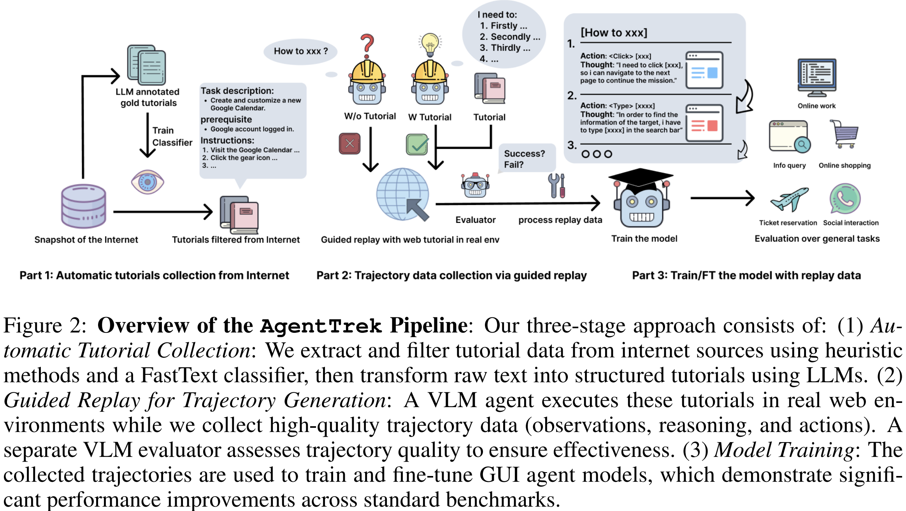
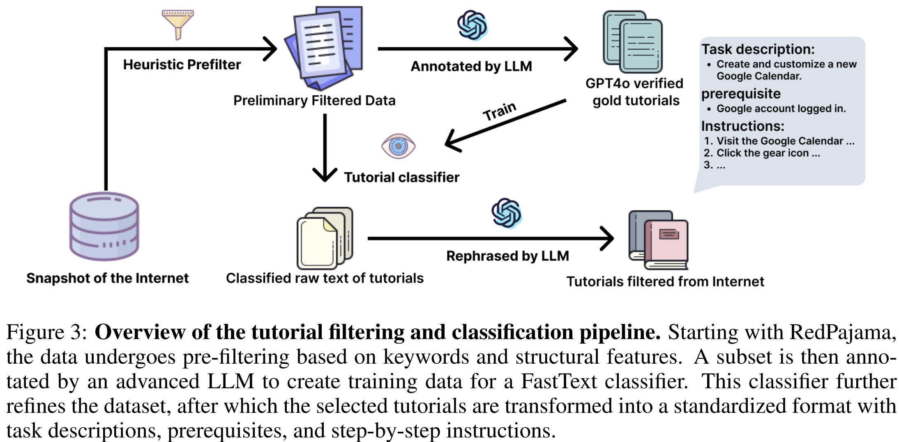
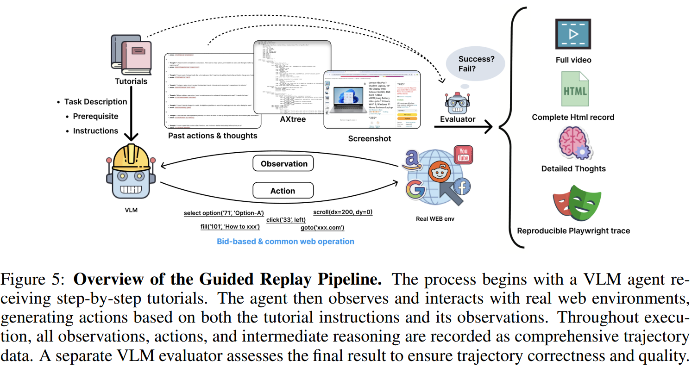
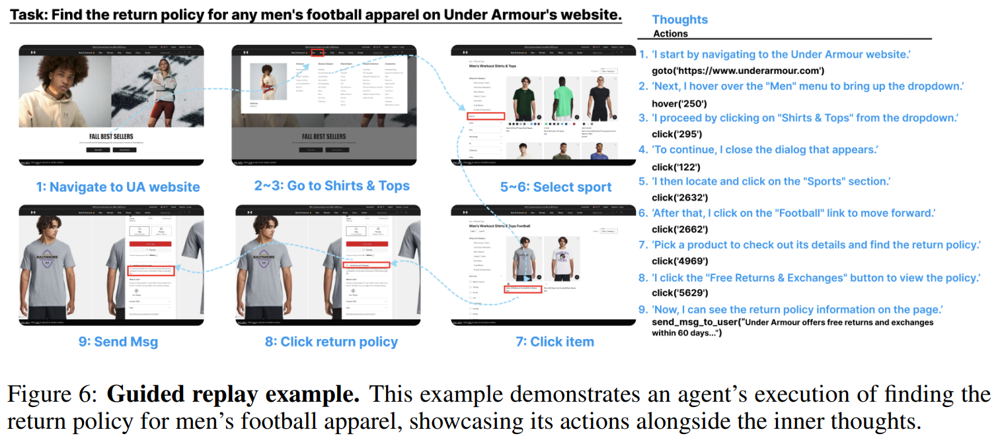

# AgentTrek: Agent Trajectory Synthesis via Guiding Replay with Web Tutorials

> Spotlight: https://openreview.net/forum?id=EEgYUccwsV
>
> https://arxiv.org/abs/2412.09605

LLMs 主要在优化用于生成信息性回应的数据集上进行训练，而不是用于进行 GUI 交互所需的复杂、顺序决策。这些决策需要长期观察、历史背景整合以及精确的动作定位能力，这些都需要使用多步骤轨迹数据进行专门训练。

高质量的代理轨迹包含几个关键要素：一个高层次目标、交错观察、自然语言推理和具有实际意义的动作。与文本或图像不同，这类数据在线上是稀缺的，因为它需要复杂的情境推理和多模态互动性。当前的方法主要依赖人工注释来收集这些轨迹，既费钱又本质上不可扩展。

Agent Trek，一个可扩展的GUI代理轨迹合成流程。我们的方法首先通过自动从网络中收集和过滤描述GUI任务和工作流程的类似教程的文本。然后将这些教程转换为具有高级目标和详细逐步说明的结构化代理任务。我们使用 VLM 代理在真实环境中执行这些任务，由合成的教程进行指导。随后，评估器模型验证目标达成情况，确保数据质量。通过这一全面的流程，我们高效生成了大量高质量的网络代理轨迹。

## 相关工作

LLMs在GUI方面取得了重大进展，像SeeAct（Zheng等人，2024年）和WebVoyager（He等人，2024年）这样的项目展示了将代理行为推广到现实世界界面的努力。然而，这些代理通常由于缺乏专门的轨迹数据而在顺序决策上遇到困难。Agent Trek通过合成增强LLM代理导航和交互能力的多模态轨迹来弥补这一差距，提升其实际效用。

现有的数据集和基准测试，如WebArena（周等人，2023年）、Mind2Web（邓等人，2024年）和WebShop（姚等人，2022年），严重依赖人工注释，限制了它们规模和适应性。最近像BAGEL（Murty等人，2024年）和NNetNav（Murty等人，2025年）这样的工作提出合成轨迹生成以克服这些限制。AgentTrek顺应了这一趋势，提供了一个完全自动化的流程，以低成本（每条轨迹0.551美元）产生多样化、真实的轨迹，在可扩展性和效率方面优于依赖人类的方法。

## 方法

三阶段过程

1. 自动教程收集和处理：我们从大规模互联网语料库中获取网络互动教程，应用多阶段过滤和标准化的方法来识别和构建相关内容
2. 引导重放以合成轨迹：我们部署一个VLM代理在真实的网络环境中执行这些结构化的教程，记录多模态观察、推理链和行动，以创建全面的轨迹
3. 代理模型训练：我们利用合成的轨迹来训练基于文本和视觉的网页代理，增强它们导航和与复杂网页界面交互的能力

### 从互联网自动收集教程

流程的第一阶段将大量的网络内容转换为结构化的、高质量的教程，适合用于代理训练。我们通过一个四步骤的过程从RedPajama数据集中提取网络互动教程：预过滤、基于 LLM 的标注、FastText分类和标准化的处理。

1. 尽管在线上有大量的图形用户界面（GUI）教程，但它们只占网络内容的一小部分，因此需要进行高效的预过滤。我们开发了一种基于规则的过滤器，识别潜在的教程。数据集从208亿条记录减少到6880万条记录。

> （1）对动作动词（例如，“点击”，“输入”）、UI元素（例如，“按钮”，“菜单”）和平台术语（例如，“macOS”，“Windows”）进行关键词匹配；（2）通过设定阈值（200-5000字）进行长度分析，以排除过于简短或冗长的内容；以及（3）评估URL格式，优先考虑包含教程相关模式的域名（例如，“如何操作”，“指南”）。

2. 为了进一步提高质量，我们采用了基于GPT-4O MINI的大语言模型（LLM）标注方法。该模型分析文本内容，并根据结构和语义特征将其分类为“教程”或“非教程”。LLM 标注器处理了90,000个经过预过滤的条目子集，生成了高置信度的标签

3. 为了将我们的分类方法扩展到包含6880万个条目的完整数据集，我们在LLM标记的数据上训练了一个FastText模型，识别出大约1880万个去重条目作为可能的教程。这代表了从预过滤集合减少了72.7%，同时保持了真正教程内容的高召回率。

4. 在基于FastText的过滤之后，我们实施了一个结构化的标准化流程，以确保教程的一致性和质量。为确保高质量的标准化，我们使用体现理想教程结构的黄金标准示例对提示策略进行了微调。

### 通过引导重放收集轨迹数据

VLM 在基于BrowserGym执行过程中，代理的观察结果主要包括视口截图和可访问性树（AXTree），由于完整的HTML结构过大且对视觉代理的相关性有限，故故意排除在外。代理使用Playwright的API函数（如点击、选择选项和清除)执行操作，而我们的系统记录包括目标元素、精确坐标、顺序截图和DOM快照在内的全面轨迹——所有这些都与代理记录的推理过程同步。

> 我们使用BrowserGym实现了一种引导式重放机制，使 VLM 代理能够根据标准化教程执行任务。BrowserGym为Chromium内的网页任务自动化提供了一个灵活的环境，允许VLM代理执行复杂的基于网络的操作
>
> 每个交互步骤的平均标记使用量约为8,027个，每个完整任务的标记使用量约为86,114个。使用GPT-4o-08-06执行1,000个任务的成本约为215美元。

每个轨迹实例包括：(1) 任务信息，包含全面的元数据，如平台规格、任务描述、先决条件、逐步说明以及预期结果；(2) 截图和视频记录，捕捉完整的交互序列；(3) 可复现的原生轨迹，通过Playwright提供详细的技术日志，涵盖DOM快照、HTML结构、网络流和精确的动作序列；以及(4) 后处理的轨迹，结构化为任务元数据、观察、中间推理和动作序列，用于模型微调。

虽然我们的引导重放机制生成了大量的轨迹数据，但识别和提取最能提升代理性能的片段至关重要。VLMs 可以通过分析记录的图像和互动模式来有效评估轨迹数据，我们开发了一个专门的VLM评估器，系统性地评估和过滤我们的轨迹数据。

我们根据两个主要标准定义轨迹的有效性：（1）遵循指定的任务指令和（2）成功完成所有关键任务组件。我们的评估器采用GPT-4O作为其核心引擎，通过精心构建的提示来评估轨迹。评估过程以任务描述d、完整的动作历史*a*={*a*1,*a*2,…,*an*}以及代理的内部推理*r*={*r*1,*r*2,…,*rn*}为输入。这些元素按顺序格式组织：{d,r1,a1,r2,a2,...,rn,a_{n}}，VLM 评估器在三个层面上提供全面的评估：整体轨迹层面的评估、逐步分析，以及在适用情况下识别最早出现故障的点

我们对1081条轨迹进行了综合人工审查，创建了一个包含558个样本的黄金标准验证集，每个样本都有详细的人类注释理由

### 使用轨迹数据进行训练

对于基于视觉的网络代理，仅依靠视觉输入，消除了对底层源代码的依赖。这种方法提供了显著的效率优势：像Qwen2-VL这样的高分辨率模型处理720p截图时仅需1200个标记，而HTML表示大约需要4000个标记。代理的动作空间通过pyautogui命令实现，这些命令基于像素坐标直接与视觉用户界面元素进行交互。我们开发了一种系统性的映射，将剧作家的动作映射到pyautogui命令，并实现了一个可插拔的动作系统来处理如select_option操作这样的专门化交互，确保全面覆盖网络交互模式。

基于文本的网络代理利用可访问性树（AXTree）作为其主要观察源，提供对网页元素关系和属性的语义理解。这种表示方式使代理能够在不需要处理原始HTML的情况下理解层次结构和元素属性。代理通过Playwright命令执行动作，这些命令提供了对被识别在可访问性树中的网页元素的精确控制。这种方法在需要与复杂网络组件（如表单、下拉菜单和嵌套导航元素）进行结构化交互的场景中表现出色，在这些场景中对元素关系的语义理解至关重要。

## 实验

对于基于视觉的代理，采用Qwen2-VL并使用NaViT作为图像编码器，该编码器提供动态分辨率支持。我们使用来自AgentTrek数据集的10,000条轨迹对模型进行微调，重点提升视觉定位能力和复杂网络导航任务的多步骤规划。

对于基于文本的代理，我们对Qwen2进行微调 5个 LLM，使用来自AgentTrek数据集的6000条代理轨迹。这些轨迹将可达性树观测与相应的剧作家动作配对，为网页交互创建了一个全面的训练信号。微调过程显著增强了模型解释结构化网页表示、推理元素关系以及基于文本线索生成上下文恰当动作的能力，从而提高了在多样化网络环境中的任务规划和执行能力。

基于文本的网页代理评估，使用WebArena作为我们的主要基准。基于视觉的网页代理评估在两个基准上评估性能提升：ScreenSpot、Mind2Web。ScreenSpot（Cheng等人，2024年）是专门为GUI视觉定位任务开发的基准，包含1200条单步指令以及目标元素的坐标。Multimodal-Mind2Web评估了网站上的GUI代理的离线规划能力

- 在AgentTrek数据上训练的模型显著优于开源基线和GPT-4o，这证明了我们的合成轨迹的高质量
- 在WebArena上的强劲表现——一个在训练期间未见过的自托管网站的分布外基准测试——证实了AgentTrek数据能够实现对新领域的稳健泛化
- 使用AgentTrek数据集对Qwen2-VL进行微调显著提高了视觉定位能力。与基线模型相比，基于文本和基于图标的任务的性能均提升了一倍多。经过微调的模型在ScreenSpot基准测试中超越了多个竞争性的基线，突显了Agent Trek在增强GUI元素定位和交互方面的有效性
- 将AgentTrek与Mind2Web训练数据结合使用在所有指标上均产生了最强结果，展现了互补优势：AgentTrek提供情境化的交互数据，而Mind2Web则提供了针对复杂网络任务的专门资源
- 我们的数据集表现出显著的多样性，涵盖了广泛的领域和任务类型。
- 随着数据缩放，性能稳步提升，随着使用更多数据，性能稳步提升，当使用完整数据集时获得最佳结果
- 与合成或简化设置不同，我们的流程在实时网站上重放教程，捕捉反映现实世界复杂性的真实互动。这种真实性对于训练必须导航动态、不可预测的图形用户界面（GUI）的代理至关重要
- 每个轨迹平均有12.1步，这种多模态数据支持对复杂的多步骤任务进行训练。尽管内容丰富，我们完全自动化的流程以每条轨迹0.551美元的成本实现了卓越的效率
- 具体 case 见 Figure 13 和 附录 K 

