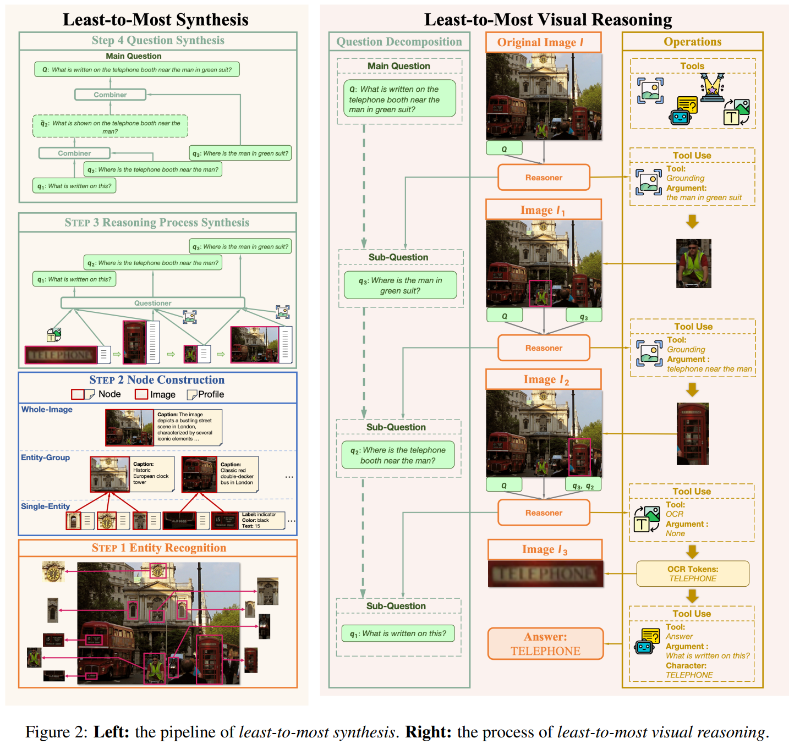
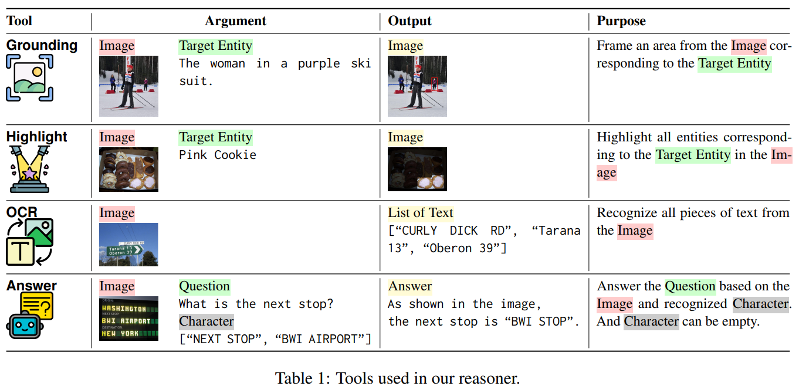
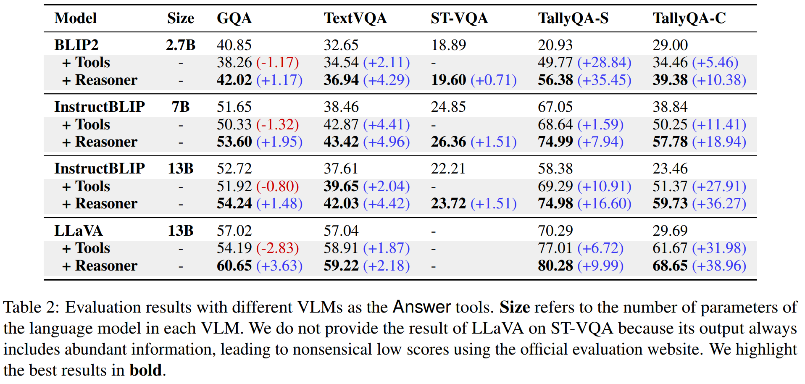

# From the Least to the Most: Building a Plug-and-Play Visual Reasoner via Data Synthesis

> https://aclanthology.org/2024.emnlp-main.284

最先进的VLMs在推理视觉内容方面仍面临挑战，直观上，问题可以通过遵循“最少到最多”的模式来正确解决，即将问题分解成一系列子问题，并逐步推导出答案。然而，现有的VLMs在执行这种多步推理时表现不佳，原因在于：

- 训练数据很少包含多步推理路径。VLMs很少有机会从后续的训练中发展推理能力
- 与文本推理不同，在视觉语言背景下解决问题可能需要操纵输入图像（例如，标记特定区域），并从文本和视觉中间结果中推导出下一步。然而，大多数视觉语言模型（VLMs），无论是开源的还是专有的，都难以实现这一要求。

我们提出了一种从最少到最多的视觉推理通用范式，指导VLMs将给定问题分解成子问题，并调用工具重新解决每个子问题，以处理多样化的视觉推理任务。以自底向上的方式为给定图像自动生成一个“（问题，推理路径）”元组。具体来说，从最少到最多的合成流程包括四个步骤：

1. 实体识别：识别图像中的所有实体；
2. 节点构建：构建三种类型的节点，每种节点汇总一个带有少量实体和一些文本特征的图像；
3. 推理过程合成：从采样的节点链合成推理路径。基于这些节点，通过连接由大型语言模型生成的子问题和工具参数序列形成推理路径；
4. 问题合成：通过大型语言模型递归组合推理路径中的子问题来生成主问题。

> 通过任务分解和逐步推理来解决复杂的视觉语言任务的各种方法已被提出。
>
> - 视觉编程利用大型语言模型通过将任务分解为子程序来执行视觉推理。
> - ViperGPT和CodeVQA通过分解任务来生成可执行的代码。
>
> 然而，这些方法严重依赖于大型语言模型的强指令遵循能力，使其在较小的模型上效果较差。此外，即使使用像GPT-3这样的强大模型，这些方法也容易受到由提示设计、演示的选择和排序以及大型语言模型选择引起的不稳定性影响。我们的工作与这些方法显著不同，专注于在大规模合成数据集上微调视觉语言模型，系统地提升模型处理复杂任务的能力。这种方法使我们能够使用较小、开源的模型（例如，7B或13B参数）实现具有竞争力的性能，使我们的方法更具成本效益、易于获取，并且适用于实际部署，需要的计算资源更少。

## 方法

首先，我们将自下而上的视觉推理形式化，描述了视觉推理器如何根据图像解决复杂问题。接着，我们介绍了通过自下而上的合成方法调整视觉语言模型作为视觉推理器进行推理的细节。

### 自下而上的视觉推理

给定一张图像I和一个问题Q，一个视觉推理器 $$\mathcal{M}_R$$ 推导出一个多步推理路径R，其中每一步要么对I执行操作（例如，用红色框标记一个区域），要么请求现成的视觉语言模型 M 得出最终答案。为此，我们将R表示为从预定义工具池中逐步调用工具的链条T={*ti*∣*i*=1,2,⋯,*T*}，每一步为工具或者 M

在第k步， $$\mathcal{M}_R$$ 提出一个子问题 $$q_k$$，并根据图像 $$I_k$$ 和前面的步骤从T中选择一个工具 $$t_k$$：
$$
q_{k},t_{k}=\mathcal{M}_{R}\left(I_{k}, Q,\left\{q_{<k}\right\}\right)
$$
其中，$$t_k$$ 是一个文本描述，指定了调用的工具和相应的参数。然后，根据  $$t_k$$ ，推导出  $$q_k$$ 的答案，记作 $$r_k$$ ，基于此获得 $$I_{k+1}$$ 如下：
$$
I_{k+1}=\left\{\begin{array}{ll}
r_{k}, &\text{if } r_{k} \text{ is an image,}\\
I_{k}, &\text{otherwise.}
\end{array}\right.
$$
特别是，我们将 $$I_1$$ 设为 I。如果包 $$I_k$$ 含一个红色框来标记小于阈值 *α* 的某个区域，并且 $$t_k$$ 意图从 $$I_k$$ 中推断信息（包括OCR和答案工具），我们会自动从原始中 $$I_k$$ 裁剪出这个区域并将其放大到与 $$I_k$$ 相同的大小。上述过程迭代进行，直到 $$t_k$$ 指向 VLM M，此时我们定义最终答案 $$A=r_k$$ 并终止推理过程。总之，我们正式表示  $$R=\left[\left(I_{k}, q_{k},t_{k}\right)\right]_{k=1}^{K}$$

根据人类经验，我们定义了四种工具，每种工具针对一类原子问题，并输出修改后的图像或一段文本。具体来说，我们使用groundingDino（刘等人，2023c）实现定位和高亮，使用PaddleOCR 实现OCR，以及使用VLM M 实现答案。

### 最少到最多合成

为了克服数据障碍，一种常见的做法是将图像-问题对输入到强大的专有大型语言模型（如GPT-4V）中，并将输出收集成一个数据集。然而，自上而下的方法存在几个问题：

1. 即使是功能强大的专有模型如GPT-4V，也仍然难以进行可靠的推理，这表明以这种方式获得的数据质量无法保证
2. 使用专有模型的成本很高，阻碍了合成数据的可扩展性
3. 其他人很难复现该方法，因为专有模型的行为可能随时间变化

与自上而下的方法相比，我们提出了一种自下而上的流程，该流程可以使用（几乎完全）开源模型来合成多步骤视觉推理数据，同时确保合成数据的质量。工作流程从一张图片开始，逐渐生成与工具和中间结果相关联的子问题，并最终基于图片和推理路径合成一个问题。具体来说，该流程包括四个步骤：实体识别、节点构建、推理路径合成和问题合成，其中每个节点汇总一个聚焦的（子）图片和相关文本形式信息。

1. 实体识别。我们采用Deformable DETR（Zhu等人，2020年）来识别图片中的实体，它可以识别1203种类型的实体。在实践中，我们丢弃那些置信度得分≤0.5的实体。
2. 节点构建。给定一张图片，我们基于识别出的实体自动构建节点。每个节点由一个图像和一个文本描述组成，其中图像是从给定的图像中提取出来的，而描述是关于该图像的属性值字典。通过将图像转换为文本描述（llava-v1.6-vicuna-13b-hf），数据合成可以消除对视觉信号的依赖，从而在后续过程中使用更高级的 LLM 代替 VLM。我们定义了三种类型的节点，涵盖不同的粒度：
   1. 单一实体节点。这类节点的图像指的是被识别的一个实体。我们利用专门的工具从多个维度（例如颜色）提取准确且细粒度的属性来形成描述
   2. 实体组节点。实体组节点的图像是多个彼此接近的被识别实体的聚合。我们采用BLIP来为图像生成标题，作为节点的相应描述。每个标题包含大约10-20个标记，详细说明实体间的关系。
   3. 整图节点。这种类型的节点对应于提前给出的完整图像。
3. 推理过程合成。我们从构建的节点集中抽取一个由M个节点组成的链，这些节点将依次连接形成推理过程。我们制定精细的规则以确保节点可以合理连接，并且最后一个节点是完整图像节点。对于每两个相邻节点，基于它们的描述和一个抽样的工具利用 LLM 作为提问者来合成一个子问题，我们得到 *M*−1 个子问题
4. 问题合成。我们通过使用另一个大型语言模型作为组合器递归地结合子问题来生成主问题 Q

我们通过微调LLaMA-3-8B-Instruct6来实现提问器和组合器。由通过使用少量高质量示范作为种子，按照自我指导流程查询GPT-4来获取训练数据。由于这两个任务相对简单，仅查询GPT-4 10,000次就足以达到令人满意的性能。

## 实验

我们将LLaVA-1.5-7B微调作为推理器，并将推理器接入四种不同大小的 VLMs，并在四个标准的视觉问答基准上进行实验。在实现中，我们分别通过查询GPT-4获取问题和组合器的10,000个训练样本。随后，我们按照最少到最多的合成方法，合成一个包含50,000个例子的视觉推理数据集（VIREO），并对VIREO进行指令微调以获得推理器。

> 限制：我们选择COCO2014作为数据合成过程的图像来源。然而，尽管COCO2014是一个通用图像数据集，我们不保证其数据能涵盖所有视觉任务。

- 推理器在所有数据集上始终提高了所有 VLM 的性能。通过分解问题和调用专门工具，推理器可以以即插即用的方式提高各种现成的视觉语言模型，显示出其强大的泛化能力
- 推理器有助于更好地捕捉复杂的实体间关系
- 推理器提高了对图像中单词的理解。OCR 工具增强了推理器在文本视觉问答（TextVQA）和结构化文本视觉问答（ST-VQA）上的性能
- 推理器大幅提高了计数性能。推理器的优势在TallyQA上尤为显著。没有推理器，基础VLMs对图像中的无关信息敏感，因此容易误计。通过使用高亮工具，推理器可以可靠地减轻此类无关信息的影响
- 随着训练样本数量的增加，性能提升逐渐增大。然而，我们也注意到边际效益在递减
- 排除任何单一工具都会对各种数据集上的模型能力产生不利影响。这一观察强调了视觉任务的多面性，这些任务通常需要多种复杂操作的协同应用，因此仅依赖单一工具是不够的
- 对图像进行额外的推理并不会增加VLMs产生幻觉的可能性，不影响VLMs内在知识的表达
- 在VIREO的端到端版本上微调的Qwen-VL模型在所有数据集上都有显著的提升
- 为了分析推理器的错误类型，并将错误分为三种类型：
  - 推理：推理器使用了错误的工具（工具）或为该工具生成了错误的论点（参数）
  - 执行：基础、OCR或高亮工具返回了错误的执行结果；
  - 推断：答案工具输出了错误的答案（错误）或与问题无关的答案（缺失）。
