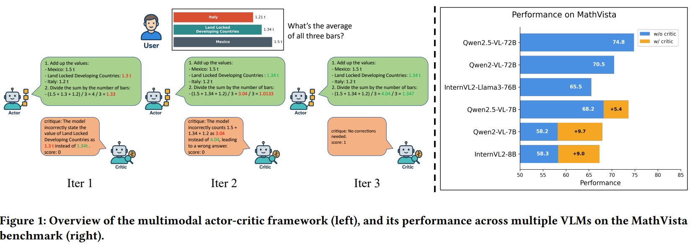
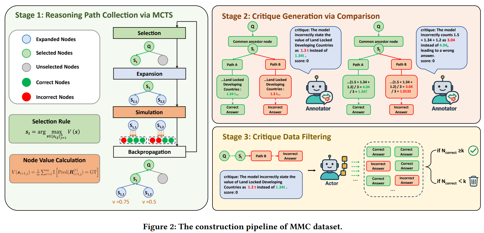
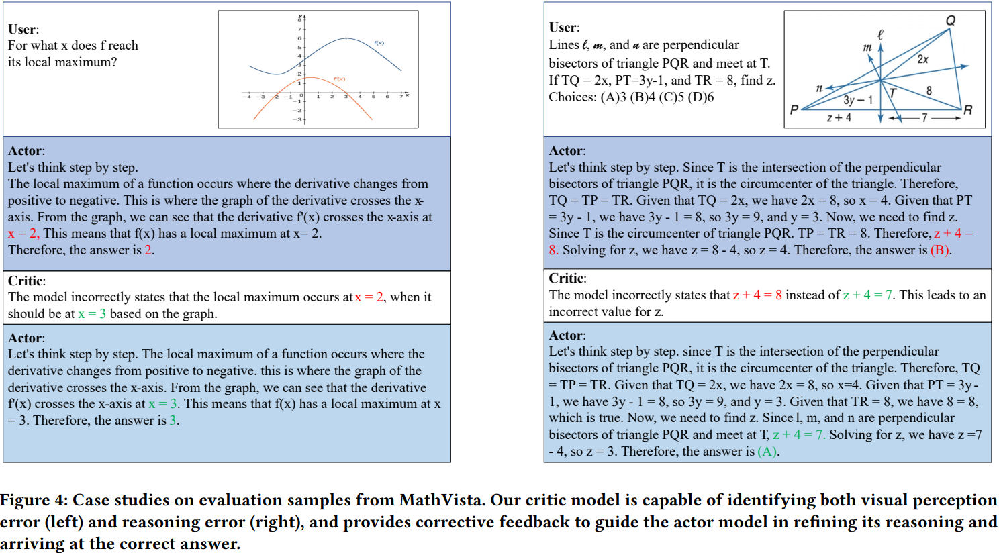

# MMC: Iterative Refinement of VLM Reasoning via MCTS-based Multimodal Critique

> https://arxiv.org/abs/2504.11009

提升VLMs的推理能力仍是一个重要的研究方向。最近的研究引入外部反馈机制，将批评生成与推理过程解耦。然而，细粒度的人工注释既费钱又耗时。

我们提出了一种自动化流程，用于构建一个无需手动注释的多模态批评数据集。我们整合了多个视觉问答（VQA）数据集，并通过蒙特卡洛树搜索（MCTS）引导行为模型，系统探索逐步推理路径。

> 与依赖完整路径比较的先前方法不同，我们的方法利用了MCTS生成的树状结构。注释者只需比较分叉分支间的局部差异，使得更容易定位错误并提供逐步纠正反馈。这消除了对比基础行为模型更强大的外部模型的依赖，大幅降低了注释成本。此外，基于树的架构能够全面覆盖每一步的推理错误及其相应的纠正策略。

基于此，我们构建了MMC（基于MCTS的多模态批评）数据集。在MMC上训练的批评模型能有效识别推理错误并生成有针对性的纠正反馈。

此外，我们构建了一个多模态行为-批评框架，以增强 VLM 的推理能力。该框架由一个行为模型和一个批评模型协同工作：基于图像和文本输入，行为模型生成逐步推理路径，而批评模型对其进行评估并提供针对性反馈。演员模型根据反馈迭代优化推理路径，直到评论家模型提供满意的反馈。

## 相关工作与背景

为了应对VLMs的推理能力挑战，OpenAI[16]致力于通过增加推理时间计算来提高模型在推理密集型基准测试上的表现，使模型能够匹配甚至超越人类专家的表现。DeepSeek-R1[13]成功利用强化学习（RL）促进大型语言模型（LLMs）中高级认知推理能力的自发出现。与此同时，许多研究采用自我反思、自我纠正和自我批评等机制来产生更长、更精细的推理链[31,36,41]。在这些进展的基础上，最近在多模态领域的研究探索了通过自适应提示动态精细化推理轨迹[39]、分阶段精细化推理注释[40]以及使用蒙特卡洛树搜索（MCTS）来连接错误和正确的路径以学习自我纠正[43]。

Atom-Think[39]利用GPT-4构建推理数据集，其中简短的思维链放大可以扩展简短的中间步骤，以创建更完整的推理过程，而动态提示则将仅包含最终答案的数据集转换为包含详细逐步推理的格式。LLaVA-CoT[40]引入了一个四阶段推理框架，该框架使用GPT-4在视觉问答任务的每个阶段完善注释。在推理过程中，分阶段的束搜索在每个推理步骤中选择最优候选路径，提高了推理过程的稳定性和可靠性。Agent-R[43]利用蒙特卡洛树搜索（MCTS）生成正确和错误的推理轨迹，通过逻辑连接将其与正确路径拼接，提示模型识别并纠正其推理中的第一个错误步骤。这种方法构建了具有自我反思的长链多步推理数据，允许监督微调教会模型如何从错误中恢复并转向正确的推理路径。因此，这种方法增强了多步推理模型的鲁棒性和自我纠正能力。

除了这些内部推理策略的努力外，最近的研究还探索了另一种范式，即引入一个外部反馈机制，将批评生成与推理过程解耦。在此框架下，行动者模型生成清晰、结构化的推理步骤，而一个独立的批评模型提供反馈、识别错误并通过迭代互动指导纠正。批评模型的有效性取决于高质量批评数据集的可用性。然而，细粒度的人工注释既费钱又耗时。为了解决这一问题，现有的研究提出了自动化构建批评数据集的方法，

RL4F 引入了一个新颖的框架，其中使用强化学习（RL）训练评论家模型，而不修改推理 LLM 的参数。评论家模型生成自然语言反馈，然后由LLM用来纠正其输出。AutoMathCritique 采用类似的方法，将推理和批评模块分离。它通过k样本采样、增加温度系数和错误插入等方法构建各种步骤级错误路径。这些错误路径被用来提示GPT-4生成相应的步骤级批评，然后利用这些批评自动构建大规模批评数据集。训练有素的评论家模型随后可以为数学推理任务提供自然语言反馈，从而监督演员模型的优化。随着推理迭代次数的增加，演员模型的推理持续改进，提高了在复杂推理任务中的表现。

对于多模态，Critic-V[44] 利用GPT-4人为地在收集到的视觉问答（VQA）数据中引入错误，允许多个视觉语言模型（VLMs）对这些错误生成关键评论。为了评估生成的评论的质量，基于规则的奖励（RBR）结合了杰卡德指数和GPT分数来对评论进行排名和打分。基于这些按偏好排名的数据，采用直接偏好优化（DPO）来训练评论家V，使其能够生成更高质量的自然语言反馈，为视觉问答任务提供更有效的推理指导。

总的来说，基于外部的方法可以大致分为两类。

1. 第一种方法涉及使用大规模大型语言模型（例如，GPT-4o）故意将正确的推理路径修改为错误的。通过明确标注错误位置和类型，注释器模型可以生成直接针对这些已知错误的批评。然而，生成的错误路径是人为插入的，而不是源自基础行为模型本身，这可能限制批评模型适应真实推理错误的能力。
2. 第二种方法涉及通过行为模型的重复采样等技术生成正确和错误的推理路径，然后将完整的推理路径传递给注释器模型进行全面评估。注释器模型比较两条完整的推理路径，系统识别错误，并基于它们之间的差异生成批评。然而，这种方法面临两个关键挑战，源于需要比较完整正确和错误的推理路径。首先，它要求注释器模型具有强大的推理和评估能力——通常依赖于像GPT-4o这样的大规模大型语言模型以确保准确的错误检测和批评生成。其次，通过专注于全路径比较，这种方法难以捕捉发生在特定步骤的细粒度推理错误。

## 方法

我们构建了一个包含两个关键组件的多模态演员-评论家框架：一个演员模型，该模型根据图像-问题输入逐步生成推理路径；以及一个评论家模型，该模型评估每一个推理步骤并提供纠正性反馈。演员模型根据反馈迭代地精炼其推理，直到评论家模型认为推理结果是令人满意的。

训练评论家模型的一个关键挑战在于获取评论质量的细粒度监督，而不依赖于昂贵的手动注释。为此，我们使用MCTS来收集逐步推理路径。这种方法使得系统性地探索可能的推理路径成为可能，平衡了多样性（探索）和质量（利用）。

### 收集推理路径

actor从一个预训练的VLM初始化。给定一个多模态问题输入，actor 模型自回归地生成一系列中间推理步骤，直至得出最终答案。其中每个中间步骤作为基于MCTS的迭代探索的基本单位。每个节点包含从根到节点的部分推理路径 P、访问次数、节点的估计值 V

MCTS的每次迭代包括四个关键阶段：选择、扩展、模拟和反向传播。

- **选择**。选择阶段从根节点Q开始，我们将其表示为初始状态 *s*0，然后根据最高估计值 V 递归地从当前节点 的子节点中选择下一个节点
- **扩展**。在选择阶段选中一个叶子节点后，扩展阶段 actor 模型生成 n 个候选的下一步。每个候选步骤从当前的部分推理路径 P 中采样，这样就得到了一组子节点
- **模拟**。在模拟阶段，对每个新扩展的子节进行评估，以获得其估计值 V。具体来说，从部分推理路径开始，自回归地生成剩余步骤，直到遇到序列结束标记或超过预定义的最大标记长度。在固定的采样设置下重复这个过程m次，得到一组完整的推理路径。对于每一条生成的推理路径，我们将其预测答案与真实答案进行比较，如果匹配则分配二进制分数1，否则分配0分。该节点的**估计值** V 被定义为m次展开的平均得分
- **反向传播**。在评估了扩展节点之后，它们的估计值会沿着遍历路径反向传播，以更新祖先节点的访问次数和值分数。
- 当选定的节点包含一个序列结束标记或超过最大标记长度时，迭代终止。

### 通过比较生成批评意见

对于每棵树，我们首先选择一个高质量的参考推理路径——具体来说，是在MCTS策略下最终被选中并导向正确答案的完整路径。然后，对于每一条导致错误最终答案的推理路径，我们找出它与参考路径的最后公共祖先节点。这个节点对应于两条路径仍达成一致的最新推理状态。从这一点开始，错误路径偏离了正确路径；我们将正确分支称为路径A，错误分支称为路径B。

得益于通过MCTS构建的分步骤推理路径，我们的框架只需要注释器模型比较路径A和路径B来生成自然语言批评意见。这种局部化比较大幅降低了批评生成的难度，使得即使是相对较弱的模型也能产生有意义的反馈。为了防止批评数据从更强大的模型（如GPT-4o）中提炼出推理结果，我们采用了一种自我注释的设置，**其中演员模型本身充当注释者**。注释者不是直接回答原始问题，而是被指导专注于识别和解释特定的推理错误。其目标是生成有针对性的纠正反馈，引导演员模型迭代地完善其推理路径，直至正确。

基于此过程，我们构建了MMC数据集，其中每个样本包括一个多模态问题输入、一个推理路径、一个二元正确性分数和一个批评文本，表示为(*Q*,*A*,*v*,*C*)。对于导致正确答案的推理路径，我们将批评文本标准化为“无需更正”，作为正面示例。

### 批评数据过滤

为确保生成的批评的质量和实用性，我们采用了一种基于其帮助演员模型纠正自身推理能力的自动过滤策略。

对于每个负面样本，我们提示演员模型使用相应的批评文本来改进原始的错误的推理路径。具体来说，演员模型以三元组(*Q*,*A*,*C*)为输入，在固定的采样设置下生成10个改进后的答案。然后将每个改进后的答案与真实答案进行比较，以确定预测是否正确。如果正确改进的数量大于或等于预定义阈值 *K*=3 时，批评样本被认为是有效的，并保留在数据集中；否则，将其丢弃。

### 训练评论家模型

使用MMC数据集对评论家模型进行微调，总的训练目标是语言建模损失和分数预测损失的加权和

对于语言建模损失。为了监督**批评生成**，我们采用一个用标准交叉熵损失训练的语言建模头部：
$$
\mathcal{L}_{\mathrm{lm}}=-\sum_{t=1}^{T}\log P_{\phi}\left(c_{t}\mid Q,A,c_{<t}\right)
$$
对于得分预测损失。为了使我们的评论家模型更好地评估演员模型生成的回应质量，我们采用了受结果奖励模型（ORM）启发的设计。具体来说，我们在评论家模型后附加了一个得分头部，实现为一个多层感知器（MLP），为每个标记输出一个标量。最后一个标记处的标量预测被用作给定回应的正确性估计。我们使用二元交叉熵损失来监督得分预测：
$$
\mathcal{L}_{\text{score}} = -\left[v \log \hat{v} + (1 - v) \log (1 - \hat{v})\right]
$$

### 迭代推理

在推理时，我们采用一个迭代的演员-评论家框架，演员模型根据评论家的反馈逐步完善其输出。该过程从演员生成逐步推理开始。在每次迭代中，评论家通过赋予一个标量分数v并产生一段自然语言评论C来评估推理。然后演员据此更新其推理。这一迭代过程持续进行，直到评论家模型认为答案令人满意，即标量分数*σ*超过预定义的阈值*γ*。

## 实验

在多样化的多模态推理基准上进行评估，涵盖了一般视觉问答和数学推理任务。为了评估答案的正确性，我们使用GPT-4o来比较模型生成的预测结果与真实情况。

在构建MMC数据集期间，我们采用Qwen2-VL-7B和Qwen2.5-VL-7B作为演员模型，解码温度设置为0.7。作为注释器模型时，解码温度设为0。采样查询来自多个视觉问答（VQA）数据集，这些数据集与我们下游评估基准测试的训练集共享相同的数据来源。为了提高注释的可靠性，我们排除了大多数多项选择和是非题，因为它们常常引入不一致性。我们微调Qwen2-VL-7B 作为使用MMC数据集的评论家模型，在推理过程中，我们使用Qwen2-VL-7B、Qwen2.5-VL-7B和InternVL2-8B作为演员模型，所有模型的解码温度均为0.7。评论家模型采用贪婪解码。演员-评论家迭代的最大次数设置为T=5。

- 整合评论家始终提高了所有任务的性能
- 反馈机制在不同演员骨干上的泛化能力强
- 为了评估迭代改进的影响，我们分析了在多个迭代中，演员-评论家在MathVista数据集上的互动过程，评论家提供了有效的纠正反馈，引导演员迭代地修正其推理，以得出正确答案

