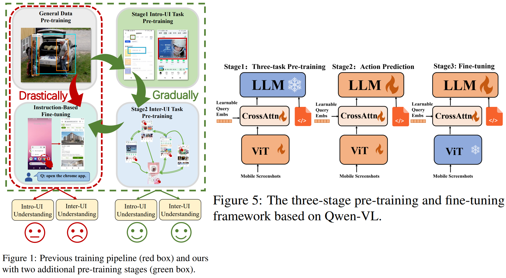
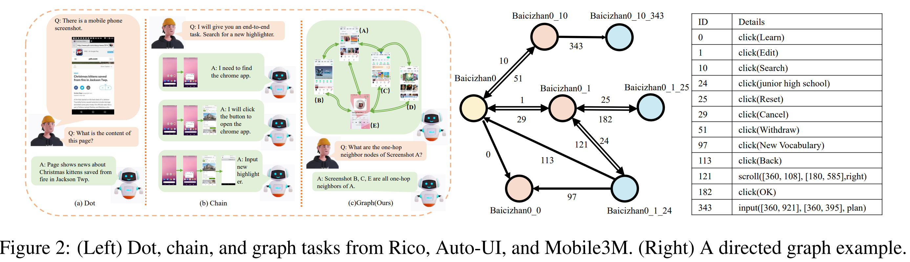
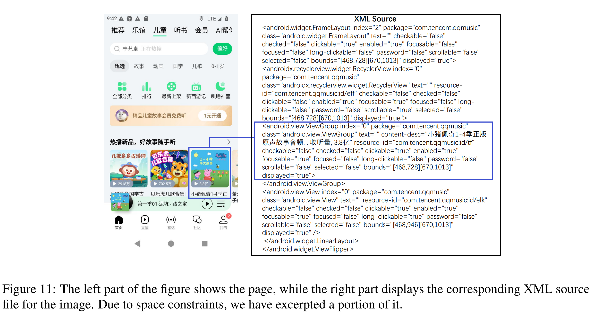
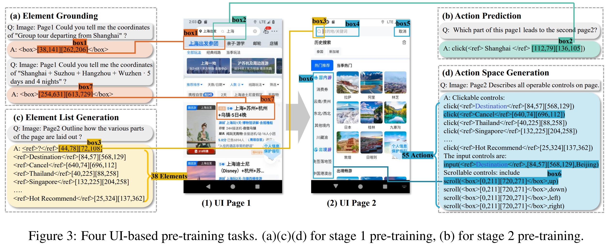
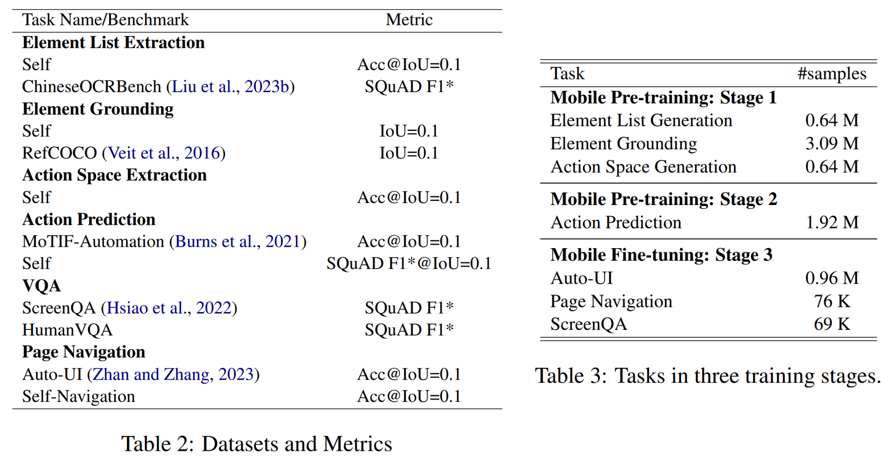

# MobileVLM: A Vision-Language Model for Better Intra- and Inter-UI Understanding

> https://arxiv.org/abs/2409.14818

对于基于移动平台的 Agent，通常会利用大规模通用数据集用于预训练，但是

- 这些数据集中移动UI页面的比例非常低，导致数据集的整体图像特征与专为移动端设计的数据集存在显著差异。
- 这些视觉语言模型的通用预训练任务并未特别考虑移动端UI的特点。通用的预训练任务，如图像描述和视觉问答，主要关注整体图像的信息，而移动端UI任务则需要捕捉更精细的细节，例如布局和元素。因此，这些视觉语言模型缺乏对UI内部信息的理解。
- 这些任务仅关注图像中的内容，而忽略了图像之间的相互关系。即便是在一些多轮导航任务中， 其交互轨迹呈现为链式结构，但这仍无法全面覆盖真实应用中海量页面间的UI关系。直观来看，一个应用的所有UI页面理应构成一张图结构。因此，这些视觉语言模型同样缺乏跨UI层面的信息。

为解决这些问题，我们提出了两个额外的移动端预训练阶段，以及四个特定的移动端任务，以增强模型对UI内部和跨UI内容的理解。

- 在第一阶段，我们实施了3项UI任务，旨在提升模型对UI内部内容的精细化理解
- 而在第二阶段，则引入了动作预测任务，用于预测连接两个页面之间的用户操作，从而进一步强化对跨UI场景的把握

基于这一训练框架，我们提出了MobileVLM，它充分利用来自Mobile3M的一致性移动端数据，实现预训练与微调的无缝衔接。这是一种能够同时理解UI页面内细粒度元素信息，以及UI页面间过渡关系的视觉语言模型。

Mobile3M是首个大规模的中文移动数据集，包含300万UI页面及真实世界交互数据，并为每个应用构建了有向图结构

## 数据集

Mobile3M 是一个专注于中文应用的大规模数据集。Mobile3M共包含20,138,332个操作，涵盖3,098,786张截图及其对应的XML文档。这些数据被组织成49个大型有向图，每个图代表一个移动应用，其中UI页面作为节点，操作则作为边。

我们从App Store中精选了49款中国应用，确保每款应用的下载量均不低于1000万次。这些应用被安装并运行在模拟器上，我们使用Appium工具来收集UI页面。每个UI页面包含一张截图和一个XML文档。

> XML文档详细描述了UI页面的结构与内容，包括按钮、文本框等元素，以及边界框和层次树状结构等布局信息。图 11 附录中展示了一个截图示例，以及适用于“QQ音乐”应用的XML文档
>
> 

该XML文档可被解析，以生成一个元素列表。如图3（c）所示的任务内容，每个元素都包含一个名称和一个边界框。

动作空间: 数据收集算法模拟了人们与智能手机互动的方式。我们设计了三种基本操作：点击、滚动和输入。一个元素可能支持多种交互操作。

> 如图所示 3，该UI页面中的38个元素可生成一个包含55种动作的操作空间。

受APPAgent启发(杨等人, 2023)我们使用随机游走算法来探索应用。该算法会迭代地与每个UI页面上的元素进行交互，并记录页面的跳转过程。每个应用的探索结果可表示为一个有向图，其中每条边代表一个操作，每个节点则代表一个UI页面。

“UI页面的操作轨迹”被定义为从应用主页到该页面的最短操作序列。轨迹中各操作的ID被组合起来，形成该页面的唯一标识，称为“页面名称”。

> 在图中 2, 该算法从“Baicizhan0”页面执行“点击（编辑）”操作，以进入编辑页面。此操作的ID为1，因此编辑页面的名称标识符被指定为Baicizhan0_1。

由于实际应用中的UI页面会随着应用的演进而发生变化。在探索过程中，如果将数天前存储的头节点简单地近似为当前的头节点，可能会误将UI变化当作边的操作，从而导致数据错误。因此，对于每个页面，该算法会保存其整个“操作轨迹”中每一步的截图和XML文档。

> 以图2中的“Baicizhan0_1_25”为例，该节点包含3个UI页面、3个XML文档，以及一个由2个操作组成的“操作轨迹”。

我们采用广度优先方法（BFS）来探索应用。与深度优先方法（DFS）相比，BFS能更全面地覆盖应用功能，并在探索新节点时缩短操作序列。

> 如图2所示，该算法将首先探索“Baicizhan0_10”，而非“Baicizhan0_1_25”。基于任务导向的探索方法(杨等人, 2023) 严重依赖于VLM的性能。然而，当前的VLM可能成本高昂，并且在处理第三方应用时表现欠佳。此外，基于任务的方法可能导致一些不常用页面和应用功能被忽略。

构建Mobile3M数据集的目标是全面探索该应用程序的所有功能，力求尽可能发现新的页面和操作。对于一个平均操作空间为50的App，仅通过四种交互式操作，其探索空间便能扩展至6,250,000个页面，其中包含大量重复内容。

为提高探索效率，我们提出了一种“唯一页面”机制。每当探索到新页面时，我们便使用BM25(罗伯逊等人, 2009) 为了检索当前应用图中与页面的XML文档最接近的前5个节点。该算法会将新页面与这五个页面逐一比较，以判断它们是否为相似页面。相似系数的阈值设定为：元素差异小于5且像素差异低于30%。其中，“元素差异”是指两个UI页面之间不同元素的数量，“像素差异”则是指两张截图之间的像素级差别。如果在当前图中未找到任何相似页面，则新页面将被视为唯一页面，并被添加到应用图中。

> 如图2所示，点击“百词斩0_1_24”上的“返回”按钮后，生成的“百词斩0_1_24_113”与“百词斩0”是等价页面。我们会在图中从上一页面“百词斩0_1_24”向相似页面“百词斩0”添加一条有向边。算法将不会把“百词斩0_1_24_113”视作一个新的可探索节点。

这种机制（1）大大缩小了每个应用的探索空间；（2）将树状结构的探索结果转换为图结构，使得不同页面可通过依次点击“编辑”、“确定”及滚动操作，最终到达终点。这一过程有助于智能体学习各类UI元素的功能（3）这一方法有效避免了循环动作序列的出现，“唯一页面”机制能够及时检测并剪枝这些序列。

> 以“携程”为例，我们的探索过程共生成了187,079个UI页面，平均步骤数为6.5。如果没有“唯一页面”机制，如此规模的页面将无法有效处理仅4步的所有可能性

为了平衡数据集中不同操作的分布，在随机游走过程中，我们优先考虑输入操作。对于每个应用，我们提供10个相关关键词。在执行输入操作时，算法可随机选择一个关键词进行输入；而对于滚动操作，算法则可从“上、下、左、右”四个方向中随机选择一个来执行滚动。

## 训练

我们采用Qwen-VL-Chat作为我们的基础模型，如图5所示我们采用一种三阶段训练方法，并在第一阶段冻结Qwen-7B的参数，而在第三阶段冻结ViT的参数。

### 预训练

第一阶段: 在预训练的第一阶段，我们的主要目标是增强VLM对UI页面内部结构的理解。为此，我们构建了以下三个任务来对模型进行预训练:

1. 元素列表生成: 这项任务要求模型从页面中识别出所有交互元素。它需要OCR和定位能力，以识别文本及其边界框。该任务为后续任务中的定位与交互奠定了基础。
2. 元素接地 (李等人, 2021)这项任务的目标是使模型能够识别并定位页面中的元素。给定一个元素描述，模型需要确定其边界框。我们在每页上随机选取五个元素用于定位训练。
3. 动作空间生成: 这项任务要求模型从UI页面中生成所有候选操作。根据提取出的元素，模型需要分析这些元素的类型：可点击、可输入和可滚动。此任务对于第二阶段的动作预测任务至关重要。

在第二阶段预训练中，我们采用动作预测任务，以增强视觉语言模型（VLM）理解两页之间关系的能力。预期的输出是完成从当前页面导航到下一页面所需的动作。

### 微调

在第三阶段的微调中，我们使用Mobile3M构建自定义页面导航任务，并结合Auto-UI实现页面导航任务，同时采用ScreenQA解决视觉问答任务。这一阶段的主要目标是将模型对UI内部元素及其相互关系的理解，转化为实际的端到端任务完成能力，以及支持页面问答的特定领域应用。

1. 页面导航 在第三阶段，页面导航不再像第二阶段那样提供两页内容，而是仅提供单页，并附带相应的指令。该模型需要根据这些指令生成相应的操作。
2. 视觉问答 VQA任务要求视觉语言模型根据截图回答问题。

## 实验

我们通过从Mobile3M中选取数据构建了自己的基准测试集，并额外选择了五个公开的中文基准测试集。我们从mobile3m中随机选取了500张截图，并邀请三位标注员为每张截图构建问答对，这一基准被命名为humanVQA。

我们使用NVIDIA A100 GPU（80G×8）对模型进行了训练。在阶段1评估中，我们采用了两个SOTA模型：GroundingDINO以及Qwen-VL-Max。在第二阶段，我们选择了Seq2Act作为MoTIF上的SOTA模型；

尽管Mobile3M是一个中文数据集，但在测试阶段，Auto-UI和ScreenQA仍需与之保持一致。因此，我们将它们的指令和答案翻译成了中文。此外，由于Mobile3M中的所有页面均统一为720x1280尺寸，我们也将Auto-UI和MoTIF的页面调整为720x1280。在我们的预训练任务中，要求视觉语言模型根据指令描述检测目标物体，为此，我们从RefCOCO数据集中移除了那些单张图像中包含多个物体的测试用例，以避免歧义。