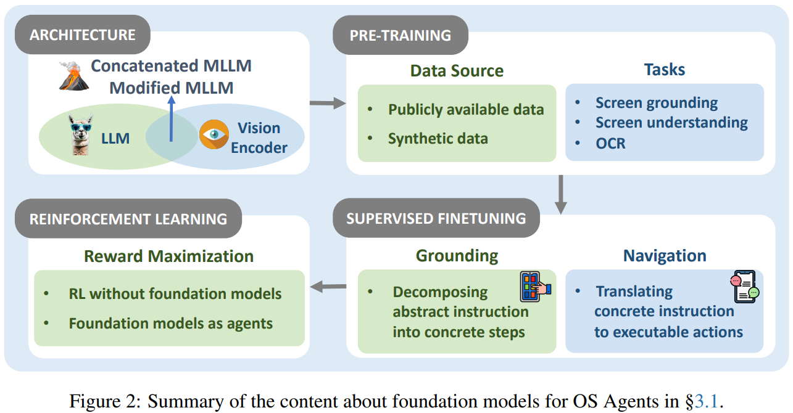

# OS Agents: A Survey on MLLM-based Agents for General Computing Devices Use

> https://arxiv.org/abs/2508.04482

## 背景

操作系统代理基于三个关键组件：环境、观察空间和动作空间，它们共同促进代理与操作系统的有效互动。此外，操作系统代理需要具备三个核心能力：理解、规划和具象化。这些能力使其能够顺序理解任务、制定行动策略并在环境中有效实施这些行动。

核心能力

- 环境：desktop、mobile、web
- 观察空间：如屏幕图像、特定处理的数据、屏幕描述文本、和网络环境中的HTML代码等
- 动作空间：输入操作、导航操作、使用外部工具或服务等

功能能力

- 理解。操作系统代理的一个关键功能是它们理解复杂操作系统环境的能力。这些环境包括多种多样的数据格式，如HTML代码以及在截图中捕获的图形用户界面。随着代码长度增加和信息稀疏，界面分辨率高且杂乱无章，布满了微小图标、小文本和密集排列的元素。这样的环境挑战了代理的感知能力，并要求高级的情境理解。这种理解不仅对旨在信息检索的任务至关重要，而且作为有效执行广泛其他任务的基本先决条件。
- 规划。规划使其能够将复杂任务分解为可管理的子任务，并设计一系列动作来实现特定目标。操作系统内的规划通常要求代理根据环境反馈和历史动作动态调整计划。像ReAct[姚等人，2023年]和CoAT[张等人，2024a]这样的推理策略也是必要的，以确保在动态且不可预测的场景中有效执行任务。
- 具象化。动作具象化是操作系统代理的另一个基本能力，指的是将文本指令或计划转换为操作系统环境内可执行的动做的能力。代理必须识别屏幕上的元素，并提供必要的参数（例如，坐标、输入值）以确保成功执行。虽然操作系统环境通常包含众多可选元素和可能的动作，但由此产生的复杂性使得具象化任务特别具有挑战性。

## 架构

通常的做法是利用现有的 LLM 或者 MLLM，一些架构可以通过连接LLM与视觉编码器来创建，使模型能够处理文本和视觉信息。此外，MLLM经常通过加入补充模块来适应特定需求，如高分辨率图像理解。

现有MLLMs的架构以有效地开发操作系统代理的基础模型。一些工作选择适合处理操作系统任务的大型语言模型和视觉编码器，并以类似于现有MLLMs的方式将它们串联起来，可能是构建操作系统代理基础模型的更合适方法。

一些工作对MLLMs的架构进行了进一步调整，以增强基础模型的理解能力。例如，大多数现有的MLLMs只能处理相对较低分辨率的图像，通常是224x224像素，而GUI截图的常见分辨率是720x1080像素。调整截图大小以适应MLLMs的分辨率视觉编码器保留了总体布局和大多数对象的特征，但文本和小图标无法被很好地识别，这在某些情况下对于MLLMs完成操作系统任务至关重要。一些工作已被提出来使MLLMs能够感知这些特征。

## 训练

操作系统的代理模型主要包括预训练、监督微调和强化学习

### 预训练

预训练为模型构建奠定了基础，并被广泛用于通过扩展对图形用户界面（GUI）的理解以及促进视觉与文本信息之间固有关联的获取，来增强操作系统代理的基础模型。

- 大多数现有的预训练方法采用从具有大量文本或视觉理解能力的一般预训练模型进行持续预训练。该策略利用这些预训练模型中已建立的知识，从而提高它们在GUI相关任务上的性能。
- Gur等人[2023年]从零开始训练模型，专门针对解析HTML文本，而不结合视觉模态。

数据来源：

1. 公开可用数据。
   1. 爬取并过滤网络数据以提取与GUI相关的信息。使用CommonCrawl获取HTML文档并提取围绕‘`<label>`’元素的子树来训练HTML-T5模型，
   2. 采用Flickr30K进行模态对齐，增强模型对图像的语义理解。
2. 合成数据。
   1. 从网络获取的HTML数据中提取可见文本元素位置和指令，构建基于此的地基数据和OCR任务数据
   2. 在获取网页链接后渲染整个网站，将其分割成1920x1080分辨率的截图，并提取特征，
   3. 一些研究指出，尽管不同GUI平台之间存在相似性，但仅基于网络数据进行预训练难以跨平台泛化。为解决这一问题，他们创建了多个模拟环境，并利用可访问性（A11y）树来模拟人机交互，采样跨平台的地基数据
   4. 通过迭代地与每个GUI页面上的每个元素进行交互，模拟人与智能手机的互动。该过程将结果表示为有向图，并生成了一个包含真实GUI交互样本的数据集

任务：

- 屏幕定位。许多研究表明，预训练使模型能够基于文本描述从图像中提取目标元素的二维坐标或边界框。此外，一些工作通过在预训练阶段加入从中心点坐标和边界框预测文本的要求，扩展了基于文本的锚定任务。
- 屏幕理解。几项研究认为操作系统的代理的基础模型应该能够从图像中提取语义信息，并分析、解释整个图像的内容。包括屏幕问答等
- 光学字符识别（OCR）。在预训练阶段通过使用Paddle-OCR从图形用户界面截图中提取文本和边界框来构建训练数据，并在TextVQA基准测试上验证了模型卓越的OCR能力

### SFT

监督式微调（SFT）已被广泛采用，以增强操作系统代理的计划和定位能力。这需要努力收集特定领域的数据，以弥合自然图像任务和图形用户界面（GUI）任务之间的领域差距。

在规划方面，研究人员首先收集多步骤轨迹并为其合成指令。

- 以固定规则遍历应用程序以及大型语言模型（LLM），后者被应用于处理某些预定义场景和案例，这些场景和案例是固定规则无法覆盖的。
- 使用在线教程文章构建轨迹，其中步骤的描述通过大型语言模型映射为代理动作。
- 构建了关于网页间导航的有向图，并在图中找到最短路径以在生成特定任务数据时获得轨迹。这些轨迹被带入先进的大型语言模型中，如GPT4，以合成相应的任务指令，以及用于分解任务的思维链推理过程

合成 grounding 数据。研究人员首先将对象上的动作与GUI图像连接起来，然后合成提及它们的指令。

- 常见的绘制连接的策略是渲染GUI的源代码。例如使用HTML渲染网页、桌面或移动模拟器、GUI检测模型
- 与仅仅学习操作源代码相比，学习以视觉形式操作可以展示出在部件之间的直接交互方面的卓越性能
- 使用GUI图像进行学习有助于避免幻觉，泛化到未见过的GUI的能力
- 为了合成涉及小部件的指示，三种典型表达方式包括通过它们显著的视觉特征、位置或功能来进行指示
- 不同的GUI可能涉及不同的动作空间，有必要将来自不同来源的动作序列适应到一个统一的动作空间中，以避免在微调过程中它们之间发生冲突。

### RL

强化学习中代理通过与环境的互动学习最优决策。通过接收奖励形式的反馈，代理迭代地精炼其策略以最大化累积奖励。

- 姚等人[2022年]引入了WebShop，一个模拟的电子商务网站环境，基于此他们使用强化学习、模仿学习和预训练的多模态模型训练并评估了一系列多样化的代理。奖励是根据购买的产品与用户说明中提到的特定属性和选项的匹配程度来确定的。
- 强化学习通常与行为克隆或监督微调相结合以提高性能。使用强化学习和来自人机交互的行为先验来通过键盘和鼠标控制计算机，在MiniWob++基准测试中达到了人类水平的性能。
- 张等[2023b]开发了一个多模态模型，通过将自然语言指令与GUI截图相结合，使用预训练的视觉编码器和语言解码器，并利用强化学习通过用视觉语义指标监督标记序列来增强空间解码，从而自动化GUI任务。

在上述基于强化学习的工作中，大型模型通常作为特征提取器。最近，研究进展到了“大型语言模型作为代理”范式，其中大型语言模型作为策略模型，应用强化学习来使大型模型与最终目标保持一致。

- 使用Miniwob++基准测试改进了大型语言模型中的网页导航，通过微调基于T5的模型并采用层次规划，然后将这些模型与一个多模态神经网络集成，同时利用监督学习和强化学习。
- 采用Flan-T5架构，并引入通过强化学习进行训练。他们利用人类示范通过行为克隆，然后用PPO进一步训练代理。
- AutoGLM 是通过GUI自主控制计算设备的基础代理。他们设计了一个有效的解耦规划和基础行为的中间界面，并开发了一种自我进化的在线课程强化学习方法，以实现强大的错误恢复和性能提升。
- AGILE 框架集成了大型语言模型、记忆、工具和执行器模块。强化学习使大型语言模型能够预测行动，执行器则管理这些行动，从而增强决策制定和互动。

## Agent 框架

框架通常由四个核心组件构成：感知、规划、记忆和行动。如图3所示，这些组件协同工作，使操作系统代理能够理解、规划、记忆并与操作系统互动。

### 感知

感知是操作系统代理收集和分析来自环境信息的过程。根据输入模态的不同，感知可以大致分为两种类型：

早期工作受限于文本大模型，输入为**文本描述**。通常以结构化格式表示，如HTML、DOM或可访问性树。将移动屏幕转换为简化的HTML表示以帮助大型语言模型的理解。然而，这些方法可能会生成无关或冗余信息，这可能对操作系统代理对环境判断产生负面影响，并导致错误行动。一些新方法来过滤掉无效描述，确保操作系统代理只观察相关信息。

另一种输入为**界面截图**，然而，大多数现有的操作系统代理的视觉编码器是在通用数据上预训练的，这使得操作系统代理对图形用户界面元素的敏感度降低。为了在不微调视觉编码器的情况下增强操作系统代理对图形用户界面截图的理解能力，现有研究关注于图形用户界面（GUI）的锚定。指的是解释屏幕并准确识别相关元素（如按钮、菜单或文本字段）的过程。图形用户界面锚定通常可以分为三种类型：

- 视觉锚定。结合OCR技术和GUI元素检测算法来提取交互元素的边界框，然后将其集成到相应的图像区域中，以增强代理对图形用户界面截图的理解。
- 语义锚定。一些研究通过添加这些交互元素的描述来提高操作系统代理的语义锚定能力。通过使用网站的HTML文档作为GUI截图的语义参考，增强了语义基础，从而将视觉元素与其在HTML结构中对应的语义意义联系起来。
- 双重基础。双重基础结合了视觉和语义信息，以提高操作系统代理对视觉环境的理解。

### 规划

规划模块处理任务分解和行动序列生成；我们将现有研究根据规划是固定的还是根据环境变化迭代来分为两种主要方法：全局规划和迭代规划，具体如下：

**全局规划**。操作系统代理仅生成一次全局计划，并在不根据环境变化进行调整的情况下执行该计划。思维链（CoT）提示大型语言模型（LLMs）将复杂任务分解为推理步骤。由于全局规划的一次性特点，关于全局规划的研究重点在于使操作系统代理的环境和任务相匹配，从一开始就提出足够可行的计划。

- OS-Copilot 将全局计划形式化为有向无环图，使得独立子任务能够并行执行，从而最小化执行时间并提高效率
- ACE提示LLMs根据用户查询细化提取的步骤
- Agent S提出经验增强的分层规划，通过整合来自记忆和在线来源的知识来指导计划。
- AIA利用标准操作程序（SOP）将复杂任务分解为可管理的子任务。

**迭代规划**。与全局规划相比，迭代规划允许操作系统代理基于历史行为或环境变化不断迭代其计划，使其能够适应持续的环境变化。这种方法对操作系统代理有效处理动态和不可预测的环境至关重要。

- ReAct在CoT概念的基础上，通过将推理与行动结果相结合，使规划更能适应环境的变化。
- Reflexion在ReAct的基础上，允许访问先前的行为和状态，增强了操作系统代理在复杂、时间敏感场景中的战略规划
- Auto-GUI采用CoT技术，其中过去的行为历史用于在每一步之后迭代生成未来计划
- OSCAR引入任务驱动的重规划，允许操作系统代理根据来自环境的实时反馈修改其计划。
- SheetCopilot采用基于状态机的任务规划，其中提出的计划通过费用或其他方式进行修订。
- 基于回溯的机制或基于检索的方法，增强了操作系统代理适应动态环境的能力。
- RCI提示大型语言模型在其输出中发现问题，并根据发现的内容改进输出，帮助操作系统代理完善其推理过程，从而导致更有效和准确的规划。
- CoAT引入了一种比ReAct更为复杂且针对操作系统代理的推理方法。它提示大型语言模型执行涉及屏幕描述、动作思考和下一步动作描述的推理过程，最终得出一个动作结果。

### 记忆

记忆模块支持信息存储和经验积累。可以分为内部记忆、外部记忆和特定记忆，发挥不同的功能：即时信息存储、外部知识支持和操作优化。最近的研究引入动态内存管理机制优化了内存检索和更新，而多模态方法的整合进一步拓宽了记忆数据的类型和范围，使代理在处理复杂场景时能够访问更多样化的信息源。

**内部记忆**。接下来，我们将介绍内部存储器的几个组成部分。

- 操作历史。通过记录每一步操作，操作历史帮助操作系统代理跟踪任务路径并优化决策。例如，Auto-GUI通过链接之前操作历史记录来整合历史和未来的行动计划
- 屏幕截图。存储屏幕截图支持视觉推理和识别图形用户界面组件。
  - CoAT对屏幕截图进行语义处理以提取界面信息，从而实现更好的任务场景理解。
  - 利用带有标记集（SoM）注释的屏幕截图来支持视觉推理，准确识别图形用户界面组件，并进行精确操作，同时也有助于任务规划和验证
  - ToL使用图形用户界面截图作为输入构建分层布局树，并结合视觉推理生成内容和布局的描述。
- 状态数据。环境中的动态信息，如页面位置和窗口状态，被存储起来以帮助操作系统代理快速定位目标任务，并在变化的环境中保持高度的任务执行准确性。
  - CoCo-Agent通过全面的环境感知（CEP）记录布局和动态状态，
  - 采用文档对象模型去噪技术来动态存储页面信息

我们将介绍两种形式的内部记忆。

- **短期记忆**存储有关当前任务的即时信息，包括代理的动作历史、状态信息和任务的执行轨迹。它支持决策优化和任务跟踪，为正在进行的任务提供上下文支持。最近的进展集中在提高操作系统代理的记忆能力上。例如，通过视觉信息理解场景中物体的布局，使多模态代理在处理复杂任务时拥有更全面的认知能力。
- **长期记忆**存储历史任务和交互记录，如先前任务的执行路径，为未来的任务提供参考和推理支持。例如，OS-Copilot 将用户偏好和代理的历史知识（如语义知识和任务历史）作为陈述性记忆进行存储。这用于进行个性化决策和执行任务，同时在任务执行期间动态生成新工具或存储与任务相关的技能代码

**外部记忆**提供长期知识支持，主要通过知识库、外部文档和在线信息丰富代理的记忆能力。例如，代理可以从外部知识库检索特定领域的背景信息，以在需要领域专业知识的任务中做出更明智的判断。此外，一些代理通过调用应用程序编程接口（API）等工具动态获取外部知识，并将此知识整合到其记忆中，以协助任务执行和决策优化。

**特定记忆**专注于存储与特定任务和用户需求直接相关的信息，同时结合广泛的任务知识和优化的应用功能，这些可以存储在内部或通过外部数据源扩展。特定记忆可以存储任务执行规则、子任务分解方法和领域知识。它为代理提供先验知识，以协助处理复杂任务。

- MobileGPT采用三层分层记忆结构（任务、子任务、动作），并以转换图的形式组织记忆，将任务分解为 子任务以函数调用的形式表示，以便快速访问和高效调用
- CoCo-Agent采用任务分解和条件动作预测（CAP）来存储执行规则和方法
- 在界面元素识别和交互方面，通过解析可访问性树来获取屏幕上所有UI元素的信息，从而增强任务理解。
- OS-Copilot通过用户档案记录用户偏好，如工具使用习惯以及音乐或视频偏好，从而实现个性化解决方案和推荐服务。
- 特定记忆还支持记录应用程序功能描述和页面访问历史，以促进跨应用程序操作优化和历史任务跟踪。例如，AppAgent通过记录操作历史和状态变化来学习应用程序功能，并将此信息存储为文档。
- ClickAgent通过使用GUI本地化模型来识别和定位应用程序内的GUI元素，同时记录功能描述和历史任务信息，从而提高应用程序环境中的理解和操作效率。

### 记忆优化

记忆优化可以通过有效管理和利用内存资源，提高代理在复杂任务中的操作效率和决策能力。以下是几种关键策略的介绍。

**管理**。对人类来说，记忆信息在大脑中不断被处理和抽象。同样，操作系统代理的记忆也可以得到有效管理，以生成更高级别的信息，整合冗余内容，并移除无关或过时的信息。有效的记忆管理提升整体性能，防止因信息过载导致的效率损失。

- 引入了一种多模态自我总结机制，生成简洁的自然语言历史记录，以替代直接存储完整屏幕或动作序列
- WebAgen通过局部和全局注意力机制以及长跨度去噪目标，理解和总结长篇HTML文档。
- WebVoyager采用了一种上下文剪辑方法，保留最新的三个观察结果，同时保持对历史思想和动作的完整记录。然而，对于较长的任务，这种方法可能导致重要信息的丢失，可能影响任务的完成。
- Agent-E通过过滤任务相关内容、压缩DOM结构层次关系以及保留关键的父子关系来优化网页表示，从而减少冗余
- AGENTOCCAM通过规划树优化代理的工作流程记忆，将每个新计划视为独立目标，并删除与先前计划相关的历史步骤信息。

**成长经验**。通过重新审视任务的每一步，代理可以分析成功和失败，识别改进机会，并在类似情景中避免重复错误。

- MobA引入双重反思，在执行前评估任务可行性并在之后审查完成状态。
- 代理分析任务失败后的一系列行动，识别最早的关键失误，并为替代行动生成结构化建议
- 操作系统代理可以在当前任务路径不可行或结果不符合预期时返回之前的状态并选择替代路径，这与经典搜索算法类似，使代理能够探索多个潜在解决方案并找到最优路径。例如，LASER使用记忆缓冲机制存储在探索期间未被选择的中间结果，允许代理在状态空间内灵活回溯。在执行错误行动后，代理可以返回之前的状态并重试。
- SheetCopilo利用状态机机制通过提供错误反馈和电子表格状态反馈来指导模型重新规划行动
- MobA使用类似树状的任务结构来记录完整路径，确保高效的回溯过程。

**体验检索**。操作系统代理可以通过从长期记忆中检索与当前任务相似的经验来高效地规划和执行，这有助于减少冗余操作。

- AWM 从过去的任务中提取类似的任务工作流程，并在新任务中重用它们，从而减少重复学习的需求。
- PeriGuru 使用K近邻算法从任务数据库检索类似的任务案例，并将它们与历史动作结合起来，通过提示增强决策能力。

### 动作

行动模块执行特定的操作指令。**输入操作**包括通过鼠标/触摸板和键盘进行的交互。**导航操作**使操作系统代理能够遍历目标平台并获得执行后续行动所需的足够信息。导航操作涵盖基本导航和特定于网络的功能。

- 基本导航包括：
  - 滚动操作，使代理能够探索当前视口之外的内容，这对于处理长文档或无限滚动界面尤为重要
  - 后退/前进导航，使代理能够遍历浏览历史并返回之前访问过的状态
  - 主页功能，提供快速访问应用程序的初始或默认状态，确保在任务执行期间的可靠重置点
- 网络导航通过以下功能扩展了这些能力：
  - 标签管理，使代理能够处理多个并发会话并在不同的网页上下文之间切换
  - URL导航功能，允许直接访问特定网页资源并促进高效的网络遍历

**扩展操作**提供了超出标准界面交互的额外能力，使代理行为更加灵活和强大。这些操作主要包括：

- 代码执行能力，允许代理动态扩展其行动空间，超出预定义的操作，通过直接脚本执行和命令解释实现灵活且可定制的控制
- API集成功能，通过访问外部工具和信息服务资源来扩展代理的能力，促进与第三方服务和专门功能的交互

## 评估

评估操作系统代理有两个核心关注点：(1) 评估原则：评估过程应如何进行；(2) 评估指标：需要评估哪些方面。

### 评估原则

评估过程主要可以分为客观评估和主观评估。这种客观与主观评估方法的结合不仅确保了在受控环境中的性能评估，还优先考虑了代理在现实世界情况下的可靠性和实际可用性。

**客观评估**主要基于标准化的数值指标来衡量操作系统代理的性能，这些指标通常是基于规则的计算得分或对标准基准数据集的硬编码评估。这种评估形式特别针对代理在感知方面的准确性、生成内容的质量、行动的有效性以及运营效率。通常，特定指标的计算得分包括精确匹配、模糊匹配以及针对文本、元素和图像的语义匹配。通过精确高效的数值分析，客观评估能够快速且标准化地衡量代理的性能。

除了自动化的客观评估外，**主观评估**同样至关重要。这些以人为中心的主观评估旨在衡量输出与人类期望的匹配程度，通常应用于需要高度理解且难以使用传统指标量化的场景。此类主观评估基于不同的主观方面，包括相关性、连贯性、自然性、无害性和整体质量。

- 早期的主观评估主要基于直接的人类评估，虽然产生了高质量的结果，但成本高且难以重复。
- 随后，LLM被引入作为评估者以替代人类判断，利用其强大的指令跟随能力。这种LLM作为评判者的评估方法可以为注释提供详细的解释，提供对代理强弱点的更细致理解。然而，尽管在效率上有所提高，但在可靠性和可控性方面仍然存在限制

### 评估指标

操作代理的评估过程主要检查它们在理解、规划和行动归一化方面的能力。在评估过程中，代理被提供任务指令和当前环境输入，并被期望执行一系列连续动作直至任务完成。通过收集代理在过程中的观察、动作输出和其他环境信息，可以计算特定的指标。具体来说，评估范围包括细粒度的步骤级评估和更全面的任务级评估。前者关注过程中的每一步是否与预定义路径一致，而后者则关注代理最终是否达成目标。

**步骤级评估**侧重于对规划轨迹的详细、逐步分析，对代理在每个步骤中采取的行动进行细粒度评估。在步骤级评估中，直接评估代理根据每个步骤的指示所做出的输出，重点关注动作定位的准确性和潜在对象元素（指动作的目标）的匹配。

- 对于动作定位，通常将每个步骤的预测动作与参考动作直接比较，以获得操作指标，如操作准确率和F1值
- 对于动作元素的匹配，根据动作和元素类型采用不同的方法，例如基于元素ID或元素位置进行比较，从而得出元素准确率和F1值
- 在特定任务的情况下，如涉及视觉定位的问题回答任务，有专门的指标，如BLEU分数、ROUGE分数以及Weber的BERTScore。

通过汇总单个步骤的所有相关指标，可以评估该步骤的成功，从而获得步骤成功率（步骤SR）。尽管提供了细粒度的理解，但此类步骤级评估在评估长连续动作序列的表现方面存在局限性，且给定任务可能有多种有效路径。为了提高鲁棒性，在评估中，，通常需要将最终任务结果纳入评估。

**任务级评估**。任务级评估关注最终输出，并评价代理是否达到期望的最终状态。两个主要标准是任务完成和资源利用。前者评估代理是否根据指令成功完成了分配的任务，而后者检查代理在任务完成过程中的整体效率。

**任务完成指标**衡量操作系统代理成功完成分配任务的有效性。这些指标涵盖几个关键方面。

- 整体成功率（SR）提供了一个直接的任务完成比例的度量
- 准确性评估代理响应或行动的精确性，确保输出与预期结果紧密匹配
- 奖励函数是另一个关键指标，它分配数值以指导代理在强化学习中实现特定目标。

**效率指标**评估代理完成分配任务的效率，考虑因素如步骤成本、硬件费用和时间消耗。

- 步骤比率比较了代理执行的步骤数与最优步骤数（通常由人类表现定义）。较低的步骤比率表示任务执行更高效、优化更好，而较高的比率则突显出冗余或不必要的动作。
- API成本评估与API调用相关的财务成本，这对于使用外部语言模型或云服务的代理尤其相关
- 执行时间衡量代理完成任务所需的时间
- 峰值内存分配显示计算过程中的最大GPU内存使用情况。

这些效率指标对于评估代理的实时性能至关重要，特别是在资源受限的环境中。

### 评估基准