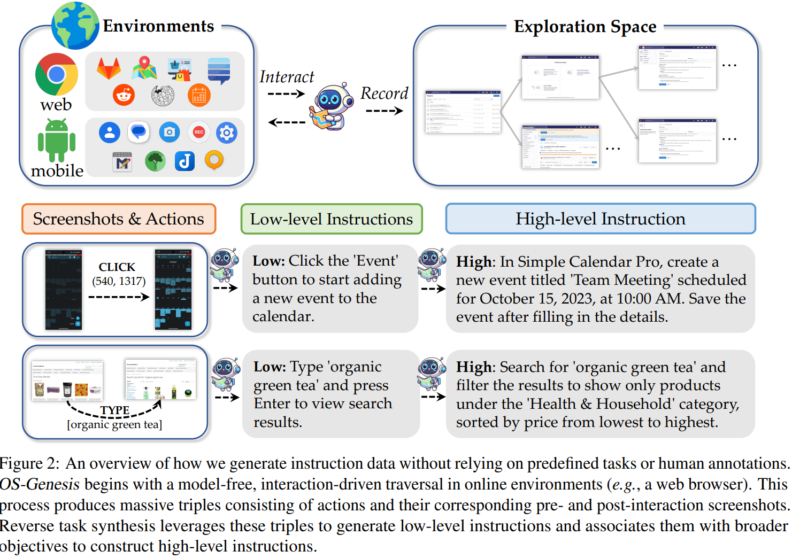
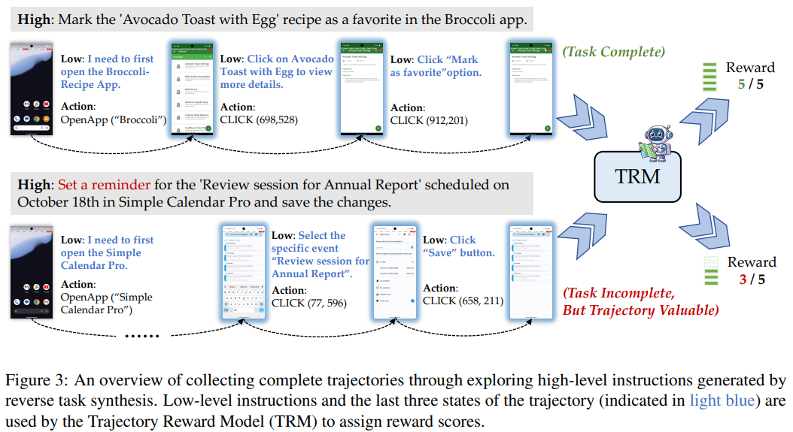
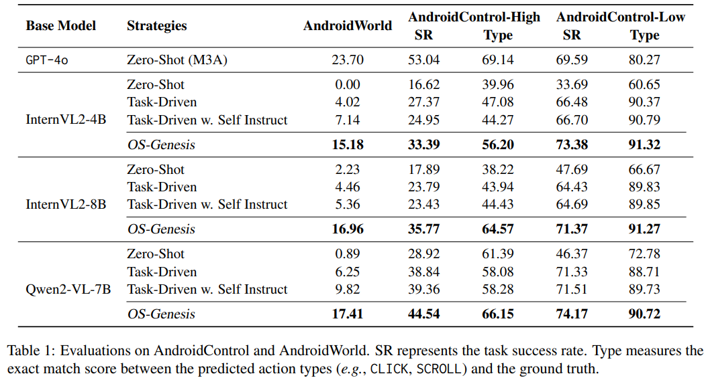

# OS-Genesis: Automating GUI Agent Trajectory Construction via Reverse Task Synthesis

> https://aclanthology.org/2025.acl-long.277/

理想的GUI代理轨迹包含以下关键组成部分：

1. 一个高级指令，定义了代理旨在实现的整体目标
2. 一系列低级指令，每一条描述所需的具体步骤
3. 动作（例如，点击、输入）
4. 状态，包括视觉表示，如截图和文本表示，如allytree

收集此类轨迹远非易事。现有的任务驱动方法依赖于人类或机器执行预定义的任务，面临以下限制：人工收集需要注释者标记整个轨迹并手动预定义高级任务，这既费钱又费工。基于模型的合成也面临关键挑战：

1. 它严重依赖预定义的高级任务，这不仅限制了合成数据的可扩展性，还约束了其多样性
2. 它难以确保数据质量，因为中间步骤中的错误或任务目标不匹配可能导致轨迹不完整或不连贯

OS-Genesis，一个无需人类监督或预定义任务的管道，用于合成高质量和多样化的GUI代理轨迹。OS-Genesis首先通过遍历带有动作（例如，点击）的交互式UI元素来探索GUI环境的功能。这构成了逆向任务合成的基础，其中观察到的状态和行动被回溯性地转换为低级指令。然后将这些低级指令衍生为高级指令，这些指令可以用于收集GUI轨迹。通过揭示相当多的功能，逆向任务合成促进了有意义且可执行任务的创建。此外，它自然地弥合了抽象指令与GUI动态特性之间的差距。一旦合成任务被转换为轨迹，我们引入了一个奖励模型以确保数据质量和有效利用。

## 方法

OS-Genesis始于在动态环境E=（移动、网络等）中进行无人探索，通过动作*a*∈A={点击、输入、滚动}系统地遍历交互元素。为了构建移动和网络代理，这一过程在安卓模拟器和谷歌浏览器中进行。这在一定程度上反映了人类与GUI的交互，无需预先定义任务即可揭示潜在功能。

> 模拟器基于Webarena和Androidworld
>
> 我们的反向任务合成过程模拟人类在未知图形用户界面环境中探索新任务的方式。在对随机元素执行操作后，人类通过观察屏幕上的变化来推断可能的后续动作，从而继续探索以构建执行特定任务的完整轨迹。在我们的反向任务合成中，我们会向 GPT-4o 提供当前正在执行的动作、屏幕变化的前后截图，以及在截图中用红色边框突出显示的交互元素。这使得 GPT-4o 首先理解正在执行的动作，然后基于观察到的屏幕变化关联可能的高级任务。

整个探索阶段基于规则进行，除了在与输入字段交互时，此时会调用GPT-4o生成上下文恰当的内容。在此阶段结束时，大量收集三元组⟨*s*pre,*a*,*s*post⟩，其中*s*pre和*s*post分别表示动作前和动作后的状态（即动作前后界面的截图），a表示执行的动作。

之后，OS-Genesis利用收集到的三元组来构建有意义的任务指令。这个过程涉及使用注释模型（例如，GPT-4o）生成低级任务，随后将其转换为高级任务。标注模型 M 将每个三元组转换为一个特定的低级任务指令

在合成低级任务的基础上，OS-Genesis 通过将每个低级任务与可能合理涵盖它的更广泛目标关联起来构建高级任务。这一过程由标注模型 M 执行，通过利用上下文信息和领域知识将各个低级步骤映射到高级任务。

> 低级任务指令代表一个原子级的、可执行的由动作 a 引起的观察到的状态转换操作。例如，如果动作 `a=点击显示一个下拉菜单`，相应的任务可能是“点击下拉以显示选项”。标注模型整合了视觉、上下文和行动语义
>
> 高级任务表示一个以目标为导向的指令，它将低级操作置于更大的用户意图背景之中。例如，一个像“点击下拉菜单以显示选项”这样的低级任务可能与“配置应用程序设置”这样的高级任务相关联，因为下拉交互通常是此类配置的先决条件。

经过这一逆向任务合成过程后，OS-Genesis 生成了一组多样化的与动态环境相符且语义丰富的高级指令，这些合成指令在环境中由类似 GPT-4o 的模型执行，生成一整套轨迹

在使用高级指令探索和生成轨迹时可能会出现错误或不完整的步骤。为了解决这个问题，我们引入了一个轨迹奖励模型（TRM），以确保由OS-Genesis合成的轨迹的质量和实用性，如图3所示。以往的方法通常依赖于标注器函数，它们会直接丢弃被认为不完整的轨迹。然而，不完整的轨迹通常包含对GUI环境的宝贵探索。鉴于它们在数据中占比较大，丢弃它们会浪费提升模型代理能力的关键机会。因此，不同于二元评估，我们利用轨迹的特性。TRM建立在GPT-4o之上，旨在执行分级评估，并给出一个奖励分数*R*∈[1,5]，以协助训练采样。奖励建模关注以下特征：

- 完成度：衡量轨迹成功完成指导任务的程度，考虑完整性及对互动的正确处理
- 连贯性：评估轨迹是否按照逻辑顺序采取行动以实现高级任务，避免冗余或不相关的步骤

> 轨迹奖励模型（TRM）主要通过关注完成度和连贯性来评估代理轨迹的质量。根据一个高级指令来完成，代理的全部动作历史（例如，低级指令），以及最后三个时间步的截图，GPT-4o被提示为轨迹分配一个1到5分之间的分数。与指令和上下文学习（孙等人，2023a）不同，我们在提示中包含了要考虑的具体连贯性和完成度方面，以及对每个1到5分的分数代表什么的详细描述。鉴于移动任务和网页任务的相似性，我们将相同的TRM应用于两者

## 实验

对于移动任务，我们选择了AndroidControl以及Android-World。主要使用GPT-4o进行逆向任务合成和奖励建模。至于用于构建代理的核心模型，我们考虑了（1）InternVL2-4B/8B，该模型在无GUI数据的情况下进行训练；以及（2）Qwen2-VL-7B-Instruc，该模型声称具备某些代理能力以进行彻底和比较实验。

基于 VLM 使用轨迹数据训练GUI代理本质上是一个 SFT 过程。尽管如此，我们设计了两个训练目标来最大化合成轨迹的效用，分别是预测低级指令 ℓ 和相应的动作a

基线包括零样本、任务驱动（常见的代理数据合成方法）、Self-Instruction 。经过轨迹训练后，代理将生成ReAct风格的输出，其逐步思考过程记录在历史中。为了确保公平比较，任务驱动基线和OS-Genesis都使用1000条轨迹进行训练，而Self-Instruction 基线则使用1.5k，平均轨迹长度为6.4步

在AndroidControl涵盖的833款应用程序中，仅有20款在数据合成过程中直接遇到，这使得此次评估成为对OS-Genesis系统异常分布（OOD）性能的测试。在低级设置中，代理将遵循人类指令，只需确定下一步；在高级别设置中，代理需要自主规划和执行动作以完成给定任务。

- OS-Genesis在各种骨干网络上一致提高了动作和计划能力
- OS-Genesis对未见过的异常情况（OOD）的泛化能力强
- 随着轨迹数量的增加，任务表现通常会有所提升，而在较大的数据规模下会出现饱和现象
- OS-Genesis显著缩小了合成轨迹与人类注释轨迹之间的性能差距

## 限制

我们在注释过程中利用GPT-4o进行探索和奖励建模。我们没有用开源的对应组件替换这一过程的原因是现有的开源VLMs缺乏遵循用户指令和在在线环境中主动完成探索的能力。我们相信未来会有更强大的行动模型来弥合这一差距，并取代这一流程中的专有组件。

在这项工作中，我们采用文本和视觉表示来训练和评估我们的GUI代理。这旨在（1）在语义丰富的环境中最大化代理的计划和行动能力，（2）确保不同环境中的评估一致性。我们意识到，单独使用文本或视觉数据也可以有助于构建GUI代理，前提是对输入输出格式和训练策略进行适当的调整。我们将部分使用完整轨迹数据作为未来的工作方向。

我们采用基于模型的方法来构建轨迹，从而无需人工注释。然而，这也导致成功构建的轨迹数量在一定程度上受到任务执行模型能力的限制。我们期待未来具有GUI能力的更高级VLMs能解决这一问题。