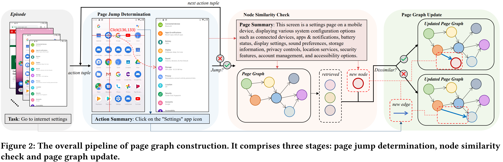
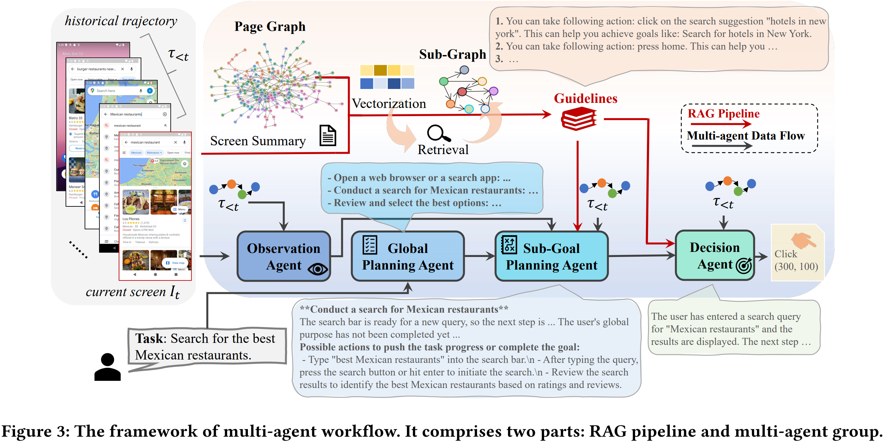
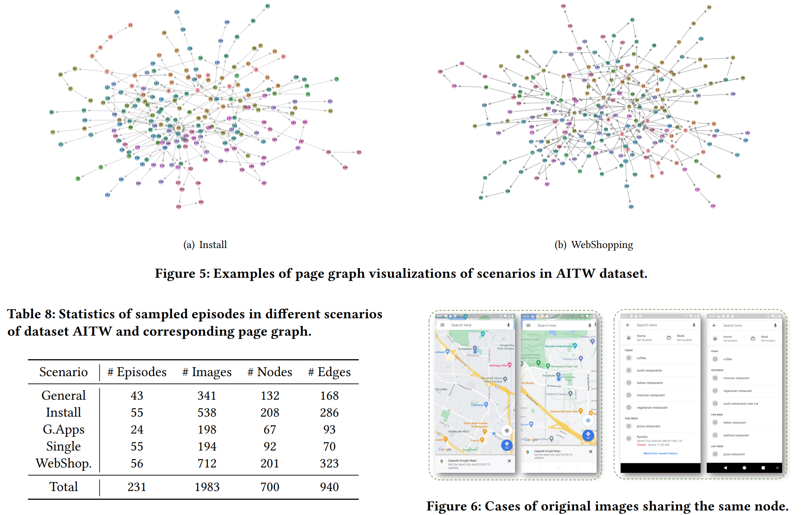

# PG-Agent: An Agent Powered by Page Graph

> https://arxiv.org/abs/2509.03536v1

GUI代理必须具备对可能执行的操作及其后续页面的感知能力。然而，现有研究通常将其视为独立的实体。

> 例如，在GUI上执行涉及跨不同页面的多步骤操作序列的导航任务，其中每一步都为该任务提供了关键的语义和功能。

这种线性知识限制了智能体主要关注连续的步骤，从而缺乏对同时可能导向其他页面的操作的感知能力。结果，页面之间的语义关联信息未能被充分整合到模型中，这使得模型在执行复杂任务时面临重大挑战，尤其是在处理新任务时尤为明显。

在部署阶段，单一的顺序式体验很可能无法直接指导智能体完成任务；而通过多个体验片段之间的转换关系，却能提供更多关于潜在动作及其对应结果的线索，这就自然引出一个核心问题：“如何显式建模页面间的语义关系，并提升GUI智能体在全新场景下的感知能力？”

GUI屏幕的页面天然构成了一个由操作连接而成的页面图，而序列化的情节本质上正是在这个图上进行路径采样的过程。受这一概念的启发，我们可以将序列化的情节重新构建为页面图，从而更全面地理解页面间的跳转关系，而非像离散的情节那样仅呈现零散的页面连接方式。

在页面图中，任意一条遍历路径均可被视为对原始独立知识项的有效重组。同时，当智能体处于某个节点时，它能够轻松地从出边获取可能的操作，并感知后续页面，以辅助导航流程。

此外，为了将页面图作为先验知识用于智能体规划，检索增强生成（RAG）技术能够在无需任何参数调整的情况下高效利用这一信息，使智能体仅通过切换页面图即可灵活适应不同场景。通过这种方式，RAG还能从页面图中显式地检索出图结构化的信息，从而更精准地理解页面间的语义转换关系。更为重要的是，RAG在页面图中的探索过程实际上是一个在任务片段中对真实动作进行访问与整合的过程，能够为智能体提供可靠且真实的可能动作集合，作为决策指导。此前的研究已成功应用RAG来检索诸如小部件功能描述[16]或类似任务中的参考轨迹[45]等指导信息，但这些信息通常以离散形式呈现，缺乏上下文关联性。

为应对上述挑战，我们提出了一套自动化流程，用于将顺序式操作片段转换为页面图结构，该流程包括三个阶段：页面跳转判定、节点相似性检查以及页面图更新。

为了从页面图中高效检索并充分利用相关指导信息，我们还设计了一个基于多智能体架构的PG-Agent系统，并结合定制化的RAG技术对其进行增强。具体而言，我们首先利用当前屏幕的摘要信息，在页面图中定位与之相似的节点，随后通过广度优先搜索（BFS）遍历可用的操作选项，最终生成如“执行… 一些操作可能导致实现一些任务“

## 方法

### 页面图构建

显然，网站或应用程序中的页面及其链接构成了一个图结构；而完成导航任务的一次会话，实际上就对应于该图中的一条行走路径。因此，在特定的GUI场景下，由于相关网站或应用的范围有限，我们能够**基于已有的会话信息，构建出相应的页面图**，以作为未来在此场景中进行导航的指导依据。我们的整个流程完全依赖于视觉线索，无需借助页面的DOM或HTML架构等额外模态输入。页面图构建的整体流程如图2所示，包括三个主要阶段：

1. 页面跳转判定。对每一个三元组（前截图，动作，后截图），判断是否跳转了。
2. 节点相似性检查。 如果结果为“yes"，这意味着此操作成功导向了不同页面。接下来，我们从语义和像素两个层面展开了相似性检查
3. 页面图更新。如果为相似节点，那么新建边，否则新建节点和边

### 多智能体工作流

代理框架的工作流程可被形式化为一个马尔可夫决策过程（MDP）。先前的研究在warper范式下，长文本内容会对模型的推理性能构成挑战，导致模型面临“中途迷失”的风险。在本节中，我们采用了一种多智能体工作流，每个智能体接收不同的输入内容，并仅执行特定任务，从而有效缓解了模型的上下文处理压力，使其能够将更多精力投入到任务推理阶段。

我们的多智能体工作流如图3所示，主要由两个关键部分组成：（1）RAG管道，它根据屏幕状态从页面图中检索出有用的指导信息；（2）多智能体小组：这些智能体各司其职，包括全局规划智能体、观察智能体、子任务规划智能体以及决策智能体。

pipeline 为：

1. 指南检索。 引导多模态大模型分析当前屏幕并生成一个屏幕状态描述，向量化处理并检索最相似的模板。并用 BFS 收集已经被探索的边。我们将动作队列与可实现任务相结合，作为指导原则。
2. 规划智能体。用于将复杂任务分解为相对简单且抽象的子任务。通过这种方式，指导原则能够激励智能体专注于完成当前的子任务。
3. 观测智能体。观察屏幕，并提供有用的视觉线索，同时给出高层次的抽象功能描述。在此阶段，我们引入了历史交互记录。 
4. 子任务规划智能体。从全局计划中选择一个与当前屏幕状态相匹配的子任务，详细描述了当前的任务建议，并生成了一份候选操作列表
5. 决策代理。最终选择在当前屏幕状态下要执行的具体动作

## 实验

基准数据集。 我们基于GUI智能体数据集对PG-Agent进行了测试：Android in the Wild (AITW) [32]、Mind2Web [8]，以及GUI Odyssey [22]。并从中采样部分 episode 构建 graph

模型。 在本文中，我们采用BGE-M3[3]作为向量化模型，并使用FAISS技术进行相似性检索。此外，考虑到Qwen2.5-VL-72B在理解GUI界面方面的强大能力，我们将其用作基础多模态大模型（MLLM）。

- 对于 AITW，智能体在具备先验知识的场景中能够提升执行精度。对于单一场景下的错误案例，我们发现这些任务片段的长度较短，且任务本应结束的步骤存在模糊性——即我们的智能体倾向于继续执行某些动作，以彻底完成任务。
- 从页面图中提取的指导原则为智能体提供了针对陌生场景的洞察，并确实提升了导航过程中规划与执行环节的效率
- 对于公开可用的数据集（例如AITW、Mind2Web和GUI Odyssey），虽然已拥有丰富的剧集数据，足以用于构建页面图，但实际收集这些数据仍需投入大量成本。因此，在之前的评估中，我们仅采样了少量剧集来构建图结构，以此验证了我们框架的实用性。
- 而采用完整剧集的PG-Agent在特定场景下表现更优，而随机采样的版本依然能保持相当不错的准确率。这一结果表明，即便可供参考的剧集数量有限，基于这些剧集构建的页面图仍能为PG-Agent提供有效的指导。