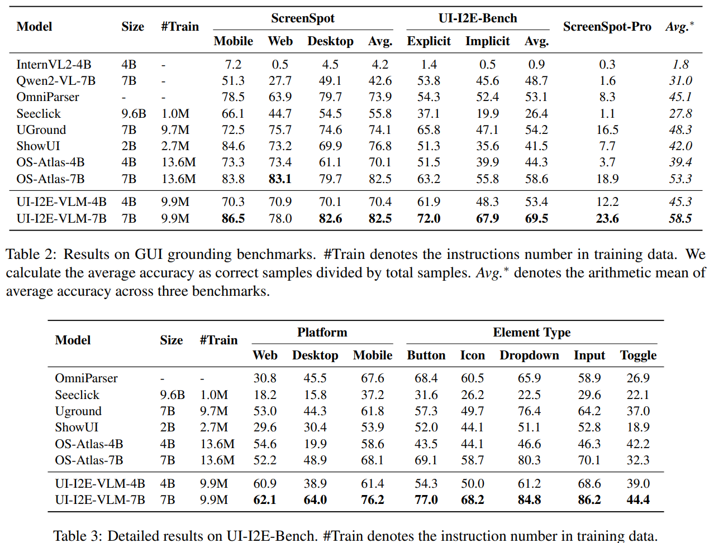

# UI-E2I-Synth: Advancing GUI Grounding with Large-Scale Instruction Synthesis

> https://aclanthology.org/2025.findings-acl.809/

对于 GUI，现有的基准与复杂多样的GUI定位环境之间仍有较大差距：

1. 元素与屏幕比例：GUI指令定位需要比自然场景物体定位更高的分辨率和更小的元素。虽然先前的研究已经讨论了训练数据集中的截图分辨率，但我们认为关键因素是元素与屏幕的比例，即元素相对于截图的大小。这个比例受到分辨率和UI缩放级别的影响。
2. 不平衡的元素类型：不同的GUI元素类型表现出多样的外观和交互设计，其出现的频率也不同。例如，文本按钮代表最常见的类别，而复选框则相对较少见。与通常通过其文本标签明确传达功能的文本按钮不同，复选框通常依赖于周围元素来定义其用途。这种区别在先前的研究中尚未得到充分解决
3. 隐式指令：在GUI指令定位的背景下，用户可以根据他们的操作能力或位置传达指令，导致与截图上可见文本缺乏直接对应，我们将其称为“隐式指令”。隐性指令挑战了视觉语言模型（VLMs）的理解和推理能力

我们引入了一个大规模指令基础数据合成流程，称为“元素到指令合成”，简称UI-E2I-Synth。该流程利用GPT-4o而非人类注释者来合成不同复杂度的真实用户指令，这与之前工作中整理的元素指代表达式不同。根据分而治之的原则，UI-E2I-Synth将基础指令合成分解为三个子任务，并逐步执行。

1. 我们从不同来源收集不同分辨率的截图元数据对，然后使用启发式图形用户界面元数据解析器提取可靠的元素属性。
2. 利用这些高质量属性来减轻幻觉现象，同时提示显性和隐性指代表达式由GPT-4o生成。
3. 再次使用GPT-4o通过生成特定动作参数来模拟用户行为。这些动作参数随后与REs结合以合成最终的真实用户指令。

我们引入了一个新的基准测试UI-I2E-Bench，其中包括通过我们的合成流程和人类注释者的组合精心策划的详细注释。我们应用所提出的UI-E2I-Synth来收集一个包含990万个指令的综合GUI基础数据集。然后，我们遵循OS-Atlas（Wu等人，2024年）的方法，在策划的数据集上微调两个不同的预训练视觉语言模型，并对其进行了评估。

## 方法

UI-E2I-Synth包括三个关键步骤：原始数据收集与解析、指代表达式生成和指令合成。这些步骤按顺序执行，每个步骤旨在解决特定的挑战：提取可靠的元素属性以减轻幻觉，生成显性和隐性的指代表达式以增加指令难度，以及通过模拟用户动作来合成指令。

### 原始数据收集与解析

我们主要将流程应用于三个平台，包括网络、Windows和安卓，以派生此训练数据集。为了统一不同平台元数据中的元素表示，我们构建了相应的启发式元素解析器，仅提取三个关键属性，包括元素类型、元素内容和元素边界框。对于元素类型，我们分析不同元数据格式中的UI元素表示，并将它们归类为五种主要元素类型：

- 文本：带有明确文本的按钮元素。
- 输入字段：需要用户输入或内容编辑的元素。
- 下拉菜单：通过从提供的选项中选择来允许用户输入的按钮。
- 图标：通过图像表示功能的图形按钮。
- 开关：双态元素，如复选框、单选按钮和开关。

GUI基础数据并不需要对单个截图中的每个元素进行完美解析。相反，我们的目标是从大规模截图元数据对中提取足够准确的元素属性。有了这个目标，我们构建了启发式元数据解析器，其中包含启发式规则，只保留高精度而忽略召回率。

### 指示表达式生成

指示表达式生成步骤旨在使现有的大型视觉语言模型能够生成既可靠又难度不同的表达式。元素指示表达式（REs）表示来自特定视角的元素描述，该描述独立于用户操作。

> 对于大型视觉语言模型来说，从头开始生成元素及其描述可能具有挑战性，因为他们通常在高分辨率图像下难以生成准确的坐标，并且容易出现幻觉。一种生成元素RE（参考实体）的简单方法是使用标记集合（杨等人，2023年）来为每个标记的元素添加说明文字。然而，这种方法也往往导致严重的幻觉。为了解决这个问题，我们提出了一种增强属性的RE生成方式。

我们提供一份包含从前一步骤获得的元素类型和元素内容的列表，并以标记集合的截图作为背景。然后，我们利用GPT-4o作为大型视觉语言模型（Large VLM），首先生成一段完整的描述，解释每个元素的功能以及与之交互时预期的结果。接下来，提示GPT-4o生成两种类型的RE：显式RE和隐式RE。

我们将显式RE定义为直接指代元素的明显特征，而隐式RE则是通过描述元素的语义功能或其与附近元素的关系来指代元素，从而避免使用显而易见的可见特征。生成的显式和隐式RE共同构成了元素RE池，这为最终步骤提供了用户操作对象。

### 指令合成

所获得的指代表达仅仅是关于元素的描述，省略了用户在过程中的角色。用户指令蕴含了用户的意图，这种意图可能与元素直接或间接相关。当直接要求生成用户指令时，我们观察到大型视觉语言模型倾向于从助手角色生成一般性的指令，例如“在输入框中填写您的详细信息”或“点击检查您的个人资料”，即使我们要求它以计算机用户的第一人称视角来生成。这种现象可能是因为在大视觉语言模型（Large VLM）中，输出信息角色被设置为“辅助者”，防止其轻易模拟用户角色。

因此，我们在这里提出一种参数化方式来生成用户指令。

- 我们将所需指令分解为用户动作类型、用户动作内容和元素对象三个参数。
- 使用提示来指导GPT-4o模拟用户与当前应用程序的交互，通过生成特定的用户动作和内容。
- 结合之前的元素指代表达式作为元素对象，进一步指导GPT-4o用所有这些动作参数合成最终指令。
- 为了保持生成指令的多样性，同时使用显式和隐式的元素指代表达式来创建不同的用户指令。

为此，整个合成流程的输出格式化为<截图，用户指令，元素坐标>。通过这个流程，我们合成大规模的基础指令数据来训练一个模型，以展示我们的进步。

我们在多个平台上采用我们的UI-E2I-Synth流程构建了UI-I2E-Bench。我们对每个元素类型进行了均衡采样并筛选，最终的UI-I2E-Bench，其中包括来自网页、Windows和安卓的1477条定位指令

## 实验

不同的平台产生不同的元数据格式，例如Web的DOM、Windows的UIA以及Android的VH：

- 网页是主要的数据源，主要是Common Crawl，我们首先从流量最高的前50万个域中提取每个域的三个网页。接下来，我们过滤掉非英文和错误状态的网页，最终得到724,839个网页。这些网页在七个不同的分辨率下重新渲染，其中一个为移动设备分辨率，用于模拟移动场景，其余六个为桌面横屏分辨率。
- 对于Windows平台，我们选取了90款Windows应用程序，共收集了15,000个截图元数据对。具体来说，我们从给定应用程序的初始界面开始，从元数据中解析出可点击按钮，并点击这些按钮以过渡到该应用程序中的其他界面。所有过程都在一个虚拟机下进行，该虚拟机不涉及任何个人信息，并且所有相应的用户界面辅助数据都被记录下来。
- 对于移动平台，我们利用AndroidControl训练集中现有的元数据-截图对。

然后我们对所有收集到的截图元数据对运行UI-E2I-Synth流程，以派生我们的合成数据集。结合现有的移动GUI数据集MOTIF（伯恩斯等人，2022年）和用于定位目的的Widget-Caption（李等人，2020年），我们最终的培训数据集包括160万张截图和950万条指令。

遵循OS-Atlas，我们将InternVL2-4B和Qwen2-VL-7B视为我们的基础模型。Qwen2-VL-7B的预训练数据包含了GUI截图，而InternVL2则没有。两个模型都支持多分辨率图像处理。我们将这两个模型命名为UI-I2E-VLM-4B和UI-I2E-VLM-7B

在多个GUI定位基准测试中比较了UI-I2E-VLM与OmniParser（陆等人，2024年）、SeeClick（程等人，2024b年）、UGround（苟等人，2024年）、ShowUI（林等人）以及OS-Atlas

- UI-I2E-VLM-7B在所有基准测试中都取得了卓越的性能，超越了之前最先进的模型OS-Atlas-7B，平均性能提高了9.7%
- grouding 精度随着元素尺寸比的减小而下降，这突显了强调较小元素和高分辨率图像的基准测试的重要性。得益于我们的训练数据和更多的输入图像标记，UI-I2E-VLM在小元素方面取得了更好的性能
- 图标和输入字段类型的性能有显著差距，这表明先前的工作大多忽略了这些长尾类别。它支持我们在策划训练数据集时使用相对平衡的元素类型分布
- 图5展示了UI-I2E-VLM在UI-I2E-Bench上的常见错误，包括：（1）由于知识有限而无法识别无文字的图标，（2）行或列内元素位置放置不正确，（3）对空间关系的误解，（4）对层次关系的误解，以及（5）误分类元素类型，例如将复选框与相邻文本混淆。

## 未来工作

基于UI-I2E-VLM在UI-I2E-Bench上的常见错误

- **空间理解**一直是百万语言模型（MLMs）面临的挑战之一。模型通常更擅长检测图像中是否存在物体，但在识别其数量和位置方面存在困难。我们认为，通过在训练期间添加与数量和空间关系相关的指令数据，可以缓解这一问题。
- **元素类型误分类**。在UI环境中，不同元素类型的交互区域自然变化。通常，大规模训练数据包含具有相同内容但不同类型元素，某些类型的元素在数量上占主导（例如，文本）。因此，模型更可能假定元素属于这些主导类型，导致对其交互区域的错误判断。
- **缺乏外部知识**。虽然通过扩大训练数据的范围可以解决一些常见问题，但需要注意的是，在训练数据中涵盖来自各种专业软件的所有图标是具有挑战性的。我们认为，对于特定软件，为其图标创建解释性文档，并将其作为模型的上下文参考，可能是未来的一种潜在解决方案。
- **用户界面层次误解**。大多数当前的基础模型直接输出边界框，缺乏对用户界面层次结构的分析和推理过程。实际上，在处理需要页面语义理解的定位任务时，模型有时需要进行多步推理。以图5中任务4为例，模型首先需要定位登录模块，然后识别电子邮件输入字段。一个潜在的缓解策略是使用CoT推理。

