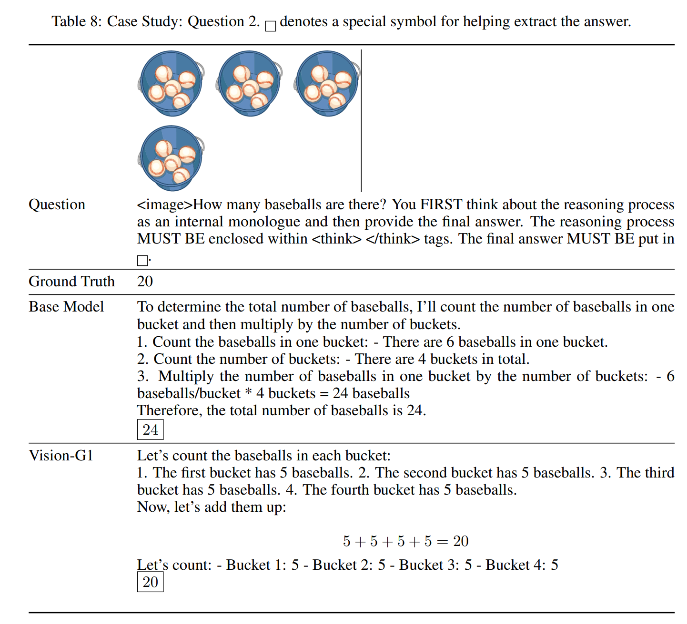

# Vision-G1: Towards General Vision Language Reasoning with Multi-Domain Data Curation

> https://arxiv.org/abs/2508.12680

提出了一种使用可验证奖励进行强化学习的视觉语言模型训练流程，旨在提升其在一般领域的推理能力。为了将其推理能力推广到更广泛的领域，我们构建了一个大型的准备用于强化学习的训练数据集。对于每个数据源，我们过滤掉答案不可验证的实例（例如，开放式问题），仅保留那些具有数值、多选选项、是/否答案或其他单字真实答案的实例。

我们提出了一种基于影响函数的数据过滤方法，旨在从强化学习训练数据中移除无用的实例。

为了进一步提高从过滤后的多源数据集中获得的推理能力，我们为多轮 RL 训练开发了一种数据课程策略。具体来说，我们从上一轮训练中的 VLM 中抽取展开（rollout）样本，并通过计算平均展开准确度来估计实例级别的难度。然后选择与当前VLM的能力相匹配的适度难度的实例进行下一轮训练。我们迭代地应用数据选择和RL训练，逐步提升我们的Vision-G1的一般推理能力。

## 方法

利用影响函数过滤高质量样本，然后进行多轮强化学习

来自不同来源的数据通常以异构格式出现，我们从每个数据集中提取问题、图像和真实标注。无法验证的实例将被过滤掉。建立了一个类别分类体系，使用一个VLM（即Qwen2.5VL-32B-Instruct），对收集到的数据集中的所有实例进行分类

我们首先使用影响函数来估计不同数据领域之间的影响。样例 z 对另一个样例 z' 的影响可以通过计算它们梯度的相似度来估计
$$
\mathrm{I}\left(z, z^{\prime}\right)\propto\operatorname{Sim}(\nabla l(z,\theta),\nabla l\left(z^{\prime},\theta\right))
$$
其中 $$l$$ 表示交叉熵损失函数。具体来说，我们通过模拟训练数据集中实例间的影响来构建强化学习影响估计函数。对于数据集中的一个实例z：
$$
I(z)=\frac{1}{\left|\mathcal{D}_{\text{dom }(z)}\right|} \sum_{z^{\prime} \in \mathcal{D}_{\text{dom }(z)}} I\left(z, z^{\prime}\right)+\frac{1}{\left|\mathcal{D} \setminus \mathcal{D}_{\text{dom }(z)}\right|} \sum_{z^{\prime} \in \mathcal{D} \setminus \mathcal{D}_{\text{dom }(z)}} I\left(z, z^{\prime}\right)\\
\mathcal{D}_{\operatorname{dom}(z)}:=\left\{z^{\prime}\in\mathcal{D}\mid\operatorname{dom}\left(z^{\prime}\right)=\operatorname{dom}(z)\right\}
$$
其中，D 是完整数据集，*dom*(*z*) 是 *z* 的领域标签（例如，信息图表推理）

为了降低计算梯度的成本，我们通过在训练数据的一个子集上使用拒绝采样从基础视觉语言模型获得的高质量推理链，对LoRA模块进行微调。为了估计训练集中实例的影响

1. 首先从基础视觉语言模型中抽取展开结果，并使用计算LoRA参数的梯度。
2. 进行随机投影以获取低维特征，并使用余弦相似度来估计每个实例的影响
3. 最后，我们过滤掉影响较小的实例，并确保剩余每个维度的实例均匀分布。

极其简单或极其困难的数据实例在 GRPO 中导致零优势，因此对训练没有贡献。在我们的初步实验中，我们还发现，即使对于那些产生非零优势的实例，它们的贡献要么微不足道（对于简单实例），要么有害（对于困难实例）。具体来说，我们观察到对于困难的样本，模型的“正确”展开仍然是错误的。由于基于规则的奖励模型只验证最终结果，无法评估中间步骤，而我们的观察通常是错误的。因此，我们根据数据实例相对于训练模型的难度来过滤数据。具体来说，对于每个实例，我们使用上一轮训练的检查点进行k次展开并计算平均准确率。我们仅保留那些平均准确率在0.2到0.8（含）之间的实例用于强化学习训练。

在多轮训练过程中，我们迭代上述基于难度的数据过滤和模型训练，直到收敛。在每一轮中，我们利用上一轮的检查点来估计未训练数据的难度，然后选择适度困难的样本进行训练。对于强化学习训练，我们采用组相对策略优化（GRPO）算法[35]，并在奖励分数和验证集结果收敛时停止训练。

## 实验

在应用基于影响函数的过滤以移除低质量数据项后，最终训练集包含4万个问题。我们使用高效的框架verl来实现GRPO算法。我们用Qwen2.5-VL-7B-Instruct初始化模型权重，并对其进行两轮训练。我们冻结了视觉编码器，只调整Qwen2.5-VL的语言模型部分

我们结合使用开源工具math-verify和标准化精确字符串匹配来比较真实情况和模型预测的答案。奖励分数范围是[0.0,1.0]。在评估期间，我们使用贪婪解码为基准测试中的每个问题生成单个响应。准确性的计算方法训练时使用的相同答案匹配协议，除非另有说明，否则模型性能报告为Pass@1。

在一系列全面的视觉推理基准上评估我们的模型。关于 baseline，包括Qwen2.5-VL-7B、Ovis-8B、MiniCPM-V2.6、Llava-OV和LLaVA-Next 。在所有上述模型中，Qwen2.5-VL-7B通常表现最佳。此外还考虑了在训练过程中结合了 RL 的以推理为导向的VLMs，即MM-Eureka-7B、Vision-R1-7B、ThinkLite-VL-7B、以及VL-Rethinker-7B。还报告了几个最先进的大型视觉语言模型和闭源产品的结果作为参考，即GPT-4o、Claude-3.5-Sonnet、Gemini-1.5-Flash、Gemini-1.5-Pro、Qwen2.5-VL-72B、InternVL2.5-78B和InternVL3-78B

- 通过强化学习训练的7B规模视觉语言模型显著优于基础模型
- 从数学数据中获得的能力可以推广到其他领域——尤其是信息图表和跨图像推理——尽管并非所有目标之间的迁移都是通用的
- 没有特定领域数据集的变化在MathVista上可以实现更好的性能，但在大多数特定领域的数据集上性能会大幅下降。这进一步证明了添加多种特定领域的训练数据集对于视觉语言模型发展一般推理能力是重要的
- 多轮强化学习训练程序，结合影响感知过滤和基于难度的选择，产生了一个稳定的训练轨迹，能力稳步提升

## 限制

- 未来研究应更多地开展与感知相关的任务和基准测试实验
- 实验主要在Qwen2.5-7B-Instruct上进行，未对其他更大规模的视觉语言模型进行测试
- 应进行更多关于其他先进强化学习算法的实验，例如DAPO。在本文中，由于计算资源的限制，我们仅测试了最受欢迎的强化学习算法GRPO的有效性。

