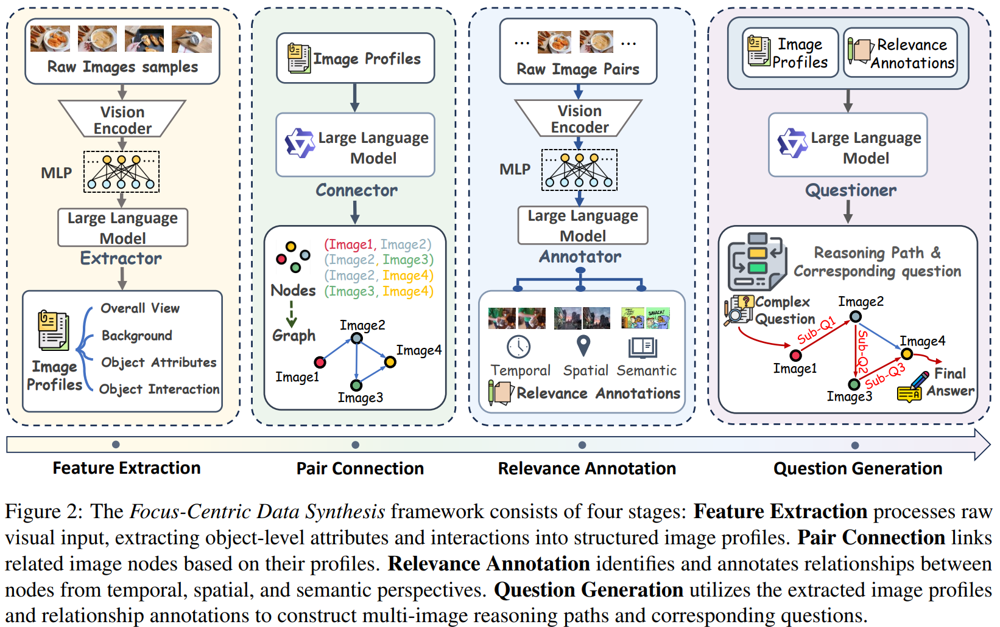

# Weaving Context Across Images: Improving Vision-Language Models through Focus-Centric Visual Chains

> https://aclanthology.org/2025.acl-long.1347/

前的视觉语言模型在这些场景下表现出显著的退化：（1）跨图像相关性：图像通常多样化相关，需要全面理解它们的上下文关系。（2）视觉不连续性：图像间信息的碎片化使得准确把握跨图像关系变得具有挑战性。

利用多模态模型直接生成推理链或从更强大的模型中提炼数据的方法存在两个主要限制：（1）可靠性不足，即使是最先进的闭源模型（例如GPT-4o）在多图像任务上表现不一致；以及（2）成本过高，闭源模型的高昂成本严重限制了扩展性。

为了应对这些挑战，我们提出了以焦点为中心的视觉链，这是一种逐步关注关键信息的多图像推理范式。在此过程中，VLM 将复杂任务分解为一系列子过程，每个子过程涉及解决一个聚焦于局部视觉输入的子问题。这一过程允许模型迭代地汇总必要的视觉证据，由子问题指导，最终解决复杂任务。

## 方法

给定一个图像集合和一个初始问题 Q，模型 M 通过多步推理逐步构建一个推理链 R。

1. 在第i步推理时，模型M生成一个中间子问题 q ，并通过识别其对应的焦点，即一个最小化的视觉信息子集 G
2. 随后，模型通过对 q 和 G 的联合分析得出中间答案 a
3. 根据现有的答案集 A，模型决定是否扩展推理路径并输出一个停止信号
   1. 停止时，从当前的问答集合中合成最终答案 A 并终止推理
   2. 否则，它会迭代地重新关注不同的视觉信息。

因此，整体推理过程 R 可以表示为一个有序序列： $$\mathcal{R}=\left[\left(q_{i}, G_{i},a_{i},z_{i}\right)\right]_{i=1}^{N}$$

为了以数据驱动的方式实现上述推理范式，我们提出了以焦点为中心的数据生成（FCDS），包括四个系统设计的模块

1. 特征提取：为每个图像构建全面的文本档案，这些档案作为后续过程中的节点；
2. 成对连接：通过面向对象和面向事件的检测识别相关图像对，形成不同节点之间的边；
3. 相关性标注：将检测到的连接分类为三种预定义类型（时间、空间和语义）并详细说明它们；
4. 问题生成：基于建立的跨图像网络生成逻辑链条的子问题，最终综合出最终的复合问题和推理路径。

按照自下而上的方式，合成过程从**特征提取**开始，为每个图像 I 构建一个详细的档案，其中包括四个核心元素：(1) I的整体视图；(2) 背景描述；(3) 对象属性和(4) 对象互动。每个生成的配置文件都被视为推理路径中的一个节点。由 LLM 和 prompt 给出

由于任意节点之间的连接可能缺乏语义有效性，我们只在具有潜在相关性的节点之间建立边。我们提出了两个标准来确定节点的相关性：（1）面向对象，即图像共享共现的对象，（2）面向事件，即图像描述共享或相关的事件。给定图像集G的配置文件集合P，实现了一个大型语言模型连接器来识别有效的**成对连接**，将具有潜在的关联的图像节点联系起来

**相关性标注**。为了系统地表征节点间相关性，我们将其分为三类：时间性、空间性和语义性，由 LLM 和 prompt 给出，具体如下：

- 时间性：成对的图像描述了一个时间顺序序列，其中一个在时间上明显先于另一个。
- 空间性：成对图像中的视觉元素展现出几何和位置相关性，形成空间连续性或进展。
- 语义性：成对的图像展现出无法直接视觉对应的抽象联系，包含主题、逻辑和因果关系。值得注意的是，这一类别适应了超越直接视觉对应的抽象联系。
- 值得注意的是，在一对实体中可能同时存在多种关系类型。

**问题生成**。通过采样K个相互连接节点的顺序链来构建推理路径。对于这条路径上的每一对相连的图像，我们基于它们的注释关系和相应的图像特征生成有针对性的子问题，由 LLM 和 prompt 给出

采用LLaVA-OneVision-7B作为提取器和注释器的基础模型，而Qwen2.5-7B-Instruct则作为连接器和提问者基础模型。通过我们精心设计的框架，构建了VISC-150K高质量数据集，该数据集包含遵循以焦点为中心视觉链范式的150K多图像推理数据实例。图像资源从可公开访问的网站收集，包括具有多样化场景和漫画的真实世界照片。

## 实验

LLaVA-OneVision-7B和Qwen2-VL-7B-Instruct都在VISC-150k上进行LoRA（胡等人，2022年）微调一个周期，批量大小为8。学习率设置为1e-5，预热比率为0.05，并采用余弦调度器。最大上下文长度设置为32,768。在进行评估时，温度设置为0，最大新标记数为1,024。对于Qwen2-VL-7B，图像分辨率被裁剪到128×28×28到1280×28×28之间，以减少内存消耗并提高推理速度。

- 在七个全面的多图像基准测试上评估了我们的方法，基线包括开源和闭源的VLM
- 我们的方法在四个基准测试上建立了新的最先进结果：MMIU、MIRB、BLINK和NLVR2。这些改进可以归因于三个关键特征：（1）视觉信息的丰富性，（2）图像间关系的多样性，以及（3）任务表述的复杂性。这些特征与我们方法在视觉感知、理解和推理方面的增强能力很好地契合。
- 关于数据量，0-25K数据规模观察到的性能飞跃归因于一个能力激活过程，即模型通过在新范式下学习推理数据来解锁更强的多图像潜力。后续较平稳上升
- 在MuirBench的所有十二个子任务中，只有四个没有显示出实质性改进。这些任务面临双重约束，即（1）视觉语言架构的内在限制和（2）基础语言模型的能力限制。例如，场景理解所需的3D空间推理和卡通理解至关重要的微妙语义解释。
- 为了研究输入图像数量对我们方法的影响，在处理3-8张图片时，以及11-14张图片时效果较好
- 不会牺牲一般任务表现为代价
- 三名具有计算机视觉和自然语言处理专长的博士学生进行严格的质量评估，质量高

## 限制

- 以焦点为中心的数据合成框架需要在图像之间进行成对的相关性注释，导致计算复杂度呈二次方增长。我们维持中等大小的图像集以平衡数据多样性和计算效率。
- 数据集主要关注现实世界的照片和漫画。该方法在结构化视觉内容（如图表、图表和代码片段）上的有效性尚未得到测试，这些内容可能需要不同的推理模式。
- 前实现受到语言模型固有能力的限制。因此，我们的方法继承了它们在管理复杂空间动态、领域专属上下文以及依赖专业知识视觉细微差别方面的局限性。
