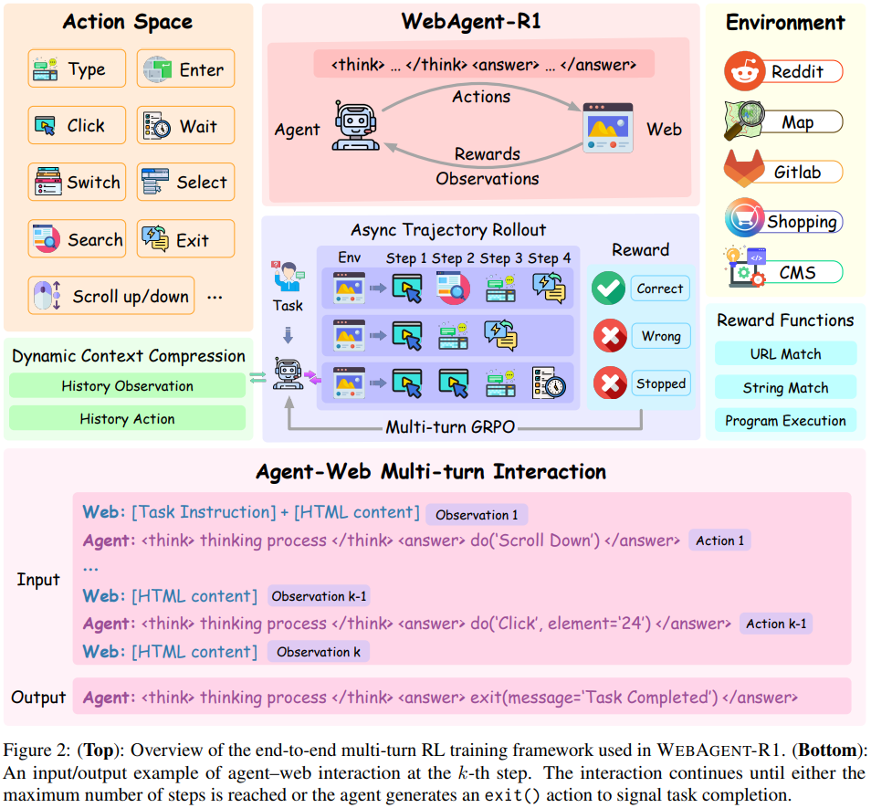
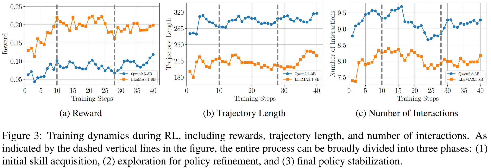

# WebAgent-R1: Training Web Agents via End-to-End Multi-Turn Reinforcement Learning

> https://arxiv.org/abs/2505.16421

与静态环境不同，网络任务因其动态特性和多样的解决方案空间而为LLMs代理带来独特的挑战。早期关于网络代理的工作主要依赖于提示方法或行为克隆（BC），后者通过监督微调模仿演示轨迹。尽管这些方法最初取得了成功，但它们缺乏探索多样化策略或从试错中学习的能力，这限制了网络代理的泛化能力。

最近的研究探讨了应用强化学习（RL）以更好地进行策略训练。然而，这一系列研究大多严重依赖于离线或迭代非策略RL解决方案，这些方案打破了网络代理与环境之间的端到端交互，并引入了额外的复杂性

与在由旧版本代理生成的数据上训练的非策略RL不同，带策略RL直接从代理当前的行为中收集训练数据。这确保了学习过程更好地与代理的最新行动保持一致，通常会带来更稳定和有效的学习，并使得代理能够根据它自己过去的决策自适应地行为——在交互式环境中这是一个关键优势，因为早期决策可能会显著影响接下来的步骤

> 这些好处在在线网络环境中特别受欢迎，由于环境的动态变化，这些环境中的任务通常涉及复杂的相互作用。例如，考虑一个情况，代理首先被要求登出一个用户账户，然后编辑该用户的个人资料。这些任务是固有相互依赖的：一旦代理登出，它就失去了访问个人资料页面的权限。如果代理使用从早期版本收集的未登录过的策略外数据进行训练，它将没有机会学习登录行为，可能会错误地假设持续访问并生成无效动作，最终导致任务失败。端到端强化学习有助于避免此类陷阱，它允许代理即时响应环境状态变化学习适当的行为。

现有的强化学习（RL）解决方案并不适合多轮场景。受到群体相对策略优化（GRPO）的启发，在WEBAGENT-R1中，我们将其扩展到多轮设置（M-GRPO），并采用异步轨迹展开策略，通过并行生成多条轨迹来进一步提高训练效率。

这些设计使得高效的RL训练成为可能，并在WebArena-Lite基准测试上取得了最先进的表现，如图1所示。广泛的消融实验进一步验证了我们的关键设计选择，揭示了一种有效的Web任务测试时扩展策略，并为基于RL的Web代理训练中行为克隆和长上下文推理的作用提供了见解。

## 方法

将网络任务表述为一个部分可观测马尔可夫决策过程（POMDP），由元组 (S,A,T,R) 定义。在每个时间步骤t，代理首先从环境 E 观察到一个状态 s∈S，表示为当前网页的纯文本HTML内容。然后，它从一个预定义的动作空间 A 生成一个动作 a，其中包括常用的网页操作。环境动态从s和a生成下一个s。代理与环境进行交互，直到任务成功完成或达到最大步数。最后，代理从奖励函数R接收到一个二进制结果奖励r

> 我们采用WebArena作为网络环境，而不是其他模拟或静态环境，如WebShop或Mind2Web，以增强实用性——它为网络代理提供了一个现实的、可自托管的环境，并配有基于规则的评分标准，该标准自动检查最终状态中的成功指标（例如，确认消息或页面上的预期内容）。
>
> 请注意，一些先前的工作结合了网页截图作为额外的视觉输入，而我们的工作仅专注于基于HTML的文本决策。其他努力，探索了优化动作空间或提示设计，而不进行模型微调。这些方向与我们研究的问题正交，并可以作为未来工作与我们方法在概念上整合。

### Behavior Cloning

为了初始化网络代理，我们首先使用固定数据集的专家演示 $$\mathcal{D}=\{(h_t,a_t)\}$$应用行为克隆（BC），其中*h*表示截至时间步t的完整交互历史。策略 *πθ* 通过监督微调（SFT）进行训练，以模仿基于此历史条件的专家行动：
$$
\mathcal{L}_{\mathrm{BC}}=-\mathbb{E}_{\left(h_{t}, a_{t}\right) \sim \mathcal{D}}\left[\log \pi_{\theta}\left(a_{t} \mid h_{t}\right)\right]
$$
这个热身阶段使代理能够习得在动作空间中定义的基本网络互动技能，为后续的强化学习优化提供了关键基础。

### 端到端强化学习

我们的方法够以在策略更新实现端到端强化学习的同时，避免诸如维护重放缓冲区和无需外部监督等额外复杂性。

我们的端到端多轮强化学习框架通过由基于规则的结果奖励指导的在线互动来训练网络代理。为了实现高效且可扩展的训练，我们实施了两种关键机制：动态上下文压缩以减少内存开销，以及异步轨迹展开以提高采样效率。

基于BC训练的策略，我们进一步使用GRPO（齐等人，2025年）的多轮设置扩展，称为M-GRPO，对代理进行微调。我们的实现可以被视为一种极简方法，支持高效的多轮强化学习训练，同时保持通用性，具有未来扩展的潜力（例如，结合细粒度奖励塑造机制用于中间步骤）。

**动态上下文压缩**

在网页任务中，每个观察通常包含数千个标记。经过多轮互动，累积的上下文迅速增长，导致过度使用内存和潜在的内存不足问题，使得训练不切实际。为解决这一问题，动态上下文压缩策略当新的观察到来时，简化早期观察以减少上下文长度，同时保留完整的动作历史。

设步骤t的互动历史为 $$h_{t}=\left(s_{1}^{\prime}, a_{1},s_{2}^{\prime}, a_{2},\ldots, s_{t}\right)$$ ，其中每个s'是代表先前观察的简化模板。当代理执行一个动作时，它会收到一个新的观测值 s_t+1，更新的历史记录变为 $$h_{t+1}=\left(s_{1}^{\prime}, a_{1},s_{2}^{\prime}, a_{2},\ldots, s_t',a_t, s_{t+1}\right)$$ ，其中 *st* 被其简化版本 *s*t′ 替代。这使得代理能够保持一个简洁而富有信息的过往交互上下文。由于上下文是动态演化的，我们还相应地更新损失掩码，以确保在 M-GRPO 优化过程中仅在动作令牌上正确计算损失。

**多轮 GRPO**

受到 GRPO 的启发，我们将它的标准形式扩展到多轮强化学习设置，并引入多轮组相对策略优化（M-GRPO）。具体来说，对于每个任务 q，我们首先采样一组轨迹 {*τ*1,*τ*2,⋯,*τG*}，然后通过最小化以下损失来优化策略模型 *πθ*：
$$
\mathcal{L}_{\text{M-GRPO}}(\theta)=-\frac{1}{G} \sum_{i=1}^{G} \frac{1}{\left|\tau_{i}\right|} \sum_{j=1}^{\left|\tau_{i}\right|} \left( \frac{1}{\left|a_{i, j}\right|} \sum_{t=1}^{\left|a_{i, j}\right|} \left[ \tilde{A}_{i, j, t} - \beta \mathbb{D}_{\text{KL}}(\theta) \right] \right)
$$

- $$\tau_{i}=\left\{a_{i,1}, a_{i,2},\cdots, a_{i,\left|\tau_{i}\right|}\right\}$$ 是第 i 条轨迹中生成的动作序列
- $$\tilde{A}_{i, j, t}=\min\left\{r_{i, j,t}(\theta) A_{i,j},\operatorname{clip}(r_{i,j,t}(\theta),1-\epsilon,1+\epsilon) A_{i,j}\right\}$$ 是第 i 条轨迹中第 j 个的第 t 个令牌的优势
- $$r_{i,j,t}(\theta)=\frac{\pi_{\theta}\left(a_{i, j,t}\mid q,a_{i,j,<t}\right)}{\pi_{\text{old}}\left(a_{i, j,t}\mid q,a_{i,j,<t}\right)}$$表示重要性抽样项
- $$A_{i,j}=\frac{r_{i}-\operatorname{mean}(\boldsymbol{r})}{\operatorname{std}(\boldsymbol{r})}$$ 是组相对优势，使用一组由基于规则的奖励函数产生的奖励 $$r=\{r_1,r_2,...,r_G\}$$ 计算得出

**异步轨迹展开**

生成一组轨迹需要与环境进行重复交互，可能会非常耗时。为了解决这个问题，我们引入了一种异步展开策略，在此策略中，会实例化多个独立的浏览器实例 {E_1,E_2,…,E_G}，每个实例都维护其自己的上下文（例如 cookies），所有实例都以相同的起始页面初始化，但代理独立地与它们互动，从而产生多样化的历史和轨迹。这种异步设计使得在M-GRPO中能够高效地生成轨迹。

**奖励设计** 

我们使用网络环境中的默认基于规则的奖励函数，这些函数根据特定任务标准（例如，达到目标页面）分配二进制奖励（成功则r=1，否则r=0）。这消除了对结果奖励模型的需求，确保了一个简单且具有泛化能力的训练设置。

## 实验

按照Qi等人（2025年）的方法，我们使用公开的9,460条轨迹进行行为克隆，并采用WebArena-Lite，即经过人工验证的WebArena版本，用于更可靠的评估。具体来说，我们使用165个经过验证的任务进行评估，以及647个剩余任务用于强化学习训练。任务成功率是根据内置的基于规则的评分标准计算得出的。

对于提示基线，我们提供了与开源和专有模型的全面比较，包括通用模型（例如，Qwen2.5、Llama3.1、GPT-4）和推理专用模型（例如，QwQ、OpenAI o3（OpenAI，2025年）），涵盖各种模型大小。对于微调方法，我们采用Qwen2.5-3B和Llama3.1-8B作为骨干模型。

我们使用Qwen2.5-3B和Llama3.1-8B作为骨干模型来实现我们的方法。默认情况下，对于提示和微调方法，我们都使用指令调整过的版本。强化学习（RL）初始化策略是从通过行为克隆获得的有监督微调（SFT）检查点派生的。由于WebRL利用额外的GPT-4生成数据来训练Llama3。1-8B，我们通过使用他们公开发布的检查点初始化我们的强化学习（RL）策略，并仅使用原始的647个训练任务进行端到端的强化学习，不引入任何额外数据，以确保公平比较。

- 一个用简单行为克隆训练的微调3B模型成功率为20%，超过了专有模型如GPT-4o。我们推测，现成模型表现不佳并非因为基础模型的大小或能力，而是因为对HTML结构和网络特定行为的理解不足。
- 与通用大型语言模型相比，配备了显式思考能力的模型在网络任务上的表现显著更高
- 强化学习使网络代理的性能更强。虽然通过SFT的行为克隆可以显著提高大型语言模型作为网络代理的性能（例如，将Qwen2.5-3B从6.1%提升至20%），但在SFT训练的策略上应用强化学习会带来额外的实质性提升（例如，将Qwen2.5-3B从20%进一步提升至33.9%）。我们将这些改进归因于强化学习优化长期决策的能力，以及通过在动态网络互动中进行试错来探索SFT数据中未见过的策略。

- 强化学习中常见的三阶段学习动态
  - 初始技能获取：奖励迅速增加，表明代理快速学习基本技能并在较简单的任务上开始取得成功；轨迹长度急剧增加；代理变得更加主动，交互轮数增加
  - 探索以改进策略：奖励增长趋于平稳并略有波动，这表明代理正在探索不同策略并完善其策略；轨迹长度稳定；着它学会更高效地互动，交互次数减少
  - 最终策略稳定：奖励再次逐渐提升，表明进行了开发并提高了稳定性；轨迹长度适度的增加；交互次数稳定下来，表明向更一致和有效的互动策略收敛
- 引入了变体WEBAGENT-R1-ZERO以研究行为克隆对网络代理的影响，效果差，由于缺乏对网络任务的知识，因为模型倾向于产生不完整或格式不当的动作（例如，缺少必需参数），并且在强化学习期间很少获得正面奖励。这严重阻碍了有效的探索和学习的进行，突显出行为克隆对于初始化网络代理以及实现后续成功的强化学习是必不可少的
- 引入了变体WEBAGENT-R1-COT，以研究长时CoT对网络代理的影响，表现更好。我们首先通过使用强大的推理模型生成长时CoT轨迹来增强行为克隆（BC）数据，然后应用SFT得到一个长时CoT的SFT模型（即强化学习前的WEBAGENT-R1-COT变体）。与在标准BC数据上训练的SFT模型相比，长时CoT SFT模型实现了更高的任务成功率（24.5%对比20%），证明了长时CoT推理对网络代理的有效性。但是强化学习的收益有限。我们假设这是因为长时对话BC期间学到的确定性推理模式可能在强化学习期间限制了模型的探索空间，使其发现新策略的能力与具有更灵活探索行为的标准SFT模型相比受限。
- 使用思考格式进行提示可以释放大型语言模型作为网络代理的潜力。
- 通过增加交互次数在测试时进行扩展，可以提高网络任务的性能

