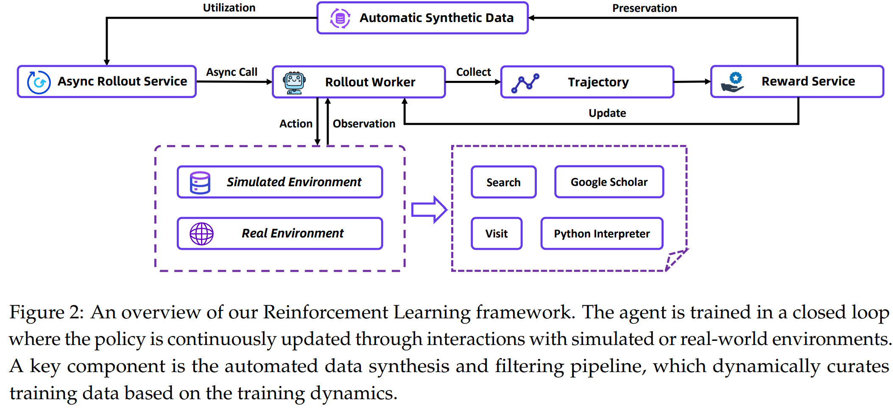

# WebSailor-V2: Bridging the Chasm to Proprietary Agents via Synthetic Data and Scalable Reinforcement Learning

> https://arxiv.org/abs/2509.13305

开发强大智能体的挑战包括数据与训练。

**数据方面**：现有数据缺乏足够的多样性，且对不确定性的定义较为单一。信息获取依赖于智能体利用已有信息及逻辑关系，进而推导或主动获取可靠新知识的能力。然而，如果训练数据中缺乏足够广泛且复杂的逻辑结构，模型将难以泛化到新颖而复杂的问题上。目前的方法大多局限于少数几种不确定性定义，例如模糊处理。事实上，为了激发基础模型更丰富、更高级的推理能力，使其更好地应对现实科研中固有的模糊性，亟需引入更多样化的不确定性类型。 

**训练方面**：缺乏可扩展的强化学习（RL）训练环境。构建一个高效、稳健的RL训练环境，对于智能体系统而言是一项重大挑战——这通常需要大规模部署，每次部署可能涉及大量工具调用。然而，同时向外部API发起高并发请求的成本极高，且技术实现极为复杂，容易引发工具延迟、API故障以及输出不一致等实际问题。这些问题不仅会污染训练数据，削弱模型所学策略，还会严重阻碍我们快速迭代强化学习训练算法的步伐

在本文中，我们介绍了用于开发强大深度研究智能体的开源解决方案：一套完整的训练后处理流程，涵盖从数据构建到监督微调（SFT）及强化学习（RL）的各个环节。 

在数据方面，我们推出了SailorFog-QA-V2

- 这是一个基于SailorFog-QA升级打造的增强版数据集。该数据集在知识图谱构建与采样策略上实现了显著优化，突破了传统方法的局限，确保更全面的结构覆盖
- 同时，我们还通过引入更多样化的不确定性定义，超越了简单的混淆方式，直接满足了对复杂推理能力的更高需求，进一步提升了问答生成任务的多样性。 

在训练层面，我们从两个角度着手解决构建可扩展且稳健的强化学习平台的需求。

- 首先，我们从零开始自主研发了一个专用的模拟环境，该环境依托大规模离线维基百科知识库构建而成。这一环境专为高频算法实验和数据整理而设计，具备成本低廉、运行极速且完全可控的优势。通过精心的架构设计，它能够高度还原真实场景中的智能体交互动态、状态转换机制以及奖励反馈模式，确保训练效果与实际应用环境高度一致
- 其次，考虑到在真实环境中开展强化学习训练是一项复杂的工程挑战——尤其是工具集扩展后工具返回结果的一致性问题、轨迹采样的可重复性，以及对高并发性和容错性的严苛要求——我们采用系统化的方法管理相关工具链，从而有效保障平台的稳定性和可靠性。 
- 最后，我们的数据构建与强化学习训练流程被整合进一个共生式的反馈闭环中。这种动态机制使系统能够根据训练过程中的表现，自动筛选并提炼出高质量数据，帮助模型不断优化策略，并持续从海量相关信息中汲取经验。正是数据与策略之间的协同进化，推动了深度研究型智能体的构建更加高效、精准。

## 框架

Agent 基于 ReAct 框架，因为它的简洁性，以及利用可扩展计算能力的通用方法，最终将超越依赖复杂的人工知识和精妙设计的传统方法。与此同时，那些需要大量、专门提示工程或具备僵化运行结构的框架，随着模型自身能力的不断提升，反而可能逐渐被淘汰

我们的实现无需预设复杂计划，也无需任何提示设计。一个包含T次迭代的完整轨迹可定义为：思考、行动和观察的序列。

行动空间由四种主要工具组成：

- 搜索功能用于访问谷歌搜索引擎，以获取信息。搜索的参数是用户输入的查询词。它支持同时搜索多个查询，并为每个查询返回前10条结果。每条结果包含标题、摘要以及对应的网址。
- · 访问用于获取特定的网页内容。输入包括多个网页及其对应的访问目标，每个页面都设有专门的目标。首先，我们使用Jina来提取网页的完整内容，随后由摘要模型根据目标提取相关信息。在本工作中，我们选用Qwen3-30B-A3B作为摘要模型。
- “谷歌学术”指使用Google Scholar进行检索
- “Python解释器”则会调用沙盒环境，以执行智能体生成的代码。

此外还有“最终答案”这一终端动作。当智能体判断已收集到足够信息后，便会执行“最终答案”动作，从而结束这一迭代过程。

## SailorFog-QA-V2

本节重点介绍SailorFog-QA-v2的数据构建过程，我们将详细介绍如何构建一个包含真实互联网信息的密集知识图谱，以及如何基于这一数据结构生成问答（QA）对。

信息检索问题的核心，可以被理解为在一个由众多实体及其相互关系构成的复杂网络中进行导航。为了有效解决这类问题，尤其是在先进AI智能体执行“深度研究”的背景下，模型必须深刻理解并充分利用这些潜在的结构化关联。因此，为确保我们生成的问答对能够涵盖丰富多样的逻辑关系，我们的基础方法是构建一个全面的知识图谱。这一图谱将作为坚实的基础，帮助我们从中灵活采样各种结构上各不相同的子图，每种子图都构成了生成问题的基础，用于检测不同的推理模式。

> 近期，面向网络智能体的数据构建技术也致力于获取此类结构化信息。这些方法通常从一个简单的“种子”问题入手，通过逐步引入外部工具（如搜索或浏览），不断扩展图谱，以发现相关实体和事实。然而，这种由“易到难”或迭代式扩展策略的一个显著缺陷是，它极易生成以树状或无环逻辑结构为主的内容。尽管这种方法在某些类型的信息检索任务中效果显著，但其固有局限性使其难以有效捕捉或生成现实中知识图谱中常见的复杂循环关系、反馈回路，以及错综复杂的相互依赖性场景。

基于SailorFog-QA的底层框架，V2依然以一个种子实体为起点，利用网络工具发现相关实体，并提取其对应信息。然而，为了实现更全面的拓扑覆盖，克服无环图的局限性，我们在图扩展阶段进行了重大优化与升级

- 我们主动寻找并建立节点间更为密集的连接，有意识地引入循环结构。这确保最终生成的图不再只是简单蔓延的树状结构，而是一个高度互联的复杂网络，更加精准地反映现实世界知识非线性的、错综复杂的本质。
- 除了结构上的改进，我们还进一步保留了更完整的流程信息，例如所使用的具体搜索查询，以及引导新发现的原始网页链接。同时，我们针对每个实体计算并存储了多种统计特征，这些特征对后续的问答生成环节至关重要，使我们能够设计出更具层次感和挑战性的提问。

在之前的版本中，我们的子图采样策略依赖于随机采样，并试图枚举固定边数的所有可能子结构。然而，随着V2版本中图的密度大幅增加，这种穷举式的枚举方法因组合爆炸而变得在计算上完全不可行。为了解决这一可扩展性问题，我们采用了一种基于随机游走的子图提取方法。最终，这一策略使我们能够高效地收集到足够数量的非同构（经由Weisfeiler-Leman算法验证）且连通的子图，这些子图共同涵盖了从简单到复杂的各种结构特征，而无需付出暴力搜索所带来的巨大成本。

在生成问答时，我们并不会直接将子图端到端地输入大语言模型以生成答案。相反，我们会首先分析给定拓扑结构中非同构节点的数量，从而确保QA的重点能够均匀分布于所有轨道节点上——即那些承担不同结构角色的节点。

此外，混淆已成为构建高难度信息检索任务时最常用的方法之一，它能有效引入不确定性，并激发模型进行高层次的推理模式。具体而言，混淆对应于当查询的关键要素——如特定实体、日期或数值——被替换为更笼统或模糊的描述时所需的推理行为。要回答这类问题，模型必须

- 超越简单的关键词匹配，转而依靠上下文推断，对未明确指代的实体进行消歧义；
- 同时，通过迭代式的信息收集，不断提出并验证假设；
- 最终，整合来自多个来源的证据，逐步逼近一个确定性的答案。

然而，尽管这些技能至关重要，它们实际上仅涵盖了真正超人类网络智能体所需能力的一小部分。为此，我们进一步引入了更多样化的明确不确定性，以期激发模型展现出更加丰富、全面的高级推理能力。

## 训练	

我们将介绍 post-training 的流程，包括SFT冷启动、模拟与真实RL环境，以及RL训练算法的详细内容。

### SFT 冷启动

我们的SFT数据集完全由基于SailorFog-QA-V2生成的合成数据构成。SFT所需的轨迹则通过开源模型生成，利用拒绝采样方法解决这些自动生成的问答任务。

> 值得一提的是，与最初的WebSailor不同，我们的智能体以Qwen3-30B-A3B-Thinking-2507作为基础模型，并将上下文长度大幅扩展至128K。

### RL 

在模拟环境中进行训练，再将已训练好的策略迁移到现实世界，或利用模拟环境验证算法，已被广泛应用于多个领域。然而，依赖真实的Web API，例如来自 SerpAPI或 Jina，会带来诸多实际挑战，包括高昂的成本、有限的每秒查询率（QPS），以及输出结果的不一致性。在开发初期，若直接在资源有限的现实环境中开展算法研究和数据整理工作，不仅会大幅拖慢开发周期，还可能导致消融实验得出不够可靠的结论。

为此，我们基于离线维基百科数据库及配套的Web工具，构建了一个模拟环境。为了向该环境中注入高质量、结构复杂的任务，我们对原有的 SailorFog-QA-V2 生成流程进行了优化，使其能够针对这一离线语料库运行，从而打造出一套专为模拟环境量身定制的训练与测试数据集。这一举措使我们能够在成本极低、速度快捷且完全可控的平台上，高频次地开展算法实验，显著加速了我们的开发与迭代进程。

但，最终目标仍是在真实世界中训练智能体。然而，这一过渡过程会带来一系列复杂的工程挑战。我们的智能体工具箱功能多样，集成了多种搜索来源、多样化的网页解析器（如readpage工具），以及代码执行沙箱。

这一复合系统的可靠性至关重要，因为外部API固有的不稳定性——包括延迟问题、彻底失效或返回结果不一致等——都可能干扰任务轨迹。这种数据污染会掩盖性能问题的真正根源，使得难以判断：究竟是算法本身存在缺陷，还是环境本身的波动性导致了次优表现。

为有效应对这些挑战，我们设计了一套统一的工具执行接口。该接口的核心是一个调度与管理层，负责协调各项工具的执行流程。针对每种工具，我们特别构建了强大的并发处理机制和故障容忍策略，例如QPS限制、结果缓存、自动超时重试机制，以及在非关键性故障时的服务降级措施，并支持无缝切换至备用数据源。通过这种多层次的设计，从智能体的角度来看，工具调用过程被抽象为一个确定性且稳定的接口，从而将训练循环与现实世界的随机性隔离开来，大幅降低运营成本。

关于**数据治理**，数据是提升模型能力的核心驱动力，其重要性甚至超过算法本身。数据的质量直接决定了模型通过自我探索实现跨分布场景泛化能力的上限。为应对这一挑战，我们以训练动态为导向，实时优化数据。这种优化通过一套全自动化的数据合成与筛选流水线来实现，能够动态调整训练集内容。通过构建数据生成与模型训练之间的闭环，这一方法不仅确保了训练过程的稳定性，还显著提升了模型性能。

我们的强化学习算法是GRPO的定制化改进版本。采用严格的在线策略训练方案，通过使用最新更新的策略持续采样轨迹，确保学习信号始终与模型当前的能力相匹配。

- 借鉴DeepSwe和DAPO的方法，我们以标记级别的策略梯度损失作为优化目标。
- 此外，为进一步降低优势估计中的方差，我们创新性地采用了“留一法”策略
- 同时，针对负样本，我们采取了较为保守的处理方式——经过观察发现，未经筛选的负向轨迹集会显著影响训练稳定性，甚至可能导致长时间训练后出现“格式崩溃”现象。为此，我们有针对性地将部分负样本排除在损失计算之外，例如那些因长度超出限制而未能生成最终答案的轨迹。
- 为了提升效率，我们并未采用动态采样机制，而是选择更大规模的批次和分组，从而有效控制方差，并为模型提供充分的监督信号。

然而，我们认为算法固然重要，但并非决定Agentic强化学习成功与否的唯一因素。我们已尝试过多种不同的算法和技巧，结果发现，**数据以及训练环境的稳定性，或许才是决定强化学习能否奏效的更关键要素**。有趣的是，我们曾直接在BrowseComp测试集上训练模型，但效果却明显逊于使用我们合成数据时的表现。我们推测，这种差异可能源于**合成数据具有更为一致的分布，从而让模型能够更精准地进行优化；而相比之下，由人类标注的数据（如BrowseComp）则存在更多不均衡性**。本质上更加嘈杂。由于其规模有限，难以近似出可学习的潜在分布，这进而阻碍了模型从中学习并实现泛化。

## 实验与结论

仅经过SFT微调后，我们的模型已展现出强大的能力，这一成绩甚至超越了许多完全训练过的开源智能体。这种强劲的初始策略并非单纯的中间检查点，而是强化学习成功的关键前提条件。这些任务具有高度复杂且开放式的特性，导致奖励信号往往非常稀疏。若没有SFT提供的出色初始策略，智能体将难以展开有意义的探索，几乎无法顺利完成任务，从而无法获得学习所需的正向反馈。因此，SFT阶段确保了智能体从一开始就具备足够稳健的策略，能够高效地探索问题空间，同时为强化学习算法提供密集且稳定的奖励信号，最终帮助其稳步收敛，打造出性能更优的最终策略。

仅次于 Gemini-2.5-pro-DeepResearch。我们认为，这一微小的性能差距并非源于研究能力的不足，而主要与我们的训练重点有关。我们的模型管线经过精心设计，旨在最大化代理的核心信息检索与整合能力，同时对最终报告生成的风格质量则未给予过多关注。因此，我们认为这种细微差异实际上反映出在最终呈现层面仍有提升空间，而非代理本身深度研究能力的根本局限。

随着训练步数的增加，训练奖励呈现出明显且显著的上升趋势，这表明智能体正在有效学习，并逐步优化其在训练分布中的策略。对于复杂任务，pass@1和pass@3指标均显示出明显且同步的提升，强化学习确实在拓展模型的基本问题解决能力，从而大幅提高了在少数几次尝试中找到正确解题路径的整体概率。

对于这类较为简单的问题，模型本身已较有可能找到解决方案，因此强化学习的主要贡献在于让这一初始尝试变得更加稳健。

在整个训练过程中，策略熵始终维持在较高水平，这表明智能体保持着强大的探索能力，有效避免了过早收敛到确定性策略。

> 这种行为与数学强化学习任务中观察到的趋势形成鲜明对比——在那些任务中，随着模型逐渐学会利用少数几种特定的解题路径，熵往往会显著下降。

我们的算法设计有意省略了任何显式的熵正则化或奖励机制，因为智能体本身已能自然地保持充分的探索。我们推测，这种持续的高熵状态正是环境非平稳性的直接结果。与封闭世界问题不同，网络工具（如搜索结果、网页内容）返回的观察值并不遵循固定分布。正是现实网络环境固有的随机性和复杂性，使得策略难以完全收敛到一种稳定、低熵的状态，反而有助于形成更加 robust 和适应性强的策略。

## 案例研究

文章展示了BrowseComp基准测试中的一个案例：在经过29个步骤的全面推理后，智能体成功识别出了正确的企业。这一案例充分体现了通过高效调用工具所实现的一系列高级推理模式。

1. 线索分解与结构化：在初始阶段，智能体将用户提出的非结构化、多维度查询分解为一组清晰、可验证且结构化的条件。这一基础性的分解过程对于通过将复杂问题拆解为可管理的子任务来解决问题至关重要。
2. 初步探索与策略调整：该智能体并未立即得出正确答案。其最初的搜索查询较为宽泛且具有探索性，例如“前员工集体诉讼和解金150万美元 2015年”。然而，这些搜索结果却返回了与麦当劳、联邦快递等公司相关但完全不相干的内容，显然过于笼统，无法与其他具体线索建立联系。这表明该智能体具备识别无效搜索路径并及时调整策略的能力。
3. 找到“黄金线索”：在最初几次尝试均未成功后，该代理意识到需要转向更具针对性的方法。它认为，最有效的策略是聚焦于那条最为独特且易于定位的信息——即领导层的变动。因此，它精心构建了一条极为精准的搜索查询：“创始人”“将担任”“董事长”“2008年”“第三季度”“有效”。这一查询专为特定时间段内的企业关键事件设计，大大提升了命中相关结果的概率。
4. 目标获取（突破）：这一精准的查询成功锁定了目标。搜索结果直接指向了FormFactor, Inc.发布的两则新闻稿，内容明确指出，公司创始人伊戈尔·坎德罗斯将出任执行董事长，而新任首席执行官将于2008财年第三季度初正式上任。至此，该代理已锁定一位极具潜力的候选人。
5. 系统性验证：确定候选人仅仅只是第一阶段。随后的步骤充分展示了该智能体严谨而有条理的核查能力。它并未过早下结论，而是针对FormFactor, Inc.，逐一系统地核实了每一条线索。这包括一系列有针对性的搜索与文件分析，以确认其公司注册信息、财务历史（客户集中度）以及法律诉讼情况。
6. 综合与最终回应：只有在每条线索都经过独立且无可辩驳的验证后，该特工才将所有证据整合起来。随后，他构建了一个条理清晰、逻辑严谨的最终答案，并附上了引用以及针对每个关键事实的资料来源摘要。

这个案例完美地展现了先进AI研究助手的核心能力。整个过程凸显了其战略适应能力，以及从初期失败中学习的能力——这些正是真正推理过程的标志，而非单纯依赖答案检索的机制。从问题分解、锁定关键切入点，到精准搜索与交叉验证，这一系列工作流程，无一不映射出人类专家所采用的复杂科研方法。