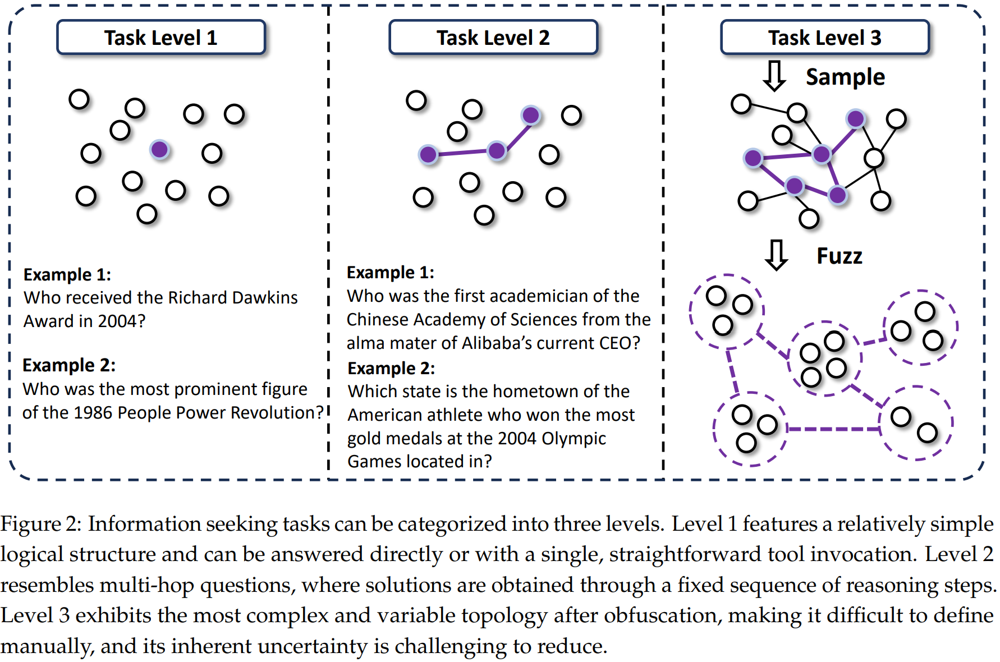

# WebSailor: Navigating Super-human Reasoning for Web Agent

> https://arxiv.org/abs/2507.02592

LLM在复杂的网络基准测试BrowseComp-en/zh上的超人表现源于复杂的推理——内部或工具介导的——系统地减少了不确定性。

然而，将这些高级推理能力灌输到开源代理中仍然是一个未解决的问题。现有的开源LLM和网络代理在BrowseComp-en上的准确率接近于零。这种明显的性能差距是因为当前的训练范式集中在我们分类为Level 1和2的任务上：不确定性低的问题（例如，单次搜索）或有明确、结构化解决方案路径的问题（例如，标准多跳QA）。这些数据集没有让模型接触到复杂基准测试中占主导地位的Level 3挑战——需要在没有预定义解决方案路径的复杂信息景观上进行稳健的组合泛化。因此，模型无法发展出导航它们所需的复杂、多步骤推理。 

为了激发这些超人类的推理模式，我们生成了具有高且难以降低的内在不确定性的训练数据。我们的主要机制涉及从通过在现实世界网站上进行随机游走而生成的相互连接的知识结构中采样子图。

> 从组合泛化角度来看，这些子图呈现了已知实体和关系的新颖组合，迫使模型对以前未见过的组合进行推理，并将其推向超越简单启发式方法的领域。这个过程生成了一系列复杂、涌现的结构，这些结构难以预先定义，迫使模型发展出可能超越既定人类模式的推理过程。 

我们进一步使用精心设计的信息混淆技术来放大任务难度，这直接增加了初始的模糊性。结构复杂性和信息模糊性的结合创造了需要异常复杂推理的任务。

> 例如，我们生成的一些问题非常具有挑战性，即使是像o3这样强大的专有模型也需要多达40次工具调用才能找到解决方案，这突显了所涉及的极端不确定性减少。 

在获得QA后，一个关键的挑战是获取全面的监督。但是：

- 虽然像QwQ和DeepSeek-R1这样的强大的开源大型推理模型可以解决一些复杂的QA问题，但它们的原生推理输出不适合直接进行微调。这些模型表现出高度风格化和冗长的思维过程，如果被模仿，可能会限制受训代理开发自己的灵活、探索性策略的能力。
- 此外，在需要几十个工具调用的长期网络任务中，它们冗长的推理链很快就会超出上下文窗口，导致性能下降和可读性差

为了解决这个问题，我们提出了一种新的方法：我们利用这些开源LRM生成成功的动作-观察轨迹，然后重建推理。通过推断每个步骤简洁、面向行动的想法，我们创建了一个干净、有效的监督信号，它捕捉了解决方案的逻辑，而不会继承与风格或冗长相关的缺点。 

在训练过程优化方面，尽管最近的研究建议跳过SFT，我们证明了对于导航如此复杂任务的网络代理来说，适度的拒绝采样微调（RFT）冷启动是不可或缺的。

- 一方面，这些场景的RL奖励非常稀疏，最初通常产生接近零的反馈。
- 另一方面，我们的方法并不严重依赖蒸馏；只需超过2k高质量的例子证明是有效的。

由于多轮推理和大量工具的使用，此类任务的代理RL训练非常缓慢。为了解决这个问题，我们提出了复制采样策略优化(DUPO)，它结合了两种动态采样策略——一种在训练前，另一种在训练中——以提高有效性和效率。 

## 背景

我们采用ReAct作为代理的框架。在接收到一个问题后，代理执行若干次思考-行动-观察的迭代。具体来说，在每次迭代中，基于现有的上下文，LLM生成一个思考并执行一个可解析的行动（工具调用），然后等待环境返回一个观察结果。

在WebTraverseX中，行动空间包括生成最终答案和两个工具，搜索和访问，

- 使用几个查询调用搜索引擎和通过URL访问几个网页以检索其内容。由搜索行动返回的观察结果包括每个搜索查询的10个标题、摘要及其对应的URL。
- 访问行动的观察结果是网页的摘要，根据LLM行动中指定的“目标”进行定制。

当LLM选择“最终答案”作为行动时，迭代终止。具有T次迭代的完整轨迹可以定义为(thought, action, and observation) 的序列

完成多跳问答通常只需要一到两轮的ReAct，因为每个步骤的动作都非常明确，不涉及太多的战略规划。相比之下，BrowseComp将代理浸入一个巨大的、无结构的信息空间，其中解决方案路径不是预先定义的。一种简单的、蛮力搜索在计算上是不可行的，可能需要数千次工具调用，这会淹没任何现代LLM的上下文窗口。

因此，成功的关键不在于遵循一个简单的脚本，而在于执行一个高度适应性的搜索策略。代理必须动态地综合部分信息，修剪没有希望的探索路径，并整合不同的事实以收敛到一个解决方案。将这个组合上庞大的搜索空间压缩成几十个步骤的可处理轨迹需要一个复杂的思想链。正是这种战略导航和综合的过程，体现了这项工作试图激发和建模的复杂、超人类的推理模式。  

回答问题所需的推理模式由其内在的不确定性和减少这种不确定性的复杂性决定。我们基于这两个维度将信息寻求型问答分类为的三个层次：

- 第1级任务表现出低不确定性，很容易减少。这些包括可以通过模型的内部知识或通过一次简单的网络搜索来回答的问题。 
- 第2级任务，如多跳问答，初始不确定性高，但遵循明确的解决路径。即使有很多步骤，实体也通过明确定义的逻辑联系在一起，允许通过结构化的行动序列系统地减少不确定性。 
- 第3级，我们工作的重点，涉及具有高度不确定性和高度难度的问题。在这里，实体以复杂、新兴的方式耦合在一起，缺乏预先定义的推理路径。解决这些问题需要创造性的探索和新颖的推理模式，这些模式很难手动指定。 

## 数据集构建

为了生成第3级任务，我们首先构建了一个复杂的信息 landscape，其中不确定性本质上难以减少。我们的过程受到随机游走的启发，构建了具有新兴非线性结构的知识图谱。通过子图采样和混淆生成高不确定性问题，以这些复杂的图形为基础，我们生成了具有高初始不确定性的问题。 

1. 我们从Wikidata的SPARQL服务中检索一个模糊实体作为种子来开始构建图谱，以确保一个具有挑战性的起点。
2. 通过模拟网络浏览，我们从互联网上收集关于这个实体的非结构化文本和特征。从这些原始信息中，我们提取相关的实体和连接它们的关系，形成初始节点和边。
3. 关键步骤是迭代扩展：我们概率性地选择现有节点，并寻找新的、不同的实体进行连接。这个随机过程阻止了简单的线性链（第2级任务的特征），而是促进了密集互联的图谱，具有复杂的、重叠的关系路径。
4. 最终的图谱作为缺乏预定义推理路径的问题的结构基础，迫使代理在复杂的信息网络中导航，而不是沿着直线前进。 
5. 通过采样具有不同拓扑结构的子图来实现，每个子图代表一组独特的耦合实体和关系
6. 然后我们根据子图提出一个问题和一个答案。关键的是，我们通过故意的信息模糊引入了不确定性。我们不直接呈现清晰的事实，而是在问题中模糊特征和关系。例如，一个精确的日期被转换成一个模糊的时期（“在2010年代初”），一个名字被部分掩盖（“由首字母为’F’的人创立的机构”），或者一个定量属性被定性描述（“市场份额小于1%”）。这种模糊直接增加了初始的不确定性，迫使代理进行推理、比较和综合信息，而不是简单地执行查找。

> 我们将我们的合成训练数据命名为SailorFog-QA，它有三个关键优势： 
>
> - 数据基于现实世界的互联网，反映了代理在实践中面临的挑战。 
> - 多样化的子图拓扑自然会产生需要一系列复杂推理模式的问题，从多步演绎到组合和比较分析。
> - 这种方法具有高度可扩展性，因为潜在子图的数量——以及因此产生的挑战性问题——会随着图形大小的增加而非线性增长，从而实现高效的大规模数据合成。 

在综合了复杂的问答对之后，下一个挑战是为冷启动监督生成相应的解决方案轨迹。

> 虽然像QwQ-32B 这样的强大的开源LRM可以提供一些正确的轨迹，但直接使用它们的全部输出进行微调是适得其反的。我们确定了两个关键问题： 
>
> - 风格污染：这些LRM在推理中具有强烈、通常冗长的风格先验。直接对这些输出进行微调可能会过于规定，抑制代理开发自己的探索策略和推广到未见过的问题的能力。
> - 上下文过载：他们推理链的冗长性是复杂网络代理任务的实际障碍。一个包含数十个工具调用的轨迹很容易生成超出上下文限制的历史记录，从而降低性能并使推理过程变得难以处理。 

过程如下：

1. 首先，我们提示一位专家开源LRM生成一个完整的解决方案轨迹，包括其原始想法。从这个完整的轨迹中，我们有选择地丢弃LRM的原始、冗长的想法，只保留成功的动作-观察序列。这个轨迹代表了解决方案路径的“什么”和“如何”，但不包括“为什么”。 
2. 接下来，我们重建缺失的“为什么”。对于动作轨迹中的每个步骤t，我们拥有到前一步为止的历史记录，以及专家选择的动作at和随后的观察ot。然后，我们提示一个独立的、强大的指令跟随模型，生成一个新的想法τ，作为采取动作at的简洁、逻辑的理由
3. 通过迭代地应用这个方法，我们合成了一个完整的、高质量的推理轨迹，包含（推理，动作，观察），其中推理是干净且目标导向的。对于这个重建，我们使用了另一个LLM，并强制执行“短-CoT”风格。这是一个关键的设计选择，确保最终的推理链足够紧凑，适用于长期任务。这种方法使我们能够可扩展地生成监督数据，灌输复杂的推理模式，而不会产生直接模仿的负面副作用。 

## 训练

### Rejection Sampling Fine-Tuning

过滤 我们对专家生成的轨迹应用了一个三阶段的过滤过程。

1. 首先，为了保证监督信号的正确性，我们进行拒绝采样，只保留最终答案正确的轨迹。
2. 其次，考虑到专家模型比我们的策略模型具有更出色的长上下文处理能力，我们丢弃任何长度超过32k个标记的轨迹
3. 最后，我们通过保留那些工具调用次数超过5次的轨迹来过滤任务复杂性，因为复杂的推理模式和有效的规划策略通常通过更长的一系列决策步骤来体现

这一阶段中，训练目标是具体提高代理的决策能力，即其生成有效思维和行动的能力。因此，与环境观察（oi）相对应的标记被从损失计算中屏蔽出来

### Duplicating Sampling Policy Optimization

在RFT冷启动阶段之后，该阶段为模型提供了基本的工具使用能力和对推理骨架的遵守，我们提出了复制采样策略优化（DUPO）来进一步完善推理能力，提高样本效率，并最终激发  它内在的潜力在于发现和内化超越直接模仿的复杂问题解决策略。 

代理的强化学习与传统推理任务的主要区别在于，rollout是一个涉及与环境（工具响应）交互的多轮过程。然而，与环境的交互导致代理强化学习的rollout速度比标准强化学习慢得多。

> DAPO采用动态采样来过滤掉完全正确或错误的rollout，然后用新的问答填充批次到其目标大小。虽然这对数据整理有效，但可能需要对同一批次中的不同情况进行顺序rollout。这种顺序处理进一步加剧了代理强化学习特有的缓慢训练速度。 

为了解决这个问题，我们首先在训练前过滤掉过于简单的情况（那些所有8个rollouts都正确的情况）。在训练过程中，我们不使用填充来扩展批次，而是复制同一批次中标准差非零的样本。与DAPO的动态采样相比，这种方法实现了大约2-3倍的速度提升。类似于SFT，在计算策略损失时也需要屏蔽观察值。我们遵循GPRO以组相对的方式估计优势。我们还利用了DAPO中的token级策略梯度损失和更高的剪切技术。

格式分数验证展开轨迹是否遵循预定义的格式，例如不同的内容段是否正确地用`<think>`和`<tool_call>`等标签包裹，以及序列是否符合ReAct框架。答案分数使用LLM作为裁判来确定最终预测是否正确。 