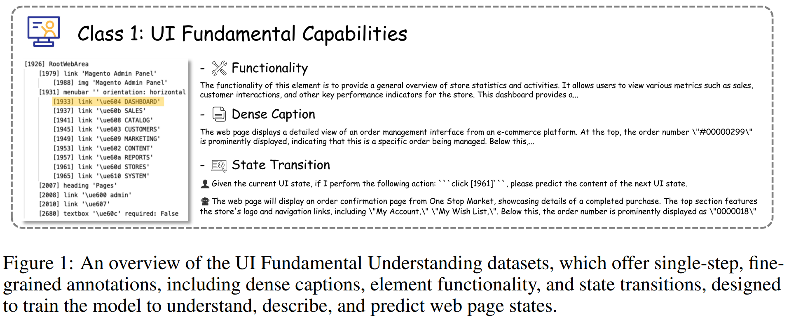
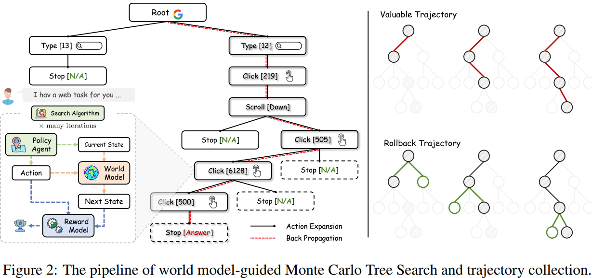
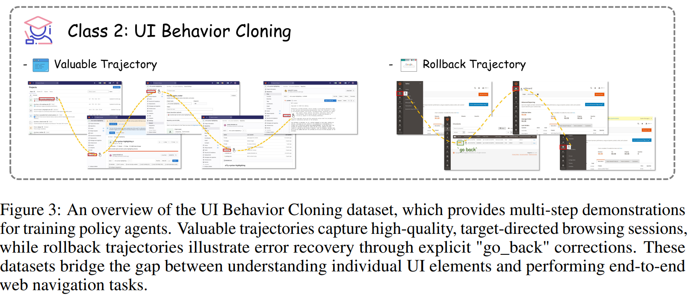
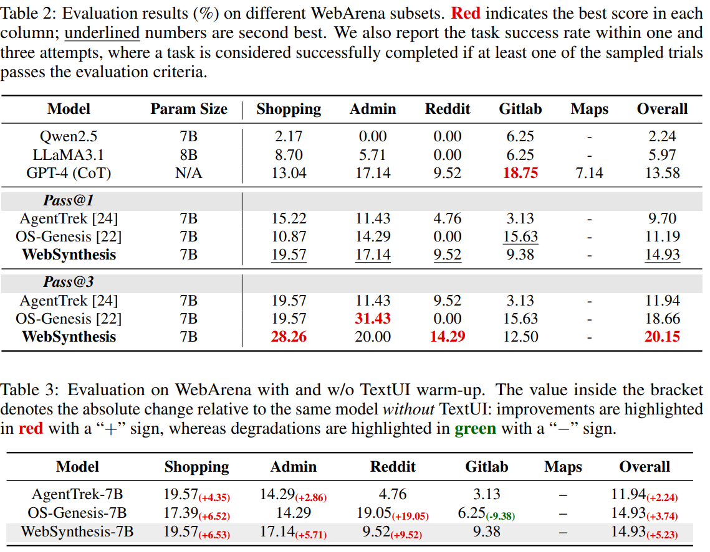

# WebSynthesis: World-Model-Guided MCTS for Efficient WebUI-Trajectory Synthesis

> https://arxiv.org/abs/2507.04370

收集用于网页导航任务的大规模、多步骤轨迹仍然具有挑战性。网络界面的动态和多样性特性使得手动演示收集既费时又不可持续。最近研究的限制包括

- 准确建模现代网络环境的全部复杂性本质上仍然困难。即使是高级代理在与不完美的模拟器互动时也可能失败，导致场景覆盖有限或行为不现实。具体来说：(1) 单纯的自我导向探索通常生成缺乏多样性的轨迹，导致学习停滞，因为代理不断遇到熟悉模式[34]。(2) 基于规则的方法或教程引导的方法通常只解决预定义的任务模板，留下许多边缘案例未被探索[24]
- 另一个关键问题是数据生成的高计算成本，因为一些合成流程要求每个轨迹有数千次互动，导致数百万个推理标记，使该方法在计算上变得禁止性。

WebSynthesis，是一个将世界建模与基于搜索的轨迹生成机制相结合的新颖框架。作为真实网络的高保真代理，世界模型促进生成多样化和丰富的轨迹，而无需承担与实时互动相关的高昂成本，从而为有效的代理探索提供了一个想象的环境。为了提高世界模型环境中政策代理合成轨迹的质量和任务相关性，我们采用蒙特卡洛树搜索（MCTS）来指导合成过程，以达成特定目标。

这种方法使世界模型能够生成适应多种任务和界面条件的交互序列，确保轨迹具有目的性和多样性。至关重要的是，搜索在世界模型内评估多个假设的动作路径，选择性地保留那些导向连贯和成功结果的路径。通过结合基于模型的环境模拟和以目标为导向的搜索，WebSynthesis高效地生成了可控且性价比高的网页导航轨迹。

在训练过程中，我们采用了一个两阶段课程学习框架。

- 第一阶段专注于加强政策代理的基本用户界面理解能力，包括状态标题、功能描述以及状态转换预测等任务，这为代理快速适应复杂和不熟悉的网页界面做好准备。
- 在第二阶段，我们使用合成的轨迹数据进行监督微调（SFT）。这些合成轨迹使政策代理能够在安全的虚拟环境中想象并排练各种任务，从而提高现实世界的泛化能力，并加速自我改进，超越先前方法的数据限制。

实验结果表明，使用大约4千条合成轨迹时，WebSynthesis达到了20%的效果提升。整体通过率为15%，表现优于OS-Genesis-7B（通过率为18.66%，在7400个真实世界轨迹上进行训练）和AgentTrek-7B（通过率为11.94%，在20000个教程引导的合成轨迹上进行训练）。此外，一项TextUI热身研究显示，在轨迹级微调之前对三个UI基本能力进行预训练，可以将OS-Genesis的性能提升33.4%，这突显了UI理解在智能体训练中的关键作用。

## 相关工作

结合强化学习

- AutoWebGLM[13]利用精心策划的网页浏览数据，通过一个三阶段的课程学习框架引导模型，其中后两个阶段结合了直接偏好优化（DPO）和拒绝采样以应对在线场景。
- WebRL[18]这样的方法引入了一种自我进化的在线课程，该课程能够根据代理的失败自动生成新任务，并采用基于结果的奖励模型，使开源代理能够在特定基准测试中稳步改进，有时甚至能与或超越GPT-4的表现。
- WebAgent-R1[23]展示了简单的端到端强化学习设置，结合异步轨迹探索和二元成功反馈，可以显著提升开放大型语言模型代理在长远任务上的成功率，突显了直接环境交互的有效性。

数据合成方法

- OS-Genesis[22]逆转了传统的数据收集过程：代理首先自由探索图形用户界面环境，然后回顾性分析使用奖励模型从其轨迹中提取高质量任务。这种方法无需人工编写脚本即可生成多样化和真实的数据。
- PAE[34]采用类似的策略进行自主技能发现，使代理能够提出新的网络任务并使用视觉语言模型自我评估结果。这允许代理构建自己的课程和奖励信号，从而实现超出任何固定指令集的策略完善。
- AgentTrek[24]利用公开可用的网络教程作为人类演示的替代品。它将指导内容转换为逐步操作，并通过一个视觉语言代理进行验证，从而以低成本扩展多模态轨迹生成，并增强在文本和视觉网络基准测试中的泛化能力。
- WebCoT[9] 确定有效网络代理所必需的基本推理技能，包括反思、分支和回滚，并综合相应的推理轨迹。

最近在网络导航领域的研究采用了“先模拟后行动”的模式[8]。

- 像WebDreamer[7]和WMA[2]这样的方法利用LLMs作为世界模型来提前预测候选动作的结果，从而避免不可逆的错误并降低实时互动的成本。然而，这些方法的有效性严重依赖于世界模型的真实性，这限制了它们在线规划的可靠性。
- WebEvolver[5] 通过共同演化代理和世界模型来扩展这一模式，允许代理通过在越来越精确的模拟环境中规划来改进其决策。

> 世界模型作为旨在捕捉真实世界动态的生成式AI系统而出现，包括其物理和空间属性。在强化学习（RL）中，世界模型用于模拟未来的观察和环境反馈，使策略代理能够在不与真实环境直接互动的情况下学习和规划。

我们的工作在这一研究方向的基础上，通过整合基于LLM的世界建模与目标导向搜索。世界模型被训练用来生成详细的下一页观察结果，如DOM或可访问性树，使策略代理能够在虚拟环境中执行高效多样的网页导航。

## 方法

根据标准的强化学习框架，我们将网页导航表述为一个部分可观测的马尔可夫决策过程（POMDP），它包含四个主要组成部分：观察空间（O）、动作空间（A）、转移函数（T）和奖励函数（R）。在我们的方法中，一个网页世界模拟器作为转移函数T，将状态-动作对（O,A）映射到下一个状态的观察结果。策略代理π处理用户查询q并在世界模型环境中进行多步骤互动，而不是在真实网页界面上操作。与先前的工作一致，我们使用可访问性树（A11y）来表示网页页面观察结果，该树捕捉了一组结构化的与可访问性相关的状态和属性。

### 用户界面基础理解

在无头浏览设置中，策略代理主要与基于文本的页面表示进行交互，这可能涉及各种数据格式，如HTML、DOM树或可访问性树（A11y）。鉴于TextUI场景的复杂性，即使提供了完整的页面信息，代理也可能难以完全理解上下文信息。为了解决这个问题，我们首先在监督微调的初期阶段收集并合成了一系列TextUI数据集。我们主要采用公共的WebArena环境，这是一个动态的GUI沙箱，提供网页的文本观察（例如，HTML和A11y）和视觉观察（例如，截图）。

通过在这个环境中进行随机探索，我们获得了大量的转移三元组（$$o_{t-1}，a_{t}，o_{t}$$），代表使用动作从旧观察转移到新观察。基于收集到的转移三元组，遵循`Ui-tars: Pioneering automated gui interaction with native agents`中的任务定义为，TextUI理解策划了三个核心能力：

- 密集caption：为了增强模型对 TextUI 输入的整体理解，我们解决了基于文本的表示的一个关键限制：**缺乏视觉布局信息。直接概括文本内容通常不足以捕捉复杂界面的结构和上下文**。为了解决这个问题，我们利用 GPT-4o，为其提供相应的 GUI 屏幕截图，从而生成全面而详细的描述，不仅捕捉单个 UI 元素，还捕捉它们的空间关系和整体布局。在训练过程中，这些描述将与基于文本的观察结果配对，并作为模型的输入。
- 元素功能：为了提高对TextUIs（例如，“文本栏”或“可点击元素”）中特定元素的识别和理解，我们专注于为每个交互组件生成详细、结构化的描述。借助GPT-4o强大的视觉理解能力，类似于SoM[25]，我们提示模型**根据基于文本的表示和相应的GUI截图合成功能描述**。**然后将这些合成的描述与文本观察（即A11y）配对，取代截图作为上下文输入，形成问答对**。
- 状态转换预测：为了进一步提升模型对UI元素的理解，尤其是在响应 用户交互请求，我们旨在**赋予模型预测页面主要内容变化的能力**。为实现这一目标，我们捕捉连续观测之间的差异，并将其纳入代理的推理过程中。在训练期间，代理会获得当前页面的观测值和相应的动作，并被要求生成后续页面框架的布局变化和标题。这种能力对于需要细粒度交互理解和动态状态感知的任务至关重要。

> 为了减轻由于A11y过长而产生的冗余问答对的生成，我们在预处理期间应用局部压缩策略。具体来说，我们仅保留与目标UI元素相邻的元素，同时保留A11y树的原始层次结构。这种方法减少了不必要的上下文，并显著提高了结果数据集的多样性和效率。

### 世界模型引导的蒙特卡洛树搜索

WebSynthesis需要一个过程奖励模型来指导策略代理逐步决策。然而，网络环境呈现出独特的挑战。如果奖励模型仅评估策略代理提出的动作而不考虑其更广泛的上下文，动作级别奖励信号的准确性可能会显著降低。受到WMA[2]和WebDreamer[7]的启发，我们利用世界模型来模拟网络环境并近似代理行动的后果。这使得过程奖励模型能够做出更加明智和准确的评估。框架的概览如图2所示。

我们现在定义策略代理、世界模型和过程奖励模型如下：

- 策略代理：在每个时间步骤t，策略代理π首先根据前一个观察结果$$o_{t-1}$$和用户指令q生成一个动作$$a_{t}$$
- 世界模型ω基于$$o_{t-1}$$和$$a_{t}$$预测下一个观察结果$$o_{t}$$
- 过程奖励模型：奖励模型γ根据$$o_{t}$$和用户的意图q评估策略代理发出的动作

整个网页导航的目标被构建如下，在固定的时间 T 或步数预算内，搜索的目标是识别一条最大化奖励的轨迹：
$$
\mathop{\arg\max}\limits_{\{a_{0},a_{1},\cdots a_{T}\}} \sum_{t=0}^{T} \gamma_{\theta}(o_{t}, a_{t})
$$
我们采用过程奖励模型 *γ* 来评估部分轨迹的质量，使得在中间节点处既可以进行选择也可以进行反向传播。在此基础上，我们将世界模型引导的蒙特卡洛树搜索（WebMCTS）构建为一个包含三个主要阶段的迭代算法：**节点选择、动作扩展和反向传播**。在每次迭代中，搜索树基于策略代理 *π* 提出的候选动作进行扩展。树中的每个节点代表一个特定的动作，并存储来自世界模型的预测下一个状态观测、来自奖励模型的相应奖励反馈 $$v_C$$ 以及访问次数  $$n_C$$ 

- 节点选择：按照标准的MCTS设置，节点选择由上置信界（UCB）策略指导，该策略在搜索过程中平衡探索和利用。子节点C的UCB得分定义为 $$U_{C}=v_{C}+\epsilon\cdot\sqrt{\frac{\ln n_{P}}{n_{C}}}$$ ，算法选择具有最高UCB得分的子节点以继续搜索
- 动作扩展：根据由UCB策略选择的节点C，我们基于与C关联的状态来采样候选动作。为了确保充分的探索和保持广度，Web MCTS 在每个扩展步骤至少采样三个不同的潜在动作。此外，由于搜索树的不同分支可能在搜索过程中的不同时间点到达相同的网页（即相同的URL），我们采用了一种缓存机制来确保从世界模型生成的状态保持一致性。具体来说，我们维护一个哈希表，该表以URL作为键来存储先前生成的页面状态。当再次遇到相同的URL时，会重用缓存的版本，从而避免重复状态生成，并在树扩展期间提高一致性和效率。
- 反向传播：最后，我们从选定的节点C开始进行价值反向传播，并使用加权平均策略更新其祖先节点的值。具体来说，对于每个访问过的节点C，我们按如下方式更新其访问次数和价值估计

$$
n_C \leftarrow n_C + 1, \text{ and } v_C \leftarrow \frac{\sum_{i} n_{C_i} \cdot v_{C_i}}{\sum_{i} n_{C_i}}
$$

经过多次迭代，该过程生成一个由世界模型模拟的网络动作树，捕捉了一系列多样的可能交互轨迹。

### 轨迹收集

在第二阶段的基础上，得到的网络动作树不仅包含成功完成任务的任务轨迹，还包含了在搜索 *τ* 过程中遇到的一组多样且有意义的尝试（尽管未成功）。我们的目标是识别和分类两种类型的轨迹，如图 3 所示，（1）有价值的轨迹，对策略学习有积极贡献；（2）回滚轨迹，代表失败的探索路径，可用于提高代理的鲁棒性和错误意识。

**有价值轨迹**：鉴于初始策略代理在与网络世界模型互动时可能会生成冗余或语义上无意义的动作，我们在收集训练轨迹之前首先对动作树进行剪枝。我们利用 GPT-4 来检测包含重复或过于相似动作的节点，这些相似操作会导致网络世界模型几乎相同的预测状态。在这些情况下，我们移除冗余节点，并将它们的子节点合并到各自的父节点中。

我们采用节点值 $$v_C$$ 作为识别有价值轨迹的标准，其中较高的值表示在当前状态下任务完成度更高。具体来说，我们对树进行深度优先搜索（DFS），以定位那些值超过预定阈值的目标节点。对于每个识别出的目标节点，我们追溯路径回到根节点，从而提取相应的轨迹用于训练。

**回滚轨迹**：回滚的核心思想是使策略代理能够在沿着轨迹的每一步动态评估其行动及其结果的有效性。当一个行动导致的结果偏离用户意图时，代理预期能够自主识别出错误决策的负面后果，恢复到之前有效的状态，并从该点恢复推理过程。

在WebMCTS中，所得到的动作树保持多个并行分支，这使得代理能够在单个搜索情节中从不同的价值节点识别出多样化的回滚轨迹。这与传统的线性或单路径回滚策略形成对比，后者通常每次运行只生成一个轨迹，并冒着忽略其他有价值路径的风险。

为了提取回滚轨迹，我们对有价值轨迹中的每个中间节点C进行操作。具体来说，我们首先确定C的不成功兄弟节点集S及其共同祖先节点P。对于S中的每个节点，我们利用GPT-4合成一个反思，该反思追溯回P，识别适当的纠正动作，记作“返回”。然后我们在P处修改历史动作序列，以纳入这个纠正，并构建一条从P通过S的新轨迹。这个过程产生形式为S→P→C的回滚轨迹，捕捉由失败的尝试及其相应的纠正反馈产生的替代推理路径。

### 策略代理训练

策略代理的训练包括两个主要组成部分

| Lessons            | Category                      | Scale | Core Goal                                               |
|--------------------|-------------------------------|-------|---------------------------------------------------------|
| C1 & stage 1       | Dense Captioning              | 2k    | Grasp the overall semantics of TextUI expressions       |
| C1 & stage 2       | Element Functionality         | 6k    | Refine its fine-grained understanding of specific UI functions |
| C1 & stage 3       | State Transition Prediction   | 7k    | Strengthen its ability to predict page-state transitions |
| C2. Behavior Cloning | Valuable & Rollback Trajectories | 4k | Perform SFT on both valuable and rollback trajectories |

用户界面基础能力：第一步是对第一阶段收集的数据进行监督微调（SFT），以增强对用户界面的基本理解能力。由于第一阶段的数据集涵盖多个维度，有些设计用于提升模型对局部和全局用户信息的理解，而其他则旨在模拟简单的用户意图，因此同时对所有样本进行训练并不适宜。因此，我们采用了一种课程学习（CL）策略，模仿人类的学习过程，鼓励模型首先从较简单的任务开始学习，并逐渐过渡到更复杂的任务。为了提高数据质量，我们遵循InfiGUIAgent[15]的做法，实施指令增强和响应细化流程：（1）对于不同维度的数据，我们提示GPT-4生成各种指令模板，以增强指令与答案之间的逻辑；（2）对于具有复杂或不一致响应格式的数据，我们利用GPT-4重新构建响应，同时保留其语义内容。

用户界面行为克隆：尽管具备上述基础能力，但由于缺乏完整的轨迹训练，策略代理仍然缺乏执行完整网页导航的能力。为解决这一问题，我们采用监督微调，使用有价值的和回滚轨迹，遵循与基于手动收集的轨迹数据的现有方法一致的程序。在上述训练程序之后，策略代理获得了完成网页浏览任务所需的基本能力，并能够根据用户指令自主执行操作。

## 实验

采用Qwen2.5-7B-Instruct作为策略代理和网页世界模型训练的基础模型，以及GPT-4作为树搜索的过程奖励模型。我们使用提供的网上环境构建数据集，用于世界模型训练。所有训练都通过低秩适配（LoRA）微调来进行。

评估基准：在网络导航任务中，WebArena 作为评估自主代理的动态基准。它涵盖的领域包括地图、电子商务（购物）、内容管理（CMS）、社交论坛（Reddit）和软件开发（Gitlab）。策略代理需要从初始状态开始做出顺序决策，任务成功通过代理的最终输出与真实答案之间的字符串匹配或网址匹配来评估。

遵循标准的 WebArena 设置，并采用以下动作空间，包括“点击”、“输入”、“悬停”、“滚动”、“转到”、“返回”和“停止”。在原始的 WebArena 环境中，它包含由 241 个任务模板派生的 812 个具有挑战性的任务。考虑到评估成本，我们使用 WebArena-Lite 中的 165 个测试用例进行评估。网络环境的观察结果由可访问性树表示。

与在真实世界轨迹上训练的方法相比，例如在7400个真实样本上训练的OS-Genesis-7B，WebSynthesis仍然取得了更好的结果。例如，尽管WebSynthesis在远小于该数据集（大约4000个样本）的数据上进行训练，但在Pass@1的总体表现上仍超越了OS-Genesis 3.74%。这些结果表明，由WebMCTS指导的高质量合成轨迹在小规模时也是相当或更有效的。

在轨迹级微调之前进行文本用户界面适应的模型一致性地优于未经过此类热身的对应模型。特别是，OS-Genesis的提升超过了其原始性能的33.4%。这表明在真实世界收集的轨迹上进行微调并非一次性解决方案。如果没有对基于文本的用户界面的结构和布局有足够的熟悉度，仅靠轨迹级训练不太可能达到期望的性能。

仅对回滚轨迹进行训练（Troll）会导致最弱的性能（整体1.49%）。这表明，如果没有接触成功的轨迹，智能体会变得过于谨慎，过早地发出返回动作，最终失去探索和完成任务的能力。这一结果强调了从目标导向行为中学习以建立自信的前向执行的重要性。

仅对有价值的轨迹进行训练（τval）会得到中等的性能（整体5.97%），因为它教会了智能体达到任务目标，但没有将其暴露于现实世界的错误模式或恢复策略。当Tval和Troll一起使用时，模型实现了显著的提升（整体9.70%），表明接触成功示范和失败恢复路径使智能体能够在不确定情况下进行更稳健的推理。

## 未来工作

一个更雄心勃勃且具有前瞻性的方向是将世界模型整合到在线强化学习中，遵循在真实世界的强化学习研究中探索的模式。在这样的设置下，策略代理可以通过直接与世界模型构建的模拟环境互动，不断提升其规划和决策能力。在网络环境中仍需克服几个关键挑战。

- 与棋盘游戏或机器人控制任务不同，网络界面高度多样化、部分可观测且非静态，这使得学习一个稳定且具有泛化能力的世界模型变得困难。
- 多步骤推广中的复合误差可能会显著降低性能，特别是当代理在探索时严重依赖想象轨迹
- 将基于模型的环境整合到在线、闭环设置中仍然是一个开放的研究问题。不仅需要防止模型随时间崩溃，还要确保代理的行为与人类标准一致。实现这一点需要在算法框架和学习到的世界模型的保真度方面取得进展。尽管如此，世界模型在罕见、成本高昂或安全关键场景中替代真实网络环境仍具有巨大潜力，在这些场景中实时交互受限或不切实际。