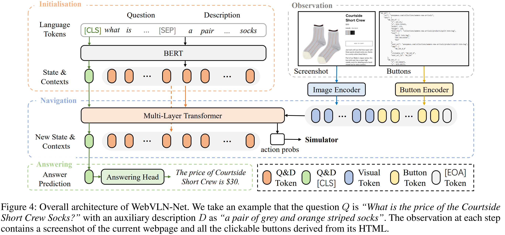

# WebVLN: Vision-and-Language Navigation on Websites

> https://arxiv.org/abs/2312.15820

视觉与语言导航（VLN）旨在将视觉感知、行为动作与语言理解无缝整合，使人工智能智能体能够在现实环境中高效地导航并开展互动。这种相似性同样可以在虚拟在线环境中找到：用户可能依赖人工智能智能体来协助他们获取特定产品的相关信息

我们提出了一项扩展的VLN任务，称为网站上的视觉与语言导航（WebVLN）。在该场景中，智能体从网站的首页开始其旅程，并被呈现一个问题。 Q 附带一个辅助说明 D. 该代理模拟真实用户的操作行为，最终抵达包含解答问题所需信息的目标网页。 并生成准确的响应 R。

在WebVLN中，人工智能智能体在网站上导航时所面临的可选动作要多得多，构建的导航图比传统 VLN 更加复杂精细，这使得仅依靠简单的启发式试错策略几乎无法遍历网站上的所有内容。因此，在 WebVLN 任务中，理想的算法应致力于在最大化准确选择的同时，通过充分利用网页内丰富的多样化信息，尽可能减少探索需求。

我们收集了一个全新的WebVLN-v1数据集，从三个不同的购物网站中提取了问答对。数据集同时包含视觉与文本内容，并将导航与QA两种场景无缝整合，并辅以基于问题的指令，从而构建了一个统一的基准测试平台。

提出了方法WebVLN-Net，同时考虑视觉和文本信息。模型性能的评估则综合了 VLN 和 VQA 两个领域的指标

## 数据集

在三个不同的购物网站上建立了WebVLN模拟器。代理通过选择一个新的按钮与模拟器进行交互，模拟器为每个网站构建一个有向图，其中边的存在表明两个网页之间存在可导航的转换。

对于数据集生成，首先采样一个目标网页，随后根据图结构 G，构建从主页到所选目标的最短路径。 对于每条路径，我们都会手动检查，以从人类视角判断其合理性，随后将不合理的路径予以舍弃。(例如，连续多次点击广告图标）。此外，我们还移除了网页跳转次数少于2次的路径，以确保数据集的质量和多样性，最终得到共计8,990条路径的样本。

为减轻人工负担，我们旨在借助 LLM，根据网页上的多模态内容自动生成问答对。具体细节如下所示。

1. 图像数据处理与HTML清理。我们采用BLIP-2，这是一种功能强大且适用于图像描述的大规模模型，将其用于将网站图片转换为文本描述，以确保大语言模型能够准确捕捉视觉信息。
2. 对词汇列表进行处理：由于直接从网页获取的原始文本通常杂乱无章，难以直接使用，同时还可能包含无关信息，例如混乱的代码等。因此，我们系统地运用基于规则的过滤方法，手动剔除这些干扰内容，从而显著提升文本的逻辑性和可读性。
3. 为大模型设计一系列规则，以指导其在生成所需问答对时的行为。生成最终问答对
4. 质量检查。我们为每个网站随机选取 100 个 QA 样本，以评估其质量：问题与网页相关，并且答案准确
5. 我们对构建的提示进行了多次迭代，直至所有样本均合理且准确。在每次迭代中，都会生成一部分样本，供人工进行质量评估。每个样本都经过至少两位评估员的严格把关，以确保评估结果的可靠性。

## 模型

如图4所示，我们的模型包含三个主要组件：初始化、导航和回答。具体而言，

1. 我们首先通过一个预训练的BERT模型初始化状态和上下文标记。
2. 随后，我们将这些初始化的语言标记，连同从当前网页中提取的截图标记和按钮标记，一同输入到导航组件中。
3. 这一过程会不断迭代，直至抵达目标网页。
4. 最后，答案组件中的回答头生成最终的答案。

训练 对于导航任务，我们采用模仿学习（IL）目标来训练网络。具体而言，我们的智能体通过遵循教师的动作，在真实轨迹上进行导航，并为每个决策计算交叉熵损失

