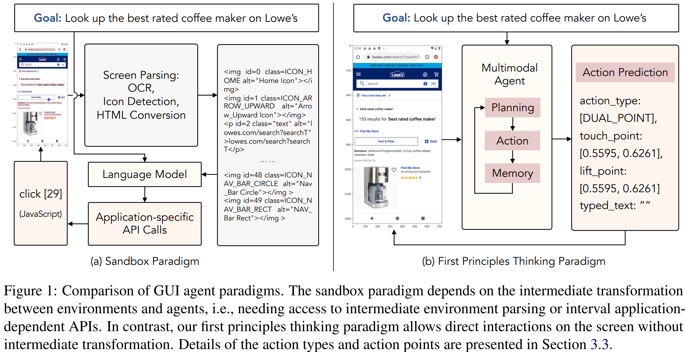
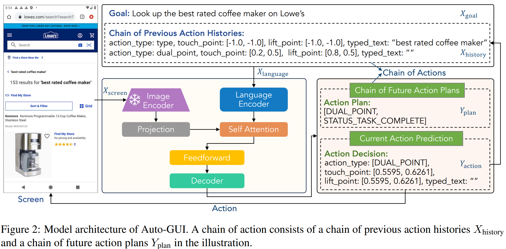

# You Only Look at Screens: Multimodal Chain-of-Action Agents

> https://arxiv.org/abs/2309.11436

近期研究已探索了提示工程以及微调技术以激发语言模型在交互式环境中执行动作的能力。然而，目前至少存在两大挑战，限制了自主智能体在现实世界中的应用。

- 首先，现有方法通常依赖于光学字符识别（OCR）和图标检测器等外部工具。将环境解析为文本元素（例如，HTML 布局），作为语言模型的输入。一方面，解析后的元素会生成冗长的输入，从而导致推理效率低下。由于计算延迟是部署中的关键指标，使用冗长的输入不仅会增加推理成本，甚至可能超出语言模型的输入长度限制。另一方面，将视觉环境解析为文本元素的过程也可能容易引发误差传播或信息丢失，因为借助外部工具进行解析时，难免会出现错误
- 其次，大多数现有方法都处于沙箱环境中，需要访问内部API才能与环境进行交互，例如，使用 JavaScript 在网页上选择元素，或通过 Python 解释器执行操作。然而，在实际应用中，第三方应用程序（App）通常无法访问该 API 接口。



我们希望允许用户直接在屏幕上进行交互，而无需访问中间环境解析或与区间相关的应用专用API。为应对这些挑战，我们引入 **Auto-GUI**，一种直接与图形用户界面（GUI）交互的多模态方法。为进一步增强智能体的动作预测能力，我们提出了一种新颖的 行动链 一种技术，其中行动链是由一系列中间的先前行动历史和未来的行动计划组成的。

## 方法



给定用户指令（也称为一个 目标)，该智能体需要通过多步交互来完成任务。整个过程被称为一个 episode，它由一系列 屏幕截图组成。 在每个 episode 的每个步骤中，智能体将获得一张截图，并需预测相应的动作，直至任务完成。

Auto-GUI 的模型架构如图2所示。 从高层次来看，Auto-GUI 包括三个阶段。

1. 首先，我们分别从视觉和语言输入中获取编码后的特征。具体而言，视觉输入（即屏幕截图）由一个冻结的视觉编码器进行编码；与此同时，语言输入——包括目标任务以及一系列先前的操作历史记录——每条历史记录均由一个元组构成，包含{操作类型、触摸点、抬起点和输入文本}，则由语言编码器进行处理。
2. 其次，经过自注意力模块融合后，视觉与语言的编码表示被整合为统一的特征表示
3. 最后，这一融合后的特征表示会被送入解码器，以生成未来一系列的操作计划（即在后续步骤中需执行的操作类型），并进一步预测具体的操作内容。

## 实验

我们使用AITW基准数据集，是一个大规模的 GUI 控件基准数据集，包含自然语言指令、屏幕截图和操作记录。该数据集共有 715 K个条目。 涵盖3万条独特指令的多个片段，覆盖了多样化的多步任务，如应用操作、网页搜索及网购，涉及超过350个应用和网站。该数据集囊括了多种设备类型与操作系统，并支持不同屏幕分辨率，以确保其通用性。基准数据集中包含五个子集，分别是：通用型、安装型、Google应用型、单一任务型以及网购型。

我们采用了三种类型的基线，这些基线包括上下文学习（ICL）和微调两种范式，并分别基于不同规模的多种骨干模型。

我们采用编码器-解码器架构，在我们的框架中，分别采用小规模（60M）、基础规模（200M）和大规模（700M）设置。我们使用FLAN-Alpaca来初始化模型权重。视觉特征由冻结的BLIP-2编码器获取。实验在8块NVIDIA Tesla V100 32GB GPU上运行。其中，训练大型模型和基础模型分别耗时75小时和25小时。

- 动作链和坐标归一化均对整体性能有所贡献（分别提高了5.74%和4.04%），我们将前一行动和未来行动的最大数量分别设定为8和4。在这些设置下，该模型实现了最优性能，且输入和输出序列的长度均未超出模型限制
- 对于大语言模型而言，无论是采用提示技术还是微调方法，其性能均无法与多模态方法相媲美。最可能的原因在于，这些模型仅基于屏幕的解析HTML元素进行学习，因此相较于更能提供丰富信息的屏幕视觉特征，它们容易遭受信息丢失的问题
- 主要挑战集中在点击区域和滚动方向的预测上。尽管该模型大多数时候能够正确预测操作，但它往往倾向于点击错误的位置或反向滚动。结果表明，未来需要提升模型理解屏幕布局的能力，例如，采用更先进的视觉特征。
- 视觉特征至关重要，凸显了有效感知的重要性
- 当提供标注的屏幕描述时，Auto-GUI 的表现能够更加出色。然而，由于在实际应用中注释并不总是可用，因此我们在框架中默认并未包含这些注释。

## 局限

我们承认本研究存在两个主要局限性。首先，我们选择不将该方法扩展至超大规模模型，因为我们的工作旨在为GUI智能体提供一种简单而高效的解决方案。研究结果表明，在GUI任务中，模型规模的扩展未必能带来根本性优势——随着模型尺寸的增大，其性能提升往往趋于平缓，并不一定显著改善实际效果。

其次，我们的实验与分析仅基于AITW展开，该数据集是当前自主GUI智能体研究领域规模最大、最具代表性的权威基准数据集，能够及时提供具有针对性的洞察。鉴于该领域的快速发展，我们期待未来的研究能够探索如何将我们的方法应用于其他新兴的基准数据集。

```
Given a mobile screen and a question, provide the action based on the screen information.

Available Actions:
{"action_type": "click", "idx": <element_idx>}
{"action_type": "type", "text": <text>}
{"action_type": "navigate_home"}
{"action_type": "navigate_back"}
{"action_type": "scroll", "direction": "up"}
{"action_type": "scroll", "direction": "down"}
{"action_type": "scroll", "direction": "left"}
{"action_type": "scroll", "direction": "right"}

Previous Actions:
{"step_idx": 0, "action_description": "press [HOME key]"}
{"step_idx": 2, "action_description": "click [Google Icon]"}
{"step_idx": 3, "action_description": "click [search for hotels]"}

Screen:
 </img>
 </img>
<p id=2 class="text" alt="search for hotels"> search for hotels </p>
<p id=3 class="text" alt="in"> in </p>
<p id=4 class="text" alt="mexico city mexico"> mexico city mexico </p>
 </img>
<p id=6 class="text" alt="Share"> Share </p>
<p id=7 class="text" alt="Select alI"> Select alI </p>
<p id=8 class="text" alt="Cut"> Cut </p>
<p id=9 class="text" alt="Copy"> Copy </p>
<p id=10 class="text" alt="hotel in mex"> hotel in mex </p>
 </img>
<p id=12 class="text" alt="best hotel"> best hotel </p>
<p id=13 class="text" alt="mexico city"> mexico city </p>
<p id=14 class="text" alt="in"> in </p>
 </img>
<p id=16 class="text" alt="K"> K </p>
<p id=17 class="text" alt="hotel ciudad"> hotel ciudad </p>
<p id=18 class="text" alt="de mexico"> de mexico </p>
<p id=19 class="text" alt="gran"> gran </p>
 </img>
 </img>
 </img>

Instruction: What time is it in Berlin?

Answer: Let's think step by step. I see unrelated search results in the Google app,
I must clear the search bar, so the action is {"action_type": "click", "idx": 1}
```

