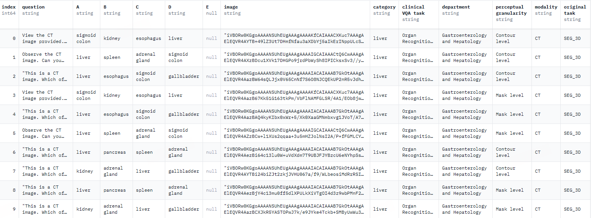

# GMAI-MMBench

> 网站：https://uni-medical.github.io/GMAI-MMBench.github.io/
> 
> Huggingface：https://huggingface.co/datasets/OpenGVLab/GMAI-MMBench
> 
> 开放数据实验室：https://opendatalab.com/GMAI/MMBench
> 
> 评估：https://github.com/open-compass/VLMEvalKit

大型视觉语言模型 (LVLMs) 能够处理成像、文本甚至生理信号等多种数据类型，在 LVLMs 真正投入到临床实践之前，还需要建立基准测试进行模型的有效性评估。但目前的基准测试通常基于特定的学术文献，且主要集中在单一领域，缺乏不同的感知粒度，因此难以全面地评估 LVLMs 在真实临床场景中的有效性和表现。

GMAI-MMBench 由来自全球的 284 个下游任务数据集构建而成，涵盖 38 种医学影像模态、18 项临床相关任务、18 个科室以及视觉问题解答 (VQA) 格式的 4 种感知粒度（图像、框、掩模和轮廓），具有完善的数据结构分类和多感知粒度。

此外，我们实现了一个词汇树结构，允许用户自定义评估任务，适应各种评估需求，并大力支持和促进医疗AI研究和应用。

我们的基准数据主要是图像-标签对

1. 研究人员从全球公开数据集和医院数据中搜索了数百个数据集，经过筛选、统一图像格式和标准化标签表达后，保留了 284 个高质量标签的数据集，涵盖了 2D 检测、2D 分类和 2D/3D 分割等多种医学影像任务，并由专业医生标注，确保了医学影像任务的多样性以及高度的临床相关性和准确性
2. 研究人员将所有标签分类为 18 个临床 VQA 任务和 18 个临床科室，使其可以全面评估 LVLMs 在各个方面的优劣，方便模型开发者和有特定需求的用户。研究人员设计了一个名为词汇树 (lexical tree) 结构的分类系统，将所有病例分为 18 项临床 VQA 任务、18 个科室、38 种模态等。「临床 VQA 任务」、「科室」、「模态」是可用于检索所需评估病例的词汇。例如，肿瘤科可以选择与肿瘤学相关的病例来评估 LVLMs 在肿瘤学任务中的表现，从而极大地提高了针对特定需求的灵活性和易用性。
3. 研究人员根据每个标签对应的问题和选项池生成了问答对。每个问题必须包含图像模态、任务提示和对应的标注粒度信息。最终的基准通过额外的验证和人工筛选获得。

## 目标

最先进的 LVLMs 包括通用型的（如 DeepSeek-VL[155]、GPT-4V[5] 和 Claude3-Opus[13]）以及用于医疗目的的（如 MedDr[95]、LLaVA-Med[138] 和 Med-Flamingo[181]），它们在一些医疗视觉-文本任务中都展现出了令人期待的表现。

一个理想的基准测试应该实现三个具体目标：

1. 全面医学知识。医学知识嵌入在医学数据中，所以全面医学知识需要来自不同数据源的各种模态的多样化医学数据。使用的数据应涵盖一系列不同的临床机构和医院，最好是世界范围内分布。在临床场景中，使用各种类型的成像方式，包括X射线、计算机断层扫描（CT）、磁共振成像（MRI）、超声成像、正电子发射断层扫描（PET）等，用于诊断和治疗目的，反映医学知识的各个方面

2. 全面评估所有临床方面。全面的基准测试应该易于定制，以评估每个LVLMs的任何特定能力。需求包括：1）跨多样任务的评估。（一些临床从业者可能需要MRI数据进行疾病诊断，而其他人可能需要处理计算机辅助或机器人辅助手术系统的手术工作流程识别）2）对不同临床部门的评估

3. 在多感知粒度上的交互能力。给定一张具体的医学图像，医生需要查看整个图像（图像级别）以获得概览，同时也需要全面的信息

## 相关工作

有一些医学基准测试，如Medical-Diff-VQA[105]、PathVQA[96]、Cholec80-VQA[222]和Cholec80[243]，专门用于评估大型语言模型的具体能力，它们有限的模态和任务无法满足模态和任务多样性的要求。

其他基准测试包括VQA-RAD[136]、RadBench[254]和MMMU（健康与医学）无法准确反映实际的临床需求，因为它们的来源远离临床实践并且容易出现数据泄露[44, 72]。

更重要的是，这些基准测试都不能定制以评估大型语言模型的各种能力，以适应高度多样化的临床需求，因为它们的数据分类不够明确。几乎不能用于定制化评估。

> 例如，在这些数据集中很难获得特定数据点的维度、模态和任务信息，这使得临床专业人士无法使用CT（模态）的2D（维度）图像进行血管识别（任务）来评估左心室心肌块。

## 数据集

## 结论

结果发现，当前的 LVLMs 中仍有 5 大不足之处，具体如下：

- 临床应用仍有进步空间：我们评估了50个LVLMs，即使是性能最优的模型 GPT-4o，虽达到了临床实际应用的要求，但准确率也仅为 53.96%，这表明当前的 LVLMs 在处理医学专业问题方面存在不足，仍有巨大进步空间
- 开源模型与商业模型的对比：MedDr 和 DeepSeek-VL-7B 等开源 LVLM 的准确率约为 44%，在某些任务上优于商业模型 Claude3-Opus 和 Qwen-VL-Max，并且与 Gemini 1.5 和 GPT-4V 的表现相当。然而，与表现最佳的 GPT-4o 相比，仍具有明显的性能差距
- 大多数医学专用模型难以达到通用 LVLMs 的一般性能水平（约 30% 的准确率），但 MedDr 除外，其准确率达到 43.69%，它基于高质量医学图像分类数据集进行微调
- 大多数 LVLMs 在不同的临床 VQA 任务、科室和感知粒度上表现不均衡。特别是在不同感知粒度的实验中，框选层级 (box-level) 的注释准确率始终最低，甚至低于图像层级的注释
- 导致性能瓶颈的主要因素包括感知错误（如图像内容识别错误）、缺乏医学领域知识、无关的回答内容以及由于安全协议拒绝回答问题

综上，这些评估结果表明，当前 LVLMs 在医疗应用中的性能还有很大提升空间，需要进一步优化以满足实际临床需求

**PubMedVision 大规模医学 VQA 数据集**

PubMedVision 是一个大规模且高质量的医疗多模态数据集，由深圳市大数据研究院、香港中文大学和 National Health Data Institute 的研究团队于 2024 年创建，包含 130 万个医学 VQA 样本。

为了提高图文数据的对齐度，研究团队采用视觉大模型 (GPT-4V) 对图片进行重新描述，并构建了 10 个场景的对话，将图文数据改写为问答形式，增强了医疗视觉知识的学习。

**MMedC 大规模多语言医疗语料库**

MMedC 是一个由上海交通大学人工智能学院智慧医疗团队于 2024 年构建的多语言医疗语料库，它包含了约 255 亿个 tokens，涵盖了 6 种主要语言：英语、中文、日语、法语、俄语和西班牙语。

研究团队还开源了多语言医疗基座模型 MMed-Llama 3，该模型在多项基准测试中表现卓越，显著超越了现有的开源模型，特别适用于医学垂直领域的定制微调。

**MedCalc-Bench 医疗计算数据集**

MedCalc-Bench 是一个专门用于评估大语言模型 (LLMs) 在医疗计算能力方面的数据集，由美国国立卫生研究院国家医学图书馆和弗吉尼亚大学等 9 个机构于 2024 年共同发布，这个数据集包含了 10,055 个训练实例和 1,047 个测试实例，涵盖了 55 种不同的计算任务。

**OmniMedVQA 大规模医学 VQA 评测数据集**

OmniMedVQA 是一个专注于医疗领域的大型视觉问答 (Visual Question Answering, VQA) 评测数据集。这个数据集由香港大学与上海人工智能实验室于 2024 年联合推出，包含 118,010 张不同的图片，涵盖 12 种不同的模态，涉及超过 20 个人体不同的器官和部位，且所有图像都来自真实的医疗场景，旨在为医学多模态大模型的发展提供评测基准。

**MedMNIST 医疗图像数据集**

MedMNIST 由上海交通大学于 2020 年 10 月 28 日发布，是一个包含 10 个医学公开数据集的集合，共计包含 45 万张 28*28 的医疗多模态图片数据，涵盖了不同的数据模式，可用于解决医学图像分析相关问题。