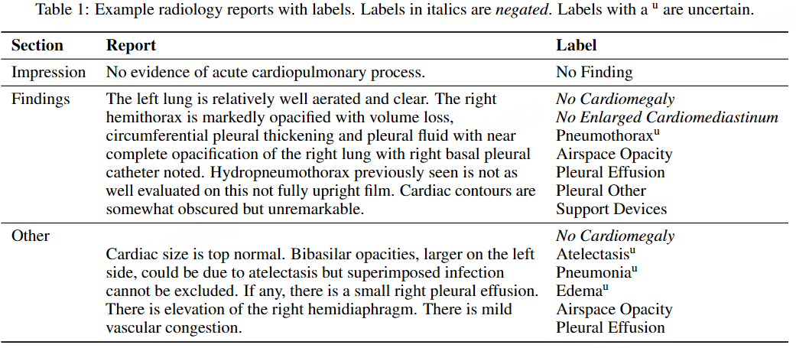

# Computer-aided Diagnosis

> https://www.sciencedirect.com/science/article/pii/S1532046423002034

MDL-based computer-aided diagnosis (CAD)是使用多模态数据生成的输出作为临床医生进行诊断的辅助工具。在此上下文中合并文本模态已被证明可以提供可以提高图像分类性能的补充功能。目前，CAD 的研究主要集中在利用胸部 X 光图像和相应的放射学报告。预计未来的病理数据集将扩大这一研究领域

医学数据集的当前趋势主要以放射学图像及其随附报告为特色，其他成像模式（如病理图像、超声、内窥镜检查）和文本模式（如临床记录）的代表性有限。

下表总结了多模态深度学习在 CAD 上的应用。存在几种常用的多模态融合策略，包括图像-文本嵌入和对比学习。图像-文本嵌入是指合并图像和文本特征，然后使用监督学习对其进行训练。例如，Wang et al. [[101]](https://www.sciencedirect.com/science/article/pii/S1532046423002034#b0505) 引入了一种文本-图像嵌入网络 （TieNet），它利用多任务 CNN-RNN 框架，在胸部疾病分类中实现了超过 0.9 的 AUC。相比之下，对比学习通常涉及图像-文本对齐和自我监督学习。Tiu 等 [[102]](https://www.sciencedirect.com/science/article/pii/S1532046423002034#b0510) 提出了一种自我监督学习框架 CheXzero，该框架在零样本胸部疾病分类中实现了专家级的性能，而无需手动标记。Monajatipoor 等[[103]](https://www.sciencedirect.com/science/article/pii/S1532046423002034#b0515) 开发了 BERTHop，它利用 PixelHop++ [[104]](https://www.sciencedirect.com/science/article/pii/S1532046423002034#b0520) 和 VisualBERT [[105]](https://www.sciencedirect.com/science/article/pii/S1532046423002034#b0525) 来学习临床图像和笔记之间的关联。该模型在 IU X-Ray 数据集上实现了 0.98 的 AUC [[20]](https://www.sciencedirect.com/science/article/pii/S1532046423002034#b0100)

| Ref.                                                                                                   | Method                                 | Dataset                                                                                           | Image type          | Text type                     | Metrics                                                | External validation | Explainability |
| ------------------------------------------------------------------------------------------------------ | -------------------------------------- | ------------------------------------------------------------------------------------------------- | ------------------- | ----------------------------- | ------------------------------------------------------ | ------------------- | -------------- |
| Wang et al. [[101]](https://www.sciencedirect.com/science/article/pii/S1532046423002034#b0505)         | CNN, LSTM                              | IU X-Ray, NIH-CXR                                                                                 | CXR                 | Radiology reports             | AUC                                                    | –                   | –              |
| Daniels et al. [[106]](https://www.sciencedirect.com/science/article/pii/S1532046423002034#b0530)      | DNN                                    | IU X-Ray, NIH-CXR                                                                                 | CXR                 | Radiology reports             | AUC, Precision                                         | –                   | –              |
| Yan et al. [[107]](https://www.sciencedirect.com/science/article/pii/S1532046423002034#b0535)          | CNN                                    | DeepLesion                                                                                        | CT                  | Annotations                   | AUC, F1                                                | –                   | √              |
| Weng et al. [[108]](https://www.sciencedirect.com/science/article/pii/S1532046423002034#b0540)         | CNN, BERT, Early fusion                | TCGA, TTH                                                                                         | Pathology images    | Pathology reports             | AUC                                                    | –                   | –              |
| Lara et al. [[94]](https://www.sciencedirect.com/science/article/pii/S1532046423002034#b0470)          | CNN, TF-IDF                            | TCGA-PRAD                                                                                         | Pathology images    | Pathology reports             | Accuracy                                               | –                   | –              |
| Chauhan et al. [[109]](https://www.sciencedirect.com/science/article/pii/S1532046423002034#b0545)      | CNN, BERT                              | MIMIC-CXR                                                                                         | CXR                 | Radiology reports             | AUC, F1                                                | √                   | √              |
| Zhang et al. [[95]](https://www.sciencedirect.com/science/article/pii/S1532046423002034#b0475)         | CNN, CLIP                              | CheXpert, COVIDx, MURA, RSNA                                                                      | X-rays              | Annotations, radiology report | AUC, Accuracy                                          | √                   | √              |
| Sonsbeek et al. [[110]](https://www.sciencedirect.com/science/article/pii/S1532046423002034#b0550)     | CNN, BERT                              | IU X-Ray, MIMIC-CXR                                                                               | CXR                 | Radiology reports             | AUC                                                    | –                   | √              |
| Wang et al. [[96]](https://www.sciencedirect.com/science/article/pii/S1532046423002034#b0480)          | Unified transformer                    | IU X-Ray, MIMIC-CXR, NIH-CXR                                                                      | CXR                 | Radiology reports             | AUC                                                    | –                   | –              |
| Ji et al. [[97]](https://www.sciencedirect.com/science/article/pii/S1532046423002034#b0485)            | CNN, Transformer                       | IU X-Ray, MIMIC-CXR                                                                               | CXR                 | Radiology reports             | AUC                                                    | –                   | –              |
| Liao et al. [[111]](https://www.sciencedirect.com/science/article/pii/S1532046423002034#b0555)         | CNN, BERT                              | CheXpert, MIMIC-CXR                                                                               | CXR                 | Radiology reports             | AUC                                                    | –                   | –              |
| Huang et al. [[98]](https://www.sciencedirect.com/science/article/pii/S1532046423002034#b0490)         | CNN, BERT, self-attention              | CheXpert, RSNA                                                                                    | CXR                 | Radiology reports             | AUC, F1                                                | –                   | √              |
| Zheng et al. [[112]](https://www.sciencedirect.com/science/article/pii/S1532046423002034#b0560)        | CNN, BERT, self-attention              | Multimodal COVID-19 Pneumonia Dataset                                                             | CT, CXR, ultrasound | Doctor-patient dialogues      | AUC, Accuracy, Precision, Sensitivity, Specificity, F1 | –                   | –              |
| Zhou et al. [[113]](https://www.sciencedirect.com/science/article/pii/S1532046423002034#b0565)         | Vision Transformer, BERT               | COVID-19 Image Data Collection, MIMIC-CXR, NIH-CXR, Shenzhen Tuberculosis, VinBigData Chest X-ray | CXR                 | Radiology reports             | AUC                                                    | √                   | √              |
| Yan et al. [[40]](https://www.sciencedirect.com/science/article/pii/S1532046423002034#b0200)           | CNN, BERT                              | COV-CTR, IU X-Ray, MIMIC-CXR                                                                      | CT, CXR             | Radiology reports             | AUC                                                    | –                   | √              |
| Monajatipoor et al. [[103]](https://www.sciencedirect.com/science/article/pii/S1532046423002034#b0515) | Vision Transformer, BERT               | IU X-Ray                                                                                          | CXR                 | Radiology reports             | AUC                                                    | –                   | –              |
| Jacenków et al. [[114]](https://www.sciencedirect.com/science/article/pii/S1532046423002034#b0570)     | CNN, BERT                              | MIMIC-CXR                                                                                         | CXR                 | Radiology reports             | AUC                                                    | √                   | –              |
| Hassan et al. [[45]](https://www.sciencedirect.com/science/article/pii/S1532046423002034#b0225)        | CNN, BERT, GRU                         | IU X-Ray                                                                                          | CXR                 | Radiology reports             | AUC                                                    | –                   | –              |
| Moon et al. [[46]](https://www.sciencedirect.com/science/article/pii/S1532046423002034#b0230)          | CNN, BERT, attention masking           | IU X-Ray, MIMIC-CXR                                                                               | CXR                 | Radiology reports             | AUC, F1                                                | –                   | √              |
| You et al. [[47]](https://www.sciencedirect.com/science/article/pii/S1532046423002034#b0235)           | CNN, Transformer, GRU                  | IU X-Ray                                                                                          | CXR                 | Radiology reports             | Accuracy                                               | –                   | √              |
| Chen et al. [[83]](https://www.sciencedirect.com/science/article/pii/S1532046423002034#b0415)          | Vision Transformer, BERT, co-attention | MedICaT, MELINDA, MIMIC-CXR, ROCO                                                                 | CXR                 | Radiology reports             | Accuracy                                               | –                   | √              |
| Wang et al. [[115]](https://www.sciencedirect.com/science/article/pii/S1532046423002034#b0575)         | Vision Transformer, BERT               | CheXpert, COVIDx, MIMIC-CXR, RSNA                                                                 | CXR                 | Radiology reports             | AUC                                                    | –                   | –              |
| Wang et al. [[100]](https://www.sciencedirect.com/science/article/pii/S1532046423002034#b0500)         | CLIP                                   | CheXpert, COVID, MIMIC- CXR, RSNA                                                                 | CXR                 | Radiology reports             | Accuracy                                               | –                   | √              |
| Tiu et al. [[102]](https://www.sciencedirect.com/science/article/pii/S1532046423002034#b0510)          | Vision Transformer, CLIP               | CheXpert, MIMIC-CXR                                                                               | CXR                 | Radiology reports             | AUC, MCC, F1                                           | √                   | √              |

关于 COVID-19 诊断的研究最近是另一个流行的趋势。Zheng 等[[112]](https://www.sciencedirect.com/science/article/pii/S1532046423002034#b0560) 基于临床图像和医患对话设计了一个用于诊断 COVID-19 的多模态知识图谱注意力嵌入框架。所提出的模型比单一模态方法表现更好，AUC 为 0.99。此外，Wang et al. [[100]](https://www.sciencedirect.com/science/article/pii/S1532046423002034#b0500) 提出的 MedCLIP 在 COVID 相关数据集的zero-shot分类任务中取得了比监督模型更好的性能

用于评估诊断分类性能的指标主要包括 AUC 和 F1 评分。此外，马修斯相关系数 （MCC） 用于评估模型分类和专家分类之间的差异 [[102]。](https://www.sciencedirect.com/science/article/pii/S1532046423002034#b0510) 在收集的 24 项研究中，4 项纳入了外部验证，而 11 项研究侧重于阐明模型的可解释性

## BASELINE

### Zhou et al.

> Generalized Radiograph Representation Learning1 via Cross-supervision between Images and2 Free-text Radiology Reports

| Zhou et al. [[113]](https://www.sciencedirect.com/science/article/pii/S1532046423002034#b0565) | Vision Transformer, BERT | COVID-19 Image Data Collection, MIMIC-CXR, NIH-CXR, Shenzhen Tuberculosis, VinBigData Chest X-ray | CXR | Radiology reports | AUC | √   | √   |
| ---------------------------------------------------------------------------------------------- | ------------------------ | ------------------------------------------------------------------------------------------------- | --- | ----------------- | --- | --- | --- |

有监督的预训练需要一个复杂且劳动密集型的两阶段人工辅助注释过程，而自监督学习无法与有监督范式竞争。为了解决这些问题，我们提出了一种名为“回顾自由文本报告以供监督”（REFERS）的交叉监督方法，该方法从伴随放射影像的原始放射科报告中获取自由监督信号。

最近，放射科医生和计算机科学家设法构建了数以十万计图像规模的用于标签监督预训练的医疗数据集，如ChestX-ray、MIMIC和CheXpert。为了获取准确的X光片标签，这些数据集通常依赖于两阶段人类干预过程

1. 首先，放射科医生会为每个患者研究准备一份放射科报告，作为临床常规的一部分

2. 人类注释者使用人工规则和现有的自然语言处理工具从这些报告中提取并确认结构化标签

这种标签提取工作流程有两个主要限制。首先，这个过程依然复杂且劳动密集型。例如，人类注释者必须为每个目标标签定义一系列备选拼写、同义词和缩写词。因此，最终提取的55个标签的准确性严重依赖于人类协助和各种自然语言处理工具的质量。在单个步骤或单个工具中的小错误可能会导致灾难性的注释结果。其次，这些人类定义的规则通常严重限制于面向应用的任务，而不是通用任务。深度卷积神经网络很难从这类面向应用的任务中学习到通用的表示

- REFERS使用了一组变换器实现，其中最重要的部分是一个作为骨干的X光片变换器（自注意力、特征与文本任务的兼容性更强）

- 采用交叉监督学习的方式，在预训练阶段不需要结构化标签。相反，通过自动交叉核对两种不同的数据形式——X光片和自由文本报告——来定义监督信号

- 通常每个患者研究都会关联一份自由文本报告，而这份报告通常涉及不止一张X光片。为了充分利用每份报告中研究级别的信息，我们设计了一个基于注意力机制的视图融合模块，用于同时处理患者研究中的所有X光片，并融合产生的多个特征。通过这种方式，学到的表示能够同时保留研究级别和图像级别的信息

- **在MIMIC-CXR-JPG的图像和文本上预训练，在其他数据集（不需要文本，保留图片）做分类**

- REFERS在基于变换器（称为X光片变换器）的骨干网络上进行交叉监督学习。给定一个患者研究，我们首先363将其视图转发至X光片变换器以提取视图依赖的特征表示。接下来，我们执行交叉监督学习，从自由文本放射学报告中获取研究级别的监督信号。为此，使用视图融合来获得整个患者研究的统一视觉表示是必要且重要的，因为367每个放射学报告都与患者研究相关联，而不是与患者研究内的个别X光片368相关联。然后在预训练阶段的两个任务中使用这种融合表示：报告生成和研究报告表示一致性强化。第一个任务利用原始放射学报告中的自由文本来监督371 X光片变换器的训练过程。第二个任务强化患者研究的视觉表示与其对应报告的文本表示之间的一致性

### Zheng et al.

> Pay attention to doctor–patient dialogues: Multi-modal knowledge graph attention image-text embedding for COVID-19 diagnosis

构建了一个新的 COVID-19 多模态数据集，包括 1393 张关于 COVID-19 患者的医患对话及其 3706 张图像（347 张 X 射线  2598 CT  761 超声）和 607 张非 COVID-19 患者对话及其 10754 张图像（9658 张 X 射线  494 CT  761 超声），以及所有图像的细粒度标签

|              | X-ray | CT   | Ultrasound | Total |
| ------------ | ----- | ---- | ---------- | ----- |
| COVID-19     | 340   | 2598 | 761        | 3706  |
| Non-COVID-19 | 9658  | 494  | 599        | 10754 |
|              | 9998  | 3092 | 1360       | 14450 |

待完善

### Sonsbeek et al.

| Sonsbeek et al. [[110]](https://www.sciencedirect.com/science/article/pii/S1532046423002034#b0550) | CNN, BERT | IU X-Ray, MIMIC-CXR | CXR | Radiology reports | AUC | –   | √   |
| -------------------------------------------------------------------------------------------------- | --------- | ------------------- | --- | ----------------- | --- | --- | --- |

使用了三个公共胸部X光数据集：

1. MIMIC-CXR[12] 是最大的公开可用数据集，包含全文结构化的电子健康记录（EHR）及随附的带注释胸部X光片[12]。该数据集包含377,110张胸部X光片，与227,827份匿名化EHR相关联。每份EHR与（多个）正面和/或矢状面X光视图相关联，每个视图根据特定类别（例如肺不张、气胸和肺炎）进行标记。

2. OpenI[20] 是一个类似的数据集，包含7,470张胸部X光片，与3,955份匿名化EHR相关联。

3. Chest X-ray14[31] 包含112,120张胸部X光片，没有关联的EHR。这个数据集存在配对的EHR，但它们不是公开可用的。因此，我们使用这个数据集进行测试，但不用于训练。

X光图像被标准化并转换为224 x 224的灰度图像，以与预训练在ImageNet[8]上的DenseNet-121卷积神经网络（CNN）主干对齐


通过微调一个在MIMIC-CXR上预训练的模型来获得我们在胸透X光14数据集上的方法结果。请注意，微调步骤对于缓解不同数据集之间的领域偏移是必要的。在OpenI和MIMIC-CXR数据集上的结果是在没有针对其他数据集的放射学图像进行任何特定预训练的情况下获得的

最广泛使用的胸部X光电子健康记录（EHR）数据集：MIMIC-CXR和OpenI，展示了变分知识蒸馏的优势。此外，我们展示了通过在MIMIC-CXR上进行预训练，我们的方法在仅有图像的Chest X-ray14数据集上表现良好，这表明其跨数据集的强迁移能力

### Ji et al.

> Improving Joint Learning of Chest X-Ray and Radiology Report by Word Region Alignment

| Ji et al. [[97]](https://www.sciencedirect.com/science/article/pii/S1532046423002034#b0485) | CNN, Transformer | IU X-Ray, MIMIC-CXR | CXR | Radiology reports | AUC | –   | –   |
| ------------------------------------------------------------------------------------------- | ---------------- | ------------------- | --- | ----------------- | --- | --- | --- |

MIMIC-CXR v2.0[11]是一个大型公共数据集，包含了377,110张胸部X光片和227,835份放射科报告。我们将研究限制在前视图图像上，并且每份报告只保留一张前视图图像。按照《Joint Modeling of Chest Radiographs and Radiology Reports for Pulmonary Edema Assessment》中的预处理方案，我们从原始报告中提取印象、发现、结论和建议部分，通过SciSpaCy[20]进行规范化处理，并将它们连接起来。如果这些部分都不存在，我们就使用最后的报告部分。其中标签1被认为是阳性的，这导致有222,252个图像-报告对，带有14个二进制标签。我们将数据集分为217,252个样本用于训练，2,000个样本用于验证，以及3,000个样本用于测试

OpenI-IU.[5]是一个公共数据集，包含3,996份放射科报告和8,121张关联的胸部X光图像，这些图像都是由人类专家使用MeSH（医学主题词）手动注释的。与TieNet[25]类似，只选择独特的正面图像及其对应的报告，这些报告包含findings and/or impressions。这样就得到了3,643个图像-报告对，仅用作外部评估集。为了比较和评估的目的，我们从MeSH领域选择了OpenI和MIMIC-CXR中共同的7个标签（表3）


### Zhang et al.

> Contrastive Learning of Medical Visual Representations from Paired Images and Text

| Zhang et al. [[95]](https://www.sciencedirect.com/science/article/pii/S1532046423002034#b0475) | CNN, CLIP | CheXpert, COVIDx, MURA, RSNA | X-rays | Annotations, radiology report | AUC, Accuracy | √   | √   |
| ---------------------------------------------------------------------------------------------- | --------- | ---------------------------- | ------ | ----------------------------- | ------------- | --- | --- |

预训练+下游任务微调

我们通过使用两个独立的图像-文本数据集（详见附录A）对两个独立的图像编码器进行预训练来评估ConVIRT：

● 胸部图像编码器：我们使用了公开MIMIC-CXR数据库的第二版（Johnson等人，2019年），这是一个包含胸部X光图像及其相应文本报告的集合，自发布以来已成为研究医学图像多模态建模的标准资源。经过预处理后，该数据集共包含约21.7万个图像-文本对，每对平均包含1.7张图片和6.0个句子。

● 骨骼图像编码器：我们从罗德岛医院系统获取了一组肌肉骨骼（即骨骼）图像-文本对。继胸部之后，肌肉骨骼图像构成了典型医院中第二常见的放射影像图像类型。该数据集共包含4.8万个图像-文本对，每对平均包含2.5张图片和8.0个句子。

图像分类。我们在四个代表性的医学图像分类任务上评估我们的预训练图像编码器：1）RSNA肺炎检测（Wang等人，2017年；Shih等人，2019年），涉及将胸部X光图像二分类为肺炎或正常类别；2）CheXpert图像分类（Irvin等人。2019年），涉及对胸部图像进行五种独立标签的多标签二分类，即肺不张、心脏肥大、实变、水肿和胸腔积液；3）COVIDx（王和汪，2020年），涉及将多类胸部图像分类为三个类别（COVID19、非COVID肺炎或正常）；以及4）MURA骨异常检测（拉杰普卡尔等人，2018a年），涉及将肌肉骨骼图像分为异常或正常的二分类。我们报告了COVIDx在其平衡测试集上的测试准确率，并报告了其他任务的标准接收者操作特征曲线下的面积（AUC）指标。

根据之前的工作（Henaff等人，2020年；Chen等人，2020a年；He等人，2020年），对于所有任务，我们在两种设置下评估每个预训练的图像编码器：线性分类设置，其中预训练的CNN权重被冻结，只训练一个线性分类头用于该任务；以及微调设置，其中CNN权重和线性头都被微调。这两种设置在评估目的上相辅相成：线性设置直接使用预训练的CNN评估提取的图像特征的质量，而微调设置更贴近于预训练CNN权重在实际应用中的使用方法。

### Wang et al

> [Multi-Granularity Cross-modal Alignment for Generalized Medical Visual Representation Learning](https://proceedings.neurips.cc/paper_files/paper/2022/hash/d925bda407ada0df3190df323a212661-Abstract-Conference.html)

在MIMIC-CXR 2.0.0做预训练，在其他数据集做下游分类

| Wang et al. [[115]](https://www.sciencedirect.com/science/article/pii/S1532046423002034#b0575) | Vision Transformer, BERT | CheXpert, COVIDx, MIMIC-CXR, RSNA | CXR | Radiology reports | AUC | –   | –   |
| ---------------------------------------------------------------------------------------------- | ------------------------ | --------------------------------- | --- | ----------------- | --- | --- | --- |

### Text-Baseline

> https://ieeexplore.ieee.org/document/10529271

MIMIC-CXR数据集是一个公开可用的胸部X光图像和报告集合，自2019年以来一直可用，并在超过300篇出版物中被引用。在使用该数据集进行的一项研究中，NLP显示出提高了气胸诊断的准确性[18]。深度学习也被用来按层次结构研究多标签胸部X光异常分类法[19]。西多尔科夫等人[20]开发了一种方法来总结放射科报告结果部分中的重要信息，从而改善放射科医生与转诊医生的沟通。还开发并测试了胸部X光报告印象的摘要系统，显著减少了放射科医生的工作量[21]。

在这项研究中，使用了包含155,716份放射科报告的MIMIC-CXR数据集，特别关注‘FINDINGS’部分。使用来自MIMIC-CXR数据集的胸部X光发现，产生了14个独特的印象( impression），包括13个正面类别和1个负面类别，在多标签分类程序中应用以揭示报告中呈现的所有发现。

本研究旨在评估三种分类模型——BERT、CNN-BERT和BILSTM-BERT在MIMIC-CXR数据集的14项发现上的表现。每个模型应用于六种不同的语言模型：BERT、ClinicalBERT、BioBERT、CXR-BERT、CXR-BERT-SPECIAL和S-PubMedBert。用于多标签分类的算法使用“精确度”、“召回率”和“F1分数”进行评估。分类过程包括训练、验证和测试阶段。虽然80%的数据集分配给训练阶段，但剩余的20%在验证和测试之间平均分配。其中，使用CXR-BERT-GENERAL语言模型的BERT分类技术获得了稍好的加权F1分数，为0.8047

> 使用两种不同的批量大小和最大长度进行测试显示，BERT分类的训练时间在各种配置中存在变化。(256,64)配置的平均持续时间为2.30小时，而具有(128,32)的模型标准差变化为7小时。整体训练过程涵盖六种语言模型，估计需要22小时。与此相比，使用六种语言模型的CNN-BERT平均训练会话持续1小时15分钟，总计7小时10分钟。LSTM-BERT是最快的，单个训练会话仅需15分钟，六模型运行在1.30小时内完成。

图像分类《X-ray classification using deep learning and the MIMIC CXR dataset》和文本分类之间的明显差异并不明显。“纵隔增宽”和“肺炎”的分类在图像分类领域内更为清晰。相反，对于与“气胸”、“胸腔积液”、“肺不透明”和“实变”相关的诊断，文本分类的精确度显著高于图像分类。

分析了两个胸部放射学中的生成式人工智能研究。第一个研究仅生成合成图像，而第二个研究则生成了合成图像和相应的报告。在[31]中，采用了图灵测试来评估放射科医生辨识生成图像真实性的能力。相反地，[32]则专注于评估所生成数据集的准确性。两项研究都指出了与合成数据相关的常见限制：其耗时的复杂生成过程、在捕捉真实世界图像的全部复杂性和多样性方面的潜在缺陷，以及对模型泛化到真实世界数据的影响。

### Image-Baseline

> [GitHub - yuanditang/MIMIC-CXR: Automated system for classifying chest X-ray abnormalities and generating radiologist-style reports using ResNet18, ResNet50, VGG16 for image classification and LLaMA-3.2-11B-Vision-Instruct for text generation.](https://github.com/yuanditang/MIMIC-CXR?tab=readme-ov-file)

相关工作

- CheXNet基于DenseNet架构的121层卷积神经网络（CNN）在广泛的ChestX-ray14数据集上进行训练，诊断准确率超过了实践放射科医生的水平

- LLaVA-Med旨在通过利用图像和语言数据执行多种医疗任务。视觉问答和医疗背景下的诊断总结等任务可以从这种类型的人工智能整合中受益。LLaVA-Med通过利用大规模预训练模型有效地实现多模态对齐，这些模型弥合了视觉和语言之间的差距。

- 同时用视觉和文本目标训练的模型，在与恰当的文本配对时，表现出更强的理解视觉数据的能力。例如，引入视觉语言变换器（例如VisualBERT）促进了图像特征与放射科报告中相应描述的更好对齐。这种整合不仅有助于生成更有效的报告，还提高了诊断的整体质量[3]。

- 迁移学习已被证明在应对紧急医学挑战中很有价值。像DenseNet和ResNet这样的模型，在像ImageNet这样的一般图像数据集上预训练，已针对特定医学任务（如COVID-19诊断）进行了微调，展现了最先进的性能

我们评估了几种预训练的卷积神经网络模型，包括VGG-16、ResNet和DenseNet。通过修改最后一个全连接层来生成一个二元分类的单输出节点，对这些模型进行了微调。训练期间使用了Adam优化器，具有可调的学习率和权重衰减，以改善正则化效果。在测试的模型中，ResNet-18表现出最佳性能，并被选中进行进一步调整。使用验证集评估了学习率、权重衰减、批量大小和丢弃概率等超参数，以选择表现最佳的模型设置。

> 为了提高泛化能力，我们在训练过程中应用了数据增强技术，包括随机水平翻转和旋转。使用诸如F1分数、ROC-AUC和准确率等指标在验证集上评估模型性能。

LLaMA经过微调，使文本和视觉特征对齐。模型的视觉编码器处理X光图像，而文本生成器创建连贯的诊断叙述。LLaMA-3.2-11B-Vision-Instruct的训练过程涉及几个关键策略，以优化其在胸部X光分析和报告生成中的性能：

- 多模态整合：模型经过微调，有效对齐文本和视觉特征。视觉编码器处理X光图像，而文本生成器创建连贯的诊断叙述。

- 数据集准备：数据集被仔细划分为训练集和验证集，其中训练集有2562个样本，验证集有285个样本

- 基于指令的学习：使用专家放射科医生的指令来指导模型：“你是一名专家放射科医生。详细准确地描述你在这张图像中看到的内容

- 对话格式：训练数据被转换为对话格式，结合指令、图像及相应内容

- 模型配置：使用4位量化加载模型以减少内存使用，并采用梯度检查点来处理长上下文

- **训练技术**：实施早期停止和数据增强。

- **超参数**：
  
  - 训练次数：2
  - 批次大小：每台设备 8 个
  - 梯度累积步数：4
  - 学习率：1e-4
  - 热身步骤：5
  - 最大步数：200

- **硬件优化**：利用 NVIDIA A100-SXM4-80GB GPU 进行混合精度训练。

- **自定义数据整理器**：使用专门的 UnslothVisionDataCollat​​or 处理多模式数据

> LLaMA-3.2-11B-Vision-Instruct的关键特性包括：
> 
> - 多模态理解：同时处理图像和文本，使得能够执行基于图像的问题回答和生成放射科报告等任务
> 
> - 预训练知识：利用广泛的数据集在医学术语和复杂的视觉-文本相关性方面表现卓越，确保输出准确且具有上下文相关性
> 
> - 情境适应性：整合患者病史和临床细节与视觉数据，以增强诊断的相关性，提供全面的洞察
> 
> - 可扩展性：展示出零样本和少样本学习的能力，使其多样且易于适应不同的临床用例。

胸腔积液（0.7733）和肺不张（0.8421）的高F1分数表明该模型可靠地检测到这些常见的胸部异常情况。这种稳健的表现表明所提供的数据集包含足够的这些病状的示例，使模型能够有效地学习独特的模式。肺不张（76.47%）的准确率进一步巩固了其在正确分类此病状方面的一致性，这可能源于X光可见的肺塌陷或体积减少等明确定义的特性。

| Disease          | Accuracy | F1 Score | AUC    |
| ---------------- | -------- | -------- | ------ |
| Pneumonia        | 0.6792   | 0.5405   | 0.6914 |
| Pleural Effusion | 0.7385   | 0.7733   | 0.8618 |
| Pneumothorax     | 0.6800   | 0.3333   | 0.6667 |
| Atelectasis      | 0.7647   | 0.8421   | 0.8279 |
| Cardiomegaly     | 0.2727   | 0.1111   | 0.6000 |
| Consolidation    | 0.7317   | 0.2667   | 0.7270 |

心脏肥大的低指标（准确率：27.27%，F1分数：0.1111，AUC：0.6）反映了检测罕见病状的显著困难。这些低分可能是由以下原因造成的：数据集表示不平衡，心脏肥大的病例代表性不足，导致其特征学习不充分。该病症的特征（例如，心脏轮廓增大）通常比其他病症更微妙和主观，增加了检测的复杂性。

> [(PDF) The Effect of Image Resolution on Automated Classification of Chest X-rays](https://www.researchgate.net/publication/353643439_The_Effect_of_Image_Resolution_on_Automated_Classification_of_Chest_X-rays)


## DATASET

### MIMIC-CXR

> https://www.nature.com/articles/s41597-019-0322-0
> 
> [MIMIC-CXR Database v2.1.0](https://physionet.org/content/mimic-cxr/2.1.0/)

MIMIC-CXR包含2011年至2016年间在贝斯以色列女执事医疗中心急诊室就诊的65,379名患者的227,835项影像学检查。每项影像学检查可能包含一张或多张图像，通常是正面视图和侧面视图。数据集中共有377,110张可用图像。研究附带一份半结构化的自由文本放射科报告，描述了图像的放射学发现，由当时从事常规临床护理的实践放射科医生撰写。

------

数据集整理方法

创建MIMIC-CXR需要处理三种不同的数据类型：电子健康记录数据、图像（胸部X光片）和自然语言（自由文本报告）。

BIDMC运营着一个本地构建的电子健康记录（EHR），包括一个放射学信息系统（RIS），用于存储和处理临床和放射影像数据。我们通过两阶段流程确定了要包含的胸部X光片集合

1. 我们查询BIDMC EHR，找出2011年至2016年间在急诊科获取的胸部X光片研究，并仅提取与这些研究相关的患者识别码集合。与单个报告report 相关联的一系列图像被称为一项研究study，由唯一标识符即研究ID来识别

2. 然后，我们提取了2011年至2016年间在RIS中为该组患者提供的所有胸部X光片和放射科报告

出于匿名化目的，为每位患者生成一个范围在10,000,000至19,999,999之间的随机标识符，我们称之为subject_id，每位患者还被分配了一个日期偏移量，将其首次入院年份映射到2100年至2200年之间的一年。这确保了数据的匿名性，同时保留了患者信息的相对时间顺序

> 此次日期偏移删除了关于研究季节性或星期几的所有信息

由于每篇报告都将与一个独特的唯一研究标识符相关联，我们在50,000,000-59,999,999范围内为每项研究生成了一个随机标识符。我们将匿名化的研究标识符称为study_id

> 由于多幅图像可能与同一项研究相关联（例如一张正面图像和一张侧面图像），MIMIC-CXR中的多幅图像具有相同的study_id

胸部X光片来源于医学数字成像与通信系统（DICOM）格式的医院影像存档与通讯系统（PACS）。DICOM是一种通用格式，有助于医疗成像设备之间的互操作性。DICOM格式包含与一幅或多幅图像相关的元数据，DICOM标准围绕这些信息的结构制定了严格的规则

> DICOM图像移除了个人健康信息（PHI）以保护患者信息

在常规护理过程中，放射科医生可以访问简短的文本摘要，概述了潜在的医疗状况、检查的原因以及之前进行的影像学检查。

> 放射科医生优先考虑那些回应转诊临床医生提出的具体临床问题的解读。放射科医生会细致检查图像发现，并在‘FINDINGS’部分详细阐述他们的解读，运用其领域专业知识。随后，他们会在‘IMPRESSION’部分概括他们的整体评估。尽管一些胸部放射科报告可能会省略IMPRESSION，而另一些可能会简要提及单一FINDINGS，但无论如何，放射科医生的IMPRESSION在指导临床医生的诊断和治疗计划中起着至关重要的作用。胸部X光检查涉及14种发现，包括13种具体异常和一类“无发现”。为了应对时间限制和不完整报告等挑战，可以提出直接识别FINDINGS以提高诊断和治疗效率。如图2所示，多标签分类旨在取代对放射科医生程序性知识依赖来生成IMPRESSION。

所有已识别研究的放射科报告从基础电子健康记录（EHR）中提取。报告以可扩展标记语言（XML）格式导出。报告有两个部分：可选的附加说明和报告正文。自由文本报告随后使用基于先前研究的规则方法进行去识别处理。任何长度的受保护健康信息（PHI）都被一致替换为三个下划线（“-”）。研究报告存储在单独的文本文件中，文件名使用匿名研究标识符命名。

------

数据格式


图像和报告根据匿名患者标识符的命名组织到子文件夹中。每个患者子文件夹包含一个单独的文件夹和为该患者提供的每项成像研究的一个单独文本文件。

研究文件夹名称设置为带前缀字母“s”的匿名研究标识符（例如s#########）。该研究文件夹包含为该研究进行的全部DICOM格式的成像；即一张或多张胸部X光片。

自由文本放射科报告以纯文本文件形式提供。文件的根名称与研究文件夹的名称相同，通过扩展名（“.txt”）与研究文件夹区分开来。


------

相关代码仓库

[GitHub - MIT-LCP/mimic-cxr: Code, documentation, and discussion around the MIMIC-CXR database](https://github.com/MIT-LCP/mimic-cxr)

[mimic-code/mimic-iv-cxr at main · MIT-LCP/mimic-code · GitHub](https://github.com/MIT-LCP/mimic-code/tree/main/mimic-iv-cxr)

[GitHub - MIT-LCP/mimic-code: MIMIC Code Repository: Code shared by the research community for the MIMIC family of databases](https://github.com/MIT-LCP/mimic-code/tree/main)

------

相关数据集

日本放射技术学会（JSRT）数据库包含247张带有由后续计算机断层扫描（CT）确认的肺部结节标签的图像。值得注意的是，该数据集提供了分割肺部和心脏的注释。蒙哥马利县胸部X光集（MC）和深圳医院X光集（SH）是专注于结核分类的公开可用数据集。MC数据集，由国家医学图书馆提供，包含138张DICOM格式的后前位胸部X光片，其中58张包含与结核相关的放射学发现。SH数据集，由深圳人民医院提供。3人民医院，包含662张PNG格式的前后位胸部X光片，其中336张显示结核病的表现。印第安纳大学开放数据集Open-I包含8,121张与3,996份去身份化放射科报告相关联的图像31。美国国立卫生研究院发布了ChestX-ray14（最初为ChestX-ray8），这是从30,805名不同患者收集的112,120张正面胸部X光片，带有14个二元标签，指示病理的存在或缺失32。斯坦福大学的研究人员发布了共224,316张胸部X光片，涉及65,240名住院患者，这些图像都带有CheXpert标注器33。这些图像发布时带有14个标签，这些标签是通过自动处理笔记得出的，与NIH数据集的处理方式类似，尽管标签并不完全重叠，且CheXpert标签还包括一个额外的“不确定”类别。同样地，西班牙阿利坎特大学发布了一组160,868张来自69,882名患者的胸部X光片，这些患者被送往西班牙阿利坎特市圣胡安医院34。该数据集带有结构化的标签，每个通过手动或自动获取的X光片都有相应的标签。手动标签来源于与超过20,000张图像相关的报告。剩余图像的自动标签是由使用前述手动标签训练的神经网络分类器生成的。值得注意的是，共有297个标签类别，标签集的目标是详尽覆盖报告中提到的所有放射学、解剖学和诊断标签

- Open-I（图像和报告） [Chest X-rays (Indiana University) | Kaggle](https://www.kaggle.com/datasets/raddar/chest-xrays-indiana-university/data)，[Preparing a collection of radiology examinations for distribution and retrieval - PubMed](https://pubmed.ncbi.nlm.nih.gov/26133894/)

- IU X-Ray（图像、报告、标签） [Awesome-Medical-Dataset/resources/IU-Xray.md at main · openmedlab/Awesome-Medical-Dataset · GitHub](https://github.com/openmedlab/Awesome-Medical-Dataset/blob/main/resources/IU-Xray.md)，[GitHub - nlpaueb/bioCaption: Diagnostic Captioning](https://github.com/nlpaueb/bioCaption)

- 新冠图像-报告-标签：[GitHub - mlii0117/COV-CTR: COV-CTR Project Pages](https://github.com/mlii0117/COV-CTR?tab=readme-ov-file)

### MIMIC-CXR-JPG

> [[1901.07042] MIMIC-CXR-JPG, a large publicly available database of labeled chest radiographs](https://arxiv.org/abs/1901.07042)
> 
> [MIMIC-CXR-JPG - chest radiographs with structured labels v2.1.0](https://www.physionet.org/content/mimic-cxr-jpg/2.1.0/)

MIMIC-CXR-JPG v2.0.0，一个包含377,110张胸部X光片的大型数据集，与227,827项影像学研究相关联，图像附带了14个标签。

MIMIC-CXR-JPG完全源自MIMIC-CXR数据库，旨在提供MIMIC-CXR的便捷处理版本，并为数据分割和图像标签提供标准参考。

医院的放射科报告是半结构化的，放射科医生在带有标题的小节中记录他们的解读。我们关注的两个主要部分是发现（findings）；对图像中重要方面的自然语言描述，以及印象（impression）；对最相关发现的简短总结。图像的标签来源于印象部分、发现部分（如果没有印象部分）或报告的最后一部分（如果没有印象和发现部分）。在总共227,835份报告中，有189,561份（83.2%）包含印象部分，27,684份（12.2%）包含发现部分，10,514份（4.6%）包含等效但未明确标记为发现或印象的部分。有8份报告没有用于标注的文本。

标签是通过两种开源标注工具得出的；NegBio和CheXpert[12, 13]。

- NegBio是一个开源的基于规则的工具，用于检测放射科报告中的否定和不确定性。NegBio以带有预标记医学发现提及的句子作为输入，并确定特定发现是否否定或不明确。

- CheXpert是一个基于规则的分类器，分为三个阶段：（1）提取，（2）分类，以及（3）聚合。在提取阶段，识别出所有标签的提及，包括变体拼写、同义词和缩写（例如，对于气胸，“pneumothoraces”和“ptx”这些词也会被捕获）。然后使用局部上下文将提及分类为正面、不确定或负面。最后，由于可能存在多个标签提及，因此需要聚合。



关于自动贴标机的性能，随机选取了一组报告进行验证。使用分层抽样以确保充分捕捉各种病理情况。由一位具有8年经验的认证放射科医生（ML）审查了共687份报告，并根据CheXpert中的14个类别手动标记。

在三个任务中评估了两种标签算法：提及提取、否定检测和不确定性检测。对于提及提取任务，任何分配的标签（正面、负面或不确定）都被视为正面预测，而空白（无提及）则被视为负面预测。对于否定检测，被否定的标签是正面的，而所有其他标签都是负面的。最后，对于不确定性检测，不确定的标签是正面的，而所有其他标签都是负面的。计算每组的敏感度和阳性预测值的调和平均值，称为F1分数。表4列出了提及标签的性能，表5列出了不确定性分类的性能，表6列出了否定分类的性能。


关于数据格式，MIMIC-CXR-JPG v2.0.0 包含：

- 一组 10 个文件夹，每个文件夹有 ~6,500 个子文件夹，对应单个患者的所有 JPG 格式图像。
- mimic-cxr-2.0.0-metadata.csv.gz - 一个压缩的 CSV 文件，为图像提供有用的元数据，包括视图位置、患者方向以及允许按时间顺序排列图像的匿名图像采集时间日期。
- mimic-cxr-2.0.0-split.csv.gz - 一个压缩的 CSV 文件，提供推荐的训练/验证/测试数据分割。
- mimic-cxr-2.0.0-chexpert.csv.gz - 一个压缩的 CSV 文件，列出了所有带有由 CheXpert 标签器生成的标签的研究。
- mimic-cxr-2.0.0-negbio.csv.gz - 一个压缩的 CSV 文件，列出了所有带有由 NegBio 标签器生成的标签的研究。
- mimic-cxr-2.1.0-test-set-labeled.csv - 用于评估 CheXpert 和 NegBio 的手动精选标签
- IMAGE_FILENAMES - 包含所有图像相对路径的纯文本文件，旨在支持数据文件的部分下载

图像以单独的文件夹形式提供。单个患者图像的文件夹结构示例如下：

```
files/
  p10/
    p10000032/
      s50414267/
        02aa804e-bde0afdd-112c0b34-7bc16630-4e384014.jpg
        174413ec-4ec4c1f7-34ea26b7-c5f994f8-79ef1962.jpg
      s53189527/
        2a2277a9-b0ded155-c0de8eb9-c124d10e-82c5caab.jpg
        e084de3b-be89b11e-20fe3f9f-9c8d8dfe-4cfd202c.jpg
      s53911762/
        68b5c4b1-227d0485-9cc38c3f-7b84ab51-4b472714.jpg
        fffabebf-74fd3a1f-673b6b41-96ec0ac9-2ab69818.jpg
      s56699142/
        ea030e7a-2e3b1346-bc518786-7a8fd698-f673b44c.jpg
```

我们有一个患者 `p10000032`。由于文件夹名称的前三个字符是 `p10`，因此 patient 文件夹位于 `p10/` 文件夹中。该患者有四项影像学检查：`s50414267`、`s53189527`、`s53911762` 和 `s56699142`。这些研究标识符是完全随机的，它们的顺序对实际研究的时间顺序没有影响。每项研究都有两项与之相关的胸部 X 光检查，但 `s56699142` 除外，它只有一项研究。与每项研究相对应的自由文本放射学报告和原始 DICOM 格式图像可在 [MIMIC-CXR](https://doi.org/10.13026/C2JT1Q) 数据库中获得。

mimic-cxr-2.0.0-metadata.csv.gz 文件包含从 [MIMIC-CXR](https://doi.org/10.13026/C2JT1Q) 中的原始 DICOM 文件派生的有用元数据。这些列是：

- `dicom_id` - DICOM 文件的标识符。每个 JPG 图像文件名的字干等于 `dicom_id`

- `PerformedProcedureStepDescription` - 执行的研究类型（“胸部（PA 和 LAT）”、“胸部（便携式 AP）”等）。

- `ViewPosition` - 拍摄胸片的方向（“AP”、“PA”、“LATERAL”等）。

- `Rows` - 图像的高度（以像素为单位）

- `Columns`图像的宽度（以像素为单位）

- `StudyDate` - 放射学研究的匿名日期。来自同一研究的所有图像将具有相同的日期和时间。日期是匿名的，但每个患者的时间顺序是一致的。在去标识化期间，两次扫描之间的间隔未被修改

- `StudyTime` - 研究的时间，以小时、分钟、秒和小数秒为单位。在去标识化期间，研究时间没有被修改

- `ProcedureCodeSequence_CodeMeaning` - 编码程序的人类可读描述（例如“CHEST （PA AND LAT）”）。描述遵循 Simon-Leeming 代码

- `ViewCodeSequence_CodeMeaning` - 图像编码视图方向的人类可读描述（例如，“后-前”、“前后”、“侧”）

- `PatientOrientationCodeSequence_CodeMeaning` - 图像采集过程中患者方向的人类可读描述。有三个值是可能的：“Erect”、“Recumbent”或 null 值（缺失）

关于标签，mimic-cxr-2.0.0-chexpert.csv.gz 和 mimic-cxr-2.0.0-negbio.csv.gz 文件是压缩的逗号分隔值文件。共有 227,827 项研究被 CheXpert 和 NegBio 分配了标签，前三列是：

- `subject_id` - 单个患者唯一的整数

- `study_id` - 单个研究的唯一整数（即带有一个或多个关联图像的单个放射学报告）

- 其余列是 CheXpert 文章 [8] 中介绍的14种标签，每个标签列包含以下四个值之一：`1.0`、`-1.0`、`0.0` 或 missing
  
  - `1.0` - 标签在相关研究中被积极提及，并出现在一个或多个相应的图像中，例如：“A large pleural effusion”
  
  - `0.0` - 标签在相关研究中被负面提及，因此不应出现在任何相应的图像中，例如，“No pneumothorax.”
  
  - `-1.0` - 标签是：（1） 在报告中被提及但不确定，因此可能在某种程度上出现在相应的图像中，或者 （2） 在报告中以模棱两可的语言提及，并且不清楚病理是否存在
  
  - 缺失（空元素） - 报告中未提及标签

> No Finding是指缺少 13 个描述性标签中的任何一个， *并*  检查文本是否没有提及描述性标签所涵盖的那些之外的一组指定的其他常见发现
> 
> 在工作《Weakly-Supervised Multimodal Learning on MIMIC-CXR》中，所有非阳性标签（包括“阴性”、“未提及”或“不确定”）按照《Effect of image resolution on automated classification of chest X-rays》的方法合并为一个综合的“阴性”标签。
> 
> 在工作《Generalized Radiograph Representation Learning via Cross-supervision between Images and Free-text Radiology Reports》中，In practice, we only keep the Findings and Impressions sections in the reports. Also, we remove all study-report pairs, where the text section has less than 3 tokens (words and phrases), from the dataset. This screening procedure produces 217k patient studies.

mimic-cxr-2.1.0-test-set-labeled.csv 文件包含测试集的带注释的标签。这些标签对应于 CheXpert 使用的 14 个结构化标签，这些标签用于评估 NegBio 和 CheXpert 分类器 [12]。该文件包含 15 列。第一列是 `study_id`，允许将标签链接到原始研究。其余列对应于 CheXpert 中使用的类别。后几列的值遵循上述描述：空白（不存在值）、`1.0`（提及且存在）、`0.0`（提及且不存在）或 `-1.0`（提及且不确定）。注释者指南规定，如果提到了结果，即使不确定，也要对值进行注释，以便能够评估模型是否能够检测对结果的提及。

### COV-CXR

[GitHub - mlii0117/COV-CTR: COV-CTR Project Pages](https://github.com/mlii0117/COV-CTR?tab=readme-ov-file)

邀请了三位来自**哈尔滨医科大学第一附属医院**的放射科医生，他们拥有超过五年的工作经验，将他们的诊断技能应用于公共 [COVID-CT 数据集](https://github.com/UCSD-AI4H/COVID-CT) ，并使用这些信息构建 COV-CTR 数据集。COV-CTR 由从已发表论文及其相应的配对中文报告中收集的 728 张图像（COVID-19 为 349 张，非 COVID-379 张）组成。有关这些图像的更多信息，请访问 [COVID-CT 数据集](https://github.com/UCSD-AI4H/COVID-CT) 。

**COV-CTR** 包括所有图像和配对的中文报告，可在线获取。 [立即下载](https://github.com/mlii0117/COV-CTR/tree/master/Datasets) 。

## embed

[CVPR 2018 Open Access Repository](https://openaccess.thecvf.com/content_cvpr_2018/html/Wang_TieNet_Text-Image_Embedding_CVPR_2018_paper.html)

[[2103.16022] Self-supervised Image-text Pre-training With Mixed Data In Chest X-rays](https://arxiv.org/abs/2103.16022)

https://ieeexplore.ieee.org/abstract/document/10586129

[Supervised and unsupervised language modelling in Chest X-Ray radiological reports | PLOS One](https://journals.plos.org/plosone/article?id=10.1371/journal.pone.0229963)

## caption

[GitHub - nlpaueb/bioCaption: Diagnostic Captioning](https://github.com/nlpaueb/bioCaption) and 图像分类

## 外部知识

将临床知识纳入医学 NLP 已被确定为一个主要的研究方向，可以提高模型的性能并拓宽其在临床实践中的应用 [[131]](https://www.sciencedirect.com/science/article/pii/S1532046423002034#b0655)、[[132]](https://www.sciencedirect.com/science/article/pii/S1532046423002034#b0660)、[[133]。](https://www.sciencedirect.com/science/article/pii/S1532046423002034#b0665) 然而，目前的研究在将临床知识整合到 MDL 模型方面是有限的。将临床知识纳入编码阶段可以帮助学习有用的视觉特征，从而获得更准确的预测。具体来说，临床知识可以提供对更具临床相关性的特定图像特征（例如病变或异常）的见解，并指导模型在编码过程中关注这些特征。

Chen 等[[25]](https://www.sciencedirect.com/science/article/pii/S1532046423002034#b0125) 将外部知识整合到 TF-IDF 的功能中，并在报告生成和诊断任务中取得了更好的性能。此外，临床知识在数据有限或新的场景中特别有用，例如与 COVID-19 相关的数据集，在这些场景中，过度拟合的可能性更大。Liu 等[[36]](https://www.sciencedirect.com/science/article/pii/S1532046423002034#b0180) 将外部知识纳入 COVID-19 CT 报告生成任务中，生成了更少的不相关单词和更高的 BLEU 分数。此外，Chen et al. [[83]](https://www.sciencedirect.com/science/article/pii/S1532046423002034#b0415) 证明，使用临床知识进行对齐、推理和学习可以比 VQA 中的每种方法单独获得更高的准确性。

## 其他有趣的任务

在我们的文章收集过程中，我们确定了几件作品，虽然不属于上述类别，但具有相当重要的意义。这些工作包括以医学图像生成、对象检测、多模态预测建模、MDL 相关数据库和预训练模型库为中心的研究。Chambon 等 [[123]](https://www.sciencedirect.com/science/article/pii/S1532046423002034#b0615) 对稳定扩散模型进行了微调，通过采用特定领域的文本提示来生成具有真实异常的 CXR 图像。在另一篇出版物中，他们介绍了 RoentGen，这是一种擅长合成 CXR 图像的模型，该模型基于放射学报告中的文本提示，从而使气胸的表示能力提高了 25% [[124]。](https://www.sciencedirect.com/science/article/pii/S1532046423002034#b0620)Qin 等 [[125]](https://www.sciencedirect.com/science/article/pii/S1532046423002034#b0625) 仔细研究了用于医疗对象检测的预训练视觉语言模型（VLM）的实现，并设计了一种将医学专业知识和图像特定信息纳入提示的方法，从而增强了零样本学习的性能。Lin 等 [[126]](https://www.sciencedirect.com/science/article/pii/S1532046423002034#b0630) 开发了一种使用放射报告和图像的生存预测模型来预测 ICU 死亡率。该模型的性能优于传统的单模态机器学习方法，具有更高的 C 指数。Bai 等[[127]](https://www.sciencedirect.com/science/article/pii/S1532046423002034#b0635) 设计了一个交互式 VQA 系统，使患者能够上传自己的多模态数据，在库中选择合适的模型，并与 AI 机器人通信以进行模型评估。Delbrouck 等[[128]](https://www.sciencedirect.com/science/article/pii/S1532046423002034#b0640) 提出了 ViLMedic，一个视觉和语言医学库，由 20 多个用于各种下游任务的预训练模型组成。 该资源有助于这些模型的实际临床转化。Kovaleva 等 [[129]](https://www.sciencedirect.com/science/article/pii/S1532046423002034#b0645) 发布了第一个公开可用的放射学视觉对话数据集，强调相信整合患者的病史信息将提高传统 VQA 模型的性能。Li 等[[130]](https://www.sciencedirect.com/science/article/pii/S1532046423002034#b0650) 总结了四种预训练模型在多模态视觉和语言特征学习中的性能，并可视化了它们的注意力机制。这些研究证明，我们相信多模态视觉和语言学习在未来将继续扩大其应用范围，并建立更多相关的数据库和模型库以促进其临床应用。

## 语义分割
