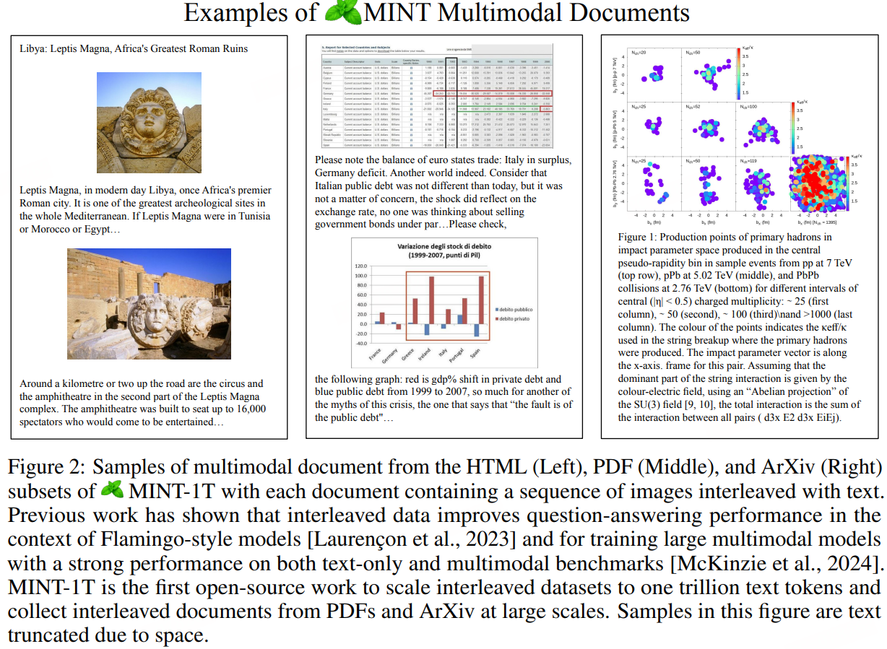
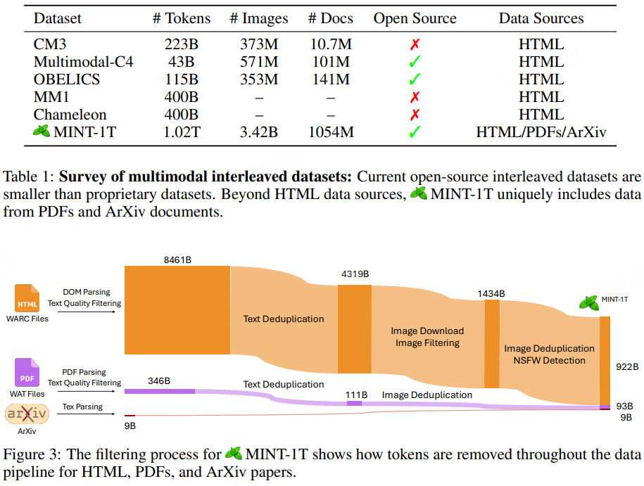
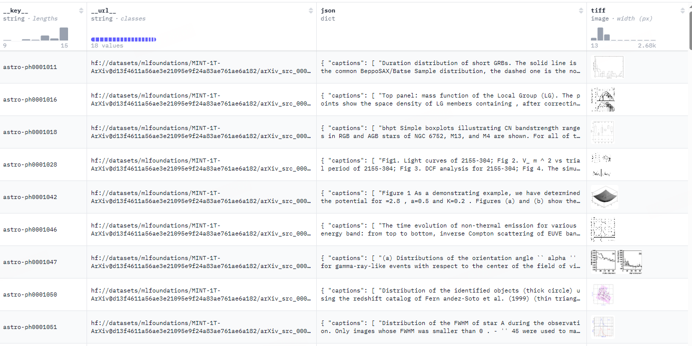

# MINT-1T

> MINT-1T: Scaling Open-Source Multimodal Data by 10x: A Multimodal Dataset with One Trillion Tokens
> 
> - 2024年10月
> 
> - 开源
> 
> - 目标是创建一个包含“图像和文本的自由形式交错序列”的数据集，适合训练大型多模态AI模型

以自由形式交错排列的图像和文本序列的多模态交错数据集对于训练前沿大型多模态模型（LMMs）至关重要。MINT-1T包含一万亿文本标记和34亿张图片，相比现有开源数据集扩大了10倍。

  

## 内容

文档库包含2017年5月至2024年4月的HTML文档，过滤掉任何不包含图像或包含超过三十幅图像的文档、URL中包含不当子字符串（如标志、头像、色情和xxx）的图像。

从2023年2月至2024年4月的CommonCrawlWAT文件中获取PDF文档，我们丢弃大于50MB大小的PDF文档（因为它们可能主要包含大尺寸图片）以及超过50页的PDF。我们排除没有文字的页面，并为剩余页面提取阅读顺序。通过找到页面上所有文本块的边界框，基于列对块进行聚类，并按从左上到右下的顺序排列块来获得阅读顺序。图像根据其边界框与同一页上文本块的接近程度在序列中定位。

ArXiv交错文档是由LaTeX源代码构建的。我们使用TexSoup 3来查找图形标签并将图像与论文文本交错。对于多文件论文（即每个部分都写在不同的Tex文件中），我们识别主Tex文件并用其文件内容替换输入标签。我们还清理LaTeX代码，移除导入、参考文献、表格和引用标签。由于ArXiv已经是一个高度策划的数据来源，我们不会执行本节其余部分描述的过滤和去重操作。

需要下载外部图片网址来收集完整的数据集。由于链接腐烂是大规模图片数据集的一个常见问题，所以不能保证这些网址在一段时间内始终可用。此外，由于该数据集超过300太字节（TB）大小，我们无法托管完整的数据集（包括图像）。下载这些外部网址的图像没有任何限制。

## 过滤

文本质量过滤：使用语言识别模型（置信度阈值为0.65）来排除非英文文档。移除了URL中包含NSFW子字符串的文档，以排除色情和不合适的内容。我们应用了RefinedWeb的文本过滤方法，具体移除那些具有过多重复n-gram或在MassiveText[Rae等人，2021年]规则下被识别为低质量的文档。

图片过滤：下载HTML数据集中所有图片的URL，丢弃任何无法检索到的链接，并移除没有有效图片链接的文档。我们移除了小于150像素的图片，以避免诸如标志和图标等噪声图片，以及大于20,000像素的图片，因为这些通常对应于与主题无关的图片。对于HTML文档，我们移除了宽高比大于2的图片，以移除诸如广告横幅等低质量图片。然而，对于PDF文件，我们将此阈值调整为3，以保留科学图形和表格，这些内容常常因为更严格的标准而被错误地排除。

安全过滤：我们使用一个NSFW图像检测器[Laborde]来过滤数据集中的所有图像。如果我们发现某个文档包含一张NSFW图像，我们会丢弃整个文档。为降低个人数据泄露的风险，我们对文本数据中的电子邮件地址和IP地址进行匿名化处理。按照FineWeb的做法，我们用“email@example.com”之类的模板替换电子邮件，用随机生成的非功能IP地址替换IP地址。

为了移除重复内容，我们在每个CommonCrawl快照中进行段落和文档文本去重，并进行图像去重，以移除重复的、无信息的图像，如图标和标志。所有的去重步骤都是针对每个数据源单独进行的。

## 实验

我们使用来自数据过滤网络的分辨率为378的ViT-H视觉编码器，并将块嵌入传递到一个六层感知器重采样器，每张图像被表示为128个标记。池化的块嵌入与文本标记嵌入交错，并传递给Phi-3微型语言模型，在训练重采样器和语言模型时，我们保持视觉编码器冻结不变。我们使用的批量大小平均为180万个多模态标记。在我们的所有训练运行中，我们使用2000个热身步骤，最大学习率为5 * 10^-5，并采用余弦学习率衰减。我们还对所有可训练参数应用0.05的权重衰减。

我们所有的训练都是使用OpenFlamingo[Awadalla等人，2023年]代码库完成的。我们在32个H100 GPU上训练我们所有的模型，每个实验总计1920个GPU小时

我们在多个字幕基准测试以及视觉问答数据集上评估了模型在4-shot和8-shot上下文学习方面的性能，我们还在多图像推理上评估模型，以探究模型在上下文学习评估之外的多图像推理能力。
