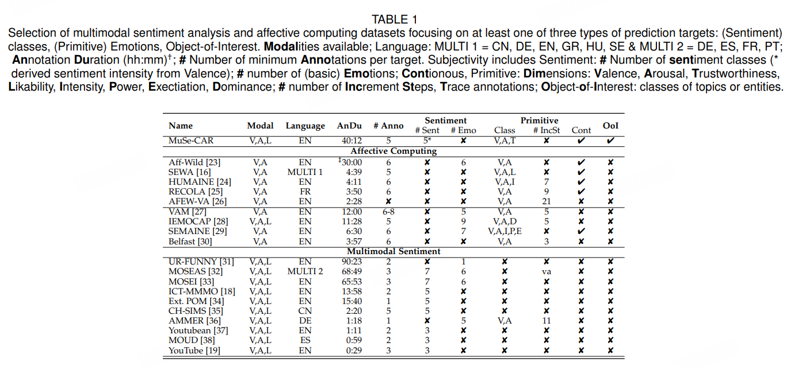
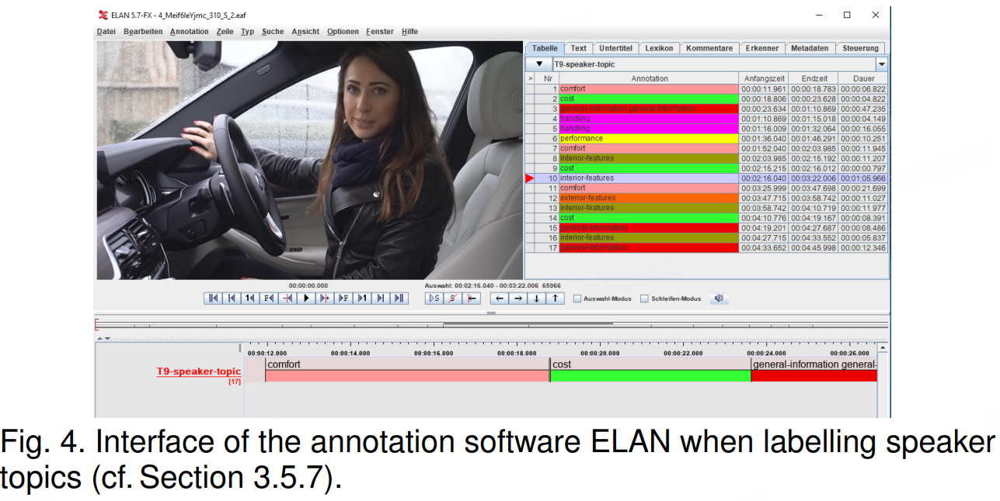
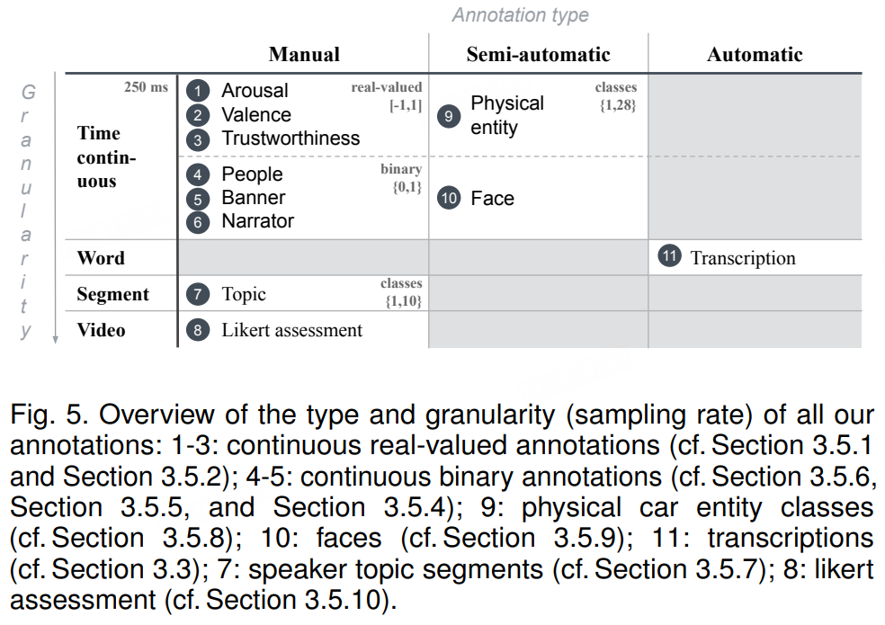
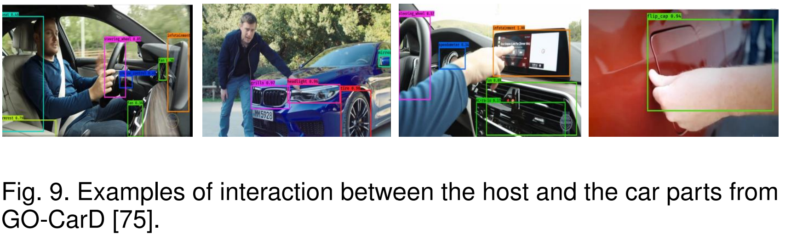
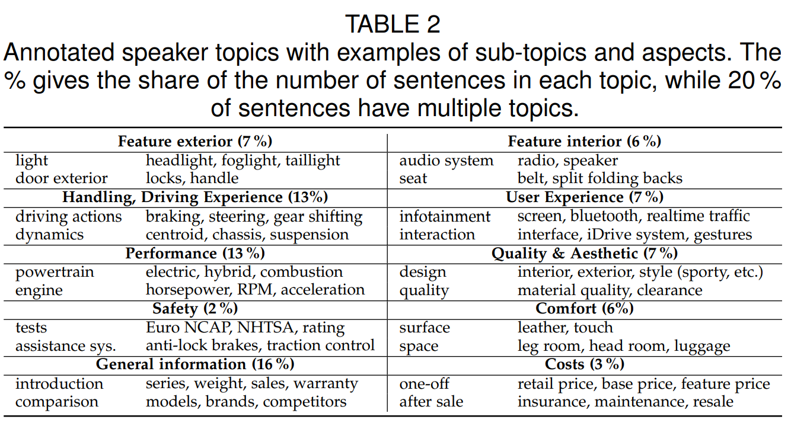

# MuSe-CaR

> The Multimodal Sentiment Analysis in Car Reviews (MuSe-CaR) Dataset: Collection, Insights and Improvements
> 
> - 2021
> 
> - 文本-图像-音频数据集，包含超过40小时经过广泛注释的高质量用户生成视频记录，这些记录提供了对可能出现在面部、声音、手势或肢体语言中的情感细微差别的见解。
> 
> - 旨在理解用户生成视频评论中上下文中的情感，以了解产品评论过程中发生的情感参与
> 
> - 需要申请，根据最终用户许可协议 (EULA)的非商业用途

多模态数据在情感分析中的应用引起了越来越多的关注，尽管已确立，与单模态输入数据相比，多模态方法能够带来更高质量的预测结果[15]，但由于缺乏鲁棒性，在现实世界应用中开发和运用这些技术仍然是一个持续的挑战。

该数据集是一个大规模注释的多模态（视频、音频、文本）数据集，在现实世界中通过多种方法收集，并进一步理解“野外”的多模态情感分析。提供了注释，这些注释明确允许对说话者主题和与连续情感相关的物理实体进行建模。

在以往的研究中，多模态情感分析和情感识别通常应用于产品评论的情境，并且数据来源于可公开访问的视频平台 YouTube。借助 MuSe-CaR，我们受到这种收集策略的影响，并设计了包含大量计算任务的数据集。此外，MuSe-CaR 的主要关注点是帮助机器理解正面和负面情感以及情感唤起如何与评论中的实体和方面（以及一般用户生成的内容）相关联。通过这样做，MuSe-CaR 旨在连接情感计算领域内的不同领域，这些领域目前使用各种情感注释信号（维度和分类）。

我们从 YouTube 收集超过 40 小时的用户生成视频材料，包括超过 350 条评论和 70 位主持人（以及 20 位配音旁白员）。广泛的注释包括 15 个差异（3 个连续维度、35 个分类和 4 个自动提取的层次）。除此之外，MuSe-CaR 提供对话主题标注、新颖的连续信任度维度以及完整的逐词对齐转录。

我们在设计MuSe-CaR时考虑了以下方面

- 数据库的记录应尽可能在录音设置、情感和语言内容方面高度不受控制。然而，所涉及的主题和方面应有一定的重叠

- 数据库不应只包含孤立的片段和句子，而应包含跨越话题多个方面的长序列

- 演讲者的情绪与对象的互动应在各种环境中（例如，在汽车内外）

- 被描绘的演讲者并不是主动表现出情绪，而是根据话题、方面和情境自然地引发情绪

- 音频-视觉材料提供言语和非言语信息。然而，偶尔，某一模态只能提供有限的信息

- 情感和主题注释应基于人类的主观评价进行分配

## 相关工作

多模态情感分析数据库目前尝试从广泛的主题中选择内容，这提高了开发模型的（语言）泛化潜力。为了实现多模态理解，我们想考察情感与物体/物理实体之间的关系。

## 标注过程

为了确保MuSe-CaR数据集的高质量、符合伦理且意义明确的注释，我们认为保持人类参与是至关重要的[53]。因此，我们定义了三个功能角色：

- 注释者：注释者的责任是根据后续指令标记数据

- 审核员：审核员的责任是审查标记信息的表现，并确保其符合注释协议。只有经过人工和自动检查、核实并得到审计员认可后，批注才被认为是可用的

- 管理员：在整个注释过程中管理所有参与方，并分配任务

管理员会分配一个或多个数据包给注释者。与之前的工作[28]类似，一个会话数据包对应约40分钟的视频材料。指导注释者在视频和会话之间有适当的休息时间，以便预期的（并且有报酬的）工作时间为一小时。在一个会话中，所有视频必须用相同的注释类型（例如，情感）进行注释。视频分两轮分发。在第一轮中，三名注释者对一个数据包进行注释，在所有注释者完成之后，进行第二轮，对每个数据包剩余的2个注释进行补充。这种分配方式是为了在第一轮确定质量（1名与2名注释者对比），以及通过提高后期分配的数据包的质量来避免不平衡。换句话说，在平均分配的情况下，早期分配的数据包质量会比最后分配的要差（参见质量跟踪）

注释者逐段、逐包地注释视频，并在完成后将数据包发送给审计员。一旦所有数据包经过审计员处理和评估，新的数据包就可以分配给注释者。

管理员定期跟踪注释者和审计员的进度。这记录了哪些数据包还需要注释或审计——在最坏的情况下，重新评估工作负荷的适宜性。

通过计算批量分配的视频“一对所有”策略中注释的相似性（一致性相关系数（CCC）），可以识别出高度不一致的情况。然后由审计员根据注释协议（见上文）手动调查这些情况的质量方面。审计员向注释者提供详细的反馈，并通过持续的审计，可以跟踪注释者的质量，因此质量得以持续提升。

所有注释者至少拥有学士学位，而审计员和管理员的最小要求是技术领域的硕士学位以及与研究领域相关的至少2年的工作经验。

对于分类注释（例如，说话者主题），我们使用了ELAN 4.9.4[54]注释软件——因其多模态界面而选择，该界面允许显示波形和视频（见图4），以及其他有用的功能，包括能够跳转到感兴趣的区域

对于连续情绪的音视频注释，我们选择了软件DARMA[57]。DARMA能够从罗技极限3D专业游戏摇杆记录注释信号。该摇杆可以更直观地传递感知到的情绪[16]。连续注释从视频开始到结束进行，采样频率为0.25赫兹，量程幅度为-1000至1000。换句话说，当注释者观看视频时，摇杆会根据感知到的情绪实时移动，即当情绪从正面变为负面时向下移动，并且摇杆信号会被DARMA记录下来。

注释者接受了现场培训。首先，通过向他们展示解释视频来介绍坐标轴，以使他们能够对情绪的不同方面有一个基本的理解。在进一步的解释和示例之后，他们可以在实操环节体验软件的操作和操纵杆的反应。测试注释之后是小组讨论，与经验丰富的注释者的手写记录注释以及小组成员之间的讨论进行对比。最终的成果包是在一个安静的环境中单独完成的，使用耳机。

## 标签

MuSe-CaR包含连续值（愉悦度、激活度和可信度）、二值（主持/叙述者转换、横幅和个人外观）以及分类（主题、实体）评分的注释。总体而言，我们对每个视频进行了11个层级的注释。维度注释反映了发言者的连续情绪状态。

针对人机交互和汽车零件的特定领域对象，所有每秒4帧记录的图像都用边界框进行了标注。共标记了28种内外部汽车零件，如门、方向盘

除了注释之外，我们还提供了超过10个预先计算好的特征，例如面部标志点、声学低级描述符（LLDs）、手势、头部动作、面部动作单元等

演讲者主题依赖于主持人表达的可泛化主题，与感兴趣的对象相关。视频按演讲者主题片段进行标记，而通常一个主题片段包含了几句话每个主题所涵盖的子主题和方面的详细概览可以在表2中找到。它还显示了所有28,000个句子中主题的分布情况，其中20%的句子标注了不止一个主题。

从这些情感汽车评论的多模态语料库中，我们衍生出三个初步任务：i) MuSe-Wild，需要预测情感维度中的唤醒度和愉悦度的水平；ii) MuSe-Topic，需要预测与领域相关的对话主题以及唤醒度和愉悦度的三个强度等级；以及，iii) MuSe-Trust，需要预测连续可信度的水平。

## 基线

我们展示了一个简单但高效的神经网络架构，称为深度信任（DEEPTRUST），它使用多注意力头层（MAHL）进行编码，并结合双向（bi）长短期记忆循环神经网络（LSTM）及其增强功能，适合对可信度建模。

> 我们利用两种神经网络机制来模拟连续诚信的短期和长期依赖性：通过多头自注意力机制（MHAL）增强输入状态的编码，并通过长短期记忆网络（LSTM）模拟状态变化的时间动态。注意力头改进了提取特征的局部表示，并能够在其表示中维持序列的长期（全局）动态。然而，这本身并不具有更深层次的位置理解[92]。为此，我们利用LSTM的功能，它特别能够学习短期和中期的模式。类似的架构被[91]和[93]用于情感识别。

声学：对于手工制作的声学特征集，我们使用了MuSe挑战提供的扩展日内瓦极简声学参数集（EGEMAPS）[85]。它基于23个声学频谱、倒谱和韵律学低级描述符（LLDs），从中计算统计函数。我们以5秒的窗口大小和250毫秒的跳跃大小提取这个88维的特征向量，以便与注释采样率对齐。我们进一步对向量维度进行标准化处理。

此外，我们提取了在广泛的YouTube音频数据集（AudioSet）[87]上预训练的VGGISH函数[86]。底层数据包含600个类别，录音中包含多种“野外”噪声，我们预期这些噪声有助于从我们的“野外”视频中获取稳健的特征。通过将帧和跳跃大小与注释采样率对齐，我们从底层对数频谱图中每0.25秒提取一个128维的VGGISH嵌入向量。

视觉：面部动作单元（FAU）被广泛用于接近情感识别的任务，描述视觉上可感知的面部运动。FAU将面部表情分解为17个独立的面部肌肉运动组件，我们从OpenFace工具包[88]中获得这些组件。

对于深度特征，我们利用最初开发用于识别人脸的预训练VGGFACE特征[79]。通过移除最后一个softmax激活层，我们获得了人脸的向量特征表示。

文本：从符号表示到连续表示转换单词的标准方法是词嵌入。这些方法根据单词在训练期间出现的语义，为每个单词计算一个静态的数值向量。我们为自动转录的每个单词提取一个300维的FASTTEXT向量[89]。与静态向量表示不同，基于上下文的自然语言处理（NLP）变压器在推理期间直接根据上下文为每个单词提取一个向量。对于这种技术，我们应用了一个BERT模型[90]，该模型已被广泛用于多种自然语言处理任务，并提取最后四层之和作为一个768维的特征向量，类似于[91]。

所有特征都使用第3.5节中介绍的时间戳进行对齐

## 结论

某些情绪（如悲伤）通过视觉信号传递得更强烈，而其他情绪（如愤怒）则更多通过音频传递

