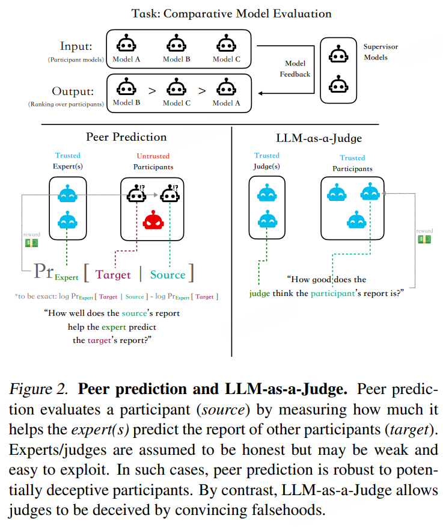
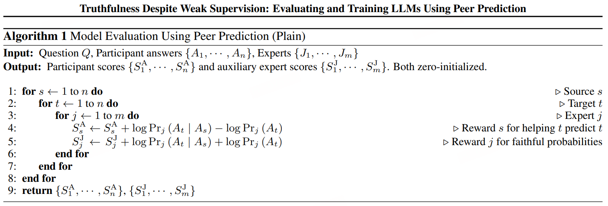

# Peer Prediction

语言模型的评估依赖于监督，但对困难任务的强监督往往难以获得，尤其是在评估强大模型时。模型会利用这种不完美监督的评估方案，从而导致误导性的评估结果。

> 超人类模型在大多数推理任务上会比人类表现得更好，使它们能够利用人类评估者。具体例子：在人类评估者面前的奉承，以及当评估者是比人类弱的模型时的奖励过度优化

我们引入了用于模型评估的同行预测方法：给定一组能力不同且诚实的模型集合以及一个待回答的问题，同行预测方法通过测量其答案的相互可预测性来区分更好的模型与较差的模型，即一个模型的答案能在多大程度上被一个独立专家作为参考以预测另一个模型的答复

即便在弱监督下（不需要真实标签），使用基于相互可预测性的指标，能够区分诚实且信息丰富的答案与欺骗性和无信息性的答案

与需要强大且可信评委的“作为裁判的大型语言模型”不同，我们在同行预测中发现了逆比例属性，随着专家与参与者之间能力差距的扩大，抵抗欺骗的能力得到了加强，使得即便在弱监督下也能可靠地评估强大模型。

> 当面对欺骗性模型时，规模是评判者大小的5到20倍，大型语言模型作为评判者的表现比随机猜测还差，而同行预测在差距较大时表现出色，包括那些规模差异超过100倍的情况

我们正式证明了同伴预测方法是激励兼容的，这意味着当同伴预测分数被用作奖励信号时，在训练均衡状态下，所有模型（包括专家）的最优策略是诚实且提供信息丰富的回答，而不是欺骗性地回答。

## 方法

输入：

- 一个问题Q

- 由n个参与者模型分别生成的针对Q的答案集合$\{A_1,···,A_n\}$

- 一个独立的可能较弱的专家模型集合$\{J_1,···,J_m\}$

输出

- 分数 $\{S^A_1,···,S^A_n\}$，然后可以比较这些分数，以确定参与者的相对排序

我们的同行预测流程基于Schoenebeck和Yu（2023年）给出的博弈论机制，包括两组代理（参与者和专家）和三种不同的代理角色：源s、目标t和专家j。同行预测评估过程包含多轮，每轮的角色分配不同：所有参与者成对轮流担任源和目标角色，专家则遍历各个专家，总共进行$n^2m$轮。

在每一轮中，会有一个特定的任务分配给信息源、专家以及目标，他们的角色如下：

- 信息源（s∈{1,⋯,n}）：每一轮的同伴预测都专注于评估当前信息源的答复A。该答案的质量通过其对专家预测目标答案的帮助程度来衡量（增加专家预测的对数概率），基于这样一个直觉：诚实且内容丰富的答案更能预测世界的真实状态。该机制奖励提供有用信息的来源，每位参与者的最终得分是其作为信息源在所有轮次中的平均奖励。

- 专家（j∈{1,⋯,m}）：专家的任务是使用信息源的答复作为参考，预测目标的答案。采用对数计分规则，该机制奖励专家忠实报告他们对目标答案的概率估计，从而为每位专家分配一个辅助得分 $S_j^J$

- 目标（t∈{1,⋯,n}）：目标的答案At​是专家所预测的答案。作为目标时，参与者不会获得奖励，但由于参与者不知道自己何时担任信息源或目标，目标仍有动机提供一个有用的回应。

同伴预测基于这样一个理念：诚实且内容丰富的答案对于预测世界的真实状态更有用，因此也是预测他人答案的更好指标。具体来说，信息量更多的 信息源 原则上可以教会专家模拟信息量较少的目标（例如，能够正确解决难题的人通常能猜测其他人会在哪里出错），但信息量较少的 信息源 无法帮助专家预测信息量更多的目标的答案。

### 定义

用 $\mathcal{A}$ 表示对问题 Q 的可能答案的有限集合。

> 例如，1024个字符以内的ASCII字符串空间 $\cup_{L\leq 1024} \sum_{\text{ASCII}}^{L}$​，或者多项选择题答案{A,B,C,D}

定义随机变量 $A_1^∗​,⋯,A_n^∗$​ 为参与者的个人答案。每个变量的实现只有参与者自己知道，但是所有参与者和专家共享 $A_1^∗​,⋯,A_n^∗$的联合分布 $\mathcal{P}$，换句话说，$A_i^*$ 可以被视为给参与者i的一个私人信号。这个先验 $\mathcal{P}$ 不必被算法所知，意味着计算得分不需要访问先验。

每位参与者i可以诚实地报告他们的个人答案（在这种情况下 $A_i=A^*_i$​），或者欺骗性地报告（在这种情况下 $A_i=\sigma(A^*_i)$）。专家要么诚实地报告他们的先验概率 $\mathrm{Pr}_j(A_t)$ 和后验概率 $\mathrm{Pr}_j(A_t|A_s)$，要么编造概率。

### 定理

同行预测的激励相容性：当所有参与者和专家共享先验概率 $\mathcal{P}$ 时，同行预测方法是激励相容的。也就是说，如果参与者和专家分别收到他们的得分 $S_i^A​/nm$ 和 $S_j^J​/n^2$ 作为收益时，如下策略组合是在任何代理的所有均衡中，具有最大预期收益的贝叶斯纳什均衡：

- 参与者如实回答 $A_i=A^*_i$

- 专家诚实报告 $\mathrm{Pr}_j(A_t) = \mathcal{P}(A_t), \mathrm{Pr}_j(A_t|A_s)=\frac{\mathcal{P}(A_t,A_s)}{\mathcal{P}(A_s)}, \forall s,t,j^2$

特别是，如果满足以下条件之一，模型会被激励收敛到诚实且提供信息的政策：（I）它们以同伴预测分数作为奖励信号进行训练；或者（II）它们执行推理以最大化评估分数。

值得强调的是，激励兼容性不仅意味着诚实，还意味着提供信息。

如果代理之间存在“世界观”差异会怎样？同伴预测方法在实际应用中的最大障碍是不现实的共享先验假设$\mathcal{P}$。人类有不同的生活经历，模型可能在不同数据集上进行训练，这些数据集可能由不同的文化来源生成。鉴于此，我们放宽共享先验的假设，并表明，当存在先验分歧时，使专家和参与者池庞大且多样化足以确保同伴预测的激励兼容性。

### 公式解释

$$
S_{s}^{\mathrm{A}}\leftarrow S_{s}^{\mathrm{A}}+\log\mathrm{Pr}_j(A_t|A_s)-\log\mathrm{Pr}_j(A_t)
$$

- **条件概率项**$\log\mathrm{Pr}_j(A_t|A_s)$：衡量专家j在观察到源s的答案后对目标t答案的预测准确性

- **边缘概率项** $\log\mathrm{Pr}_j(A_t)$：衡量专家j在不依赖任何源时的基线预测能力

当源s的答案 $A_s$ ​对预测 $A_t$ ​有帮助时，$\log\mathrm{Pr}_j(A_t|A_s)-\log\mathrm{Pr}_j(A_t)>0$，此时源s的奖励 $S_{s}^{\mathrm{A}}$会增加，奖励的幅度与信息增益（KL散度）成正比，信息丰富的源s能提升专家预测的条件概率，无信息量的源s无法改变条件概率，导致奖励增益为0

$$
S_{j}^{\mathrm{J}}\leftarrow S_{j}^{\mathrm{J}}+\log\mathrm{Pr}_j(A_t|A_s)+\log\mathrm{Pr}_j(A_t)
$$

- ​**条件概率评分**$\log\mathrm{Pr}_j(A_t|A_s)$：验证专家能否利用源s的信息改进预测

- **边缘概率评分** $\log\mathrm{Pr}_j(A_t)$：验证专家对目标t答案的独立预测能力

专家必须如实报告使得奖励最大

## 实验

### 有效性

**有效性实验旨在展示同行预测方法能够区分出较高质量的答案和较低质量的答案**，并将它们正确地放置在一个质量等级上。鉴于我们在一个开放式环境中运作，不仅评估结论的正确性，还评估导致其的推理过程，**我们选择使用模型大小作为质量的代理指标，假设在其他条件相同的情况下，同一系列中较大的模型会产生更高质量的答案**。

通过结合MATH（Hendrycks等人，2021b）、MMLU（Hendrycks等人，2021a）、MMLU-PRO（Wang等人，2024年）、ARC（Clark等人，2018年）、OpenBookQA（Mihaylov等人，2018年）、RACE（Lai等人，2017年）的子集以及MCTest（Richardson等人，2013年），我们获得了一个包含37079个问题、涵盖85个领域的数据集，这些领域包括数学、自然科学、工程、社会科学、医学、人文科学、哲学、法律、专业技能、常识以及一般推理技能。这包括选择题和开放式问题的混合。我们丢弃了真实标签，仅使用问题作为同行预测方法的输入。

对于这37079个问题中的每一个，我们独立地运行算法，参与者分别为Llama-3.1-8B、Llama-3.1-70B和Llama-3.1-405B模型，专家为Mistral-7B-v0.3模型。算法中的对数概率是基于上下文学习的结构化对话中，从专家模型的对数输出计算得出的，其中专家会获得一些先前的源-目标答案对的样本，并被要求基于当前轮次中的源来预测目标的答案

算法会为每个参与者在每个问题上输出一个分数，这使我们能够计算出每个参与者在每个领域的所有问题上的平均分数。然后我们可以比较不同参与者的平均分数，并检查它们之间是否存在统计上显著的差异。

根据同行预测分数——在不使用任何真实标签的情况下获得——**405B模型通常优于70B模型，而70B模型又优于8B模型，这表明同行预测在不同领域的有效性**。

### 对欺骗的抵抗

对欺骗的抵抗实验旨在展示，**与诚实答案相比，同行预测方法能够惩罚欺骗性答案，因此能够抵抗策略性操纵**

- 参与者构成：为了控制模型能力，我们现在确保在任何给定实验中的所有参与者都是同一模型的实例，仅在提示模板（诚实 vs 欺骗）上存在差异。具体来说，我们在三组不同的实验中使用Llama-3.1-8B、Gemma2-2B和Gemma2-27B模型作为参与者，以确保涵盖广泛的模型大小。

- 欺骗性参与者：在每个实验中，我们随机选择一个或多个参与者对所有问题做出欺骗性回答，而其余的则诚实地回答。欺骗的具体方式由提示模板控制。因此，任务是在零样本设置中检测欺骗，且无法访问真实标签，这特别具有挑战性。

- 基线（作为裁判的LLM）：除了同行预测方法外，我们还考虑了一个基线，其中专家是单个大型语言模型（LLM），被要求评判答案的质量。由于专家的输出直接使用，没有任何验证机制，这个基线不具备激励兼容性属性，并且已被证明在参与者模型比专家模型更强时容易受到策略操纵和欺骗

- 抗性指标：我们使用逻辑回归在同行预测/作为裁判的LLM得分与二进制之间的交叉熵损失。 诚信标签用于衡量参与者得分对其诚信的正向预测程度。这反过来反映了评估方案对欺骗行为的惩罚程度。对于欺骗行为，较低的交叉熵表示更强的抵抗欺骗能力。当拟合模型在得分上赋予负系数（意味着更高的得分对应较低的诚信）时，我们将其视为反对评估方案的证据，并在绘制时反映其相对于随机猜测的零基线log(2)=0.69的交叉熵值，以便可视化这种否定。之所以使用回归分析而不是简单比较平均得分，是因为同伴预测和作为裁判的大型语言模型具有不同的得分分布，使得直接比较成为不可能

- 专家模型：我们现在考虑一系列专家模型，其大小跨度接近三个数量级：SmolLM-135M、SmolLM-360M（Allal等人，2024年）、Qwen2.5-0.5B、Qwen2.5-1.5B、Qwen2.5-3B和Qwen2.5-7B（Qwen团队，2024年），以研究同伴预测的扩展属性。选择SmolLM和Qwen系列模型是因为它们覆盖了不同模型大小的广泛范围。

- 扩展性分析：通过改变参与者模型大小、专家模型大小以及参与者/专家的数量，我们研究了抵抗欺骗能力的扩展属性，并检验了这些参数变化时抵抗欺骗能力如何变化。在这些参数中，最关键的参数是参与者模型大小与专家模型大小的比率，我们称之为模型能力差距。较大的模型能力差距意味着更强的欺骗辨识能力，因此对抵抗欺骗的需求更高。这个量捕捉了可扩展监督问题的本质，可以精确地定义为在存在较大模型能力差距时确保评估方法对策略操纵具有抵抗力

### 发现

- 我们观察到一个逆比例属性：结果表明，抵抗欺骗的能力随着模型能力差距的增大而增强。当参与者模型比专家模型更强时，同行预测方法对欺骗的抵抗力更强

- 当模型能力差距较大时，同行预测始终优于作为裁判的大型语言模型基线

- 当有更多的专家时，同行预测方法更能抵抗欺骗（为了考虑到专家能力的不对称性，我们对专家施加了权重）

- 我们使用同行预测分数作为真实性训练的信号。我们首先对提示进行欺骗的模型的5万份答案进行监督微调，然后通过对12万份具有高vs低同行预测分数的配对答案进行线下直接偏好优化（DPO）来尝试恢复准确性。两个阶段都使用了LoRA。在评估训练好的模型时使用了交叉验证。结果表明，从欺骗训练中损失的准确性已完全恢复，且所得到的模型甚至优于欺骗训练之前的初始模型。该发现表明，同伴预测对优化压力具有鲁棒性

- 同伴预测是一种有前途的大型语言模型评估方法，可用于确保现在和未来AI系统的可信度，因为可扩展的监督已成为一个紧迫问题

