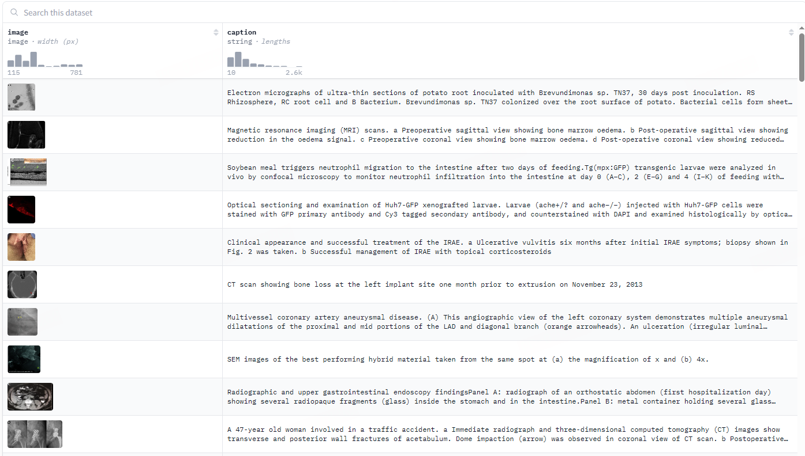
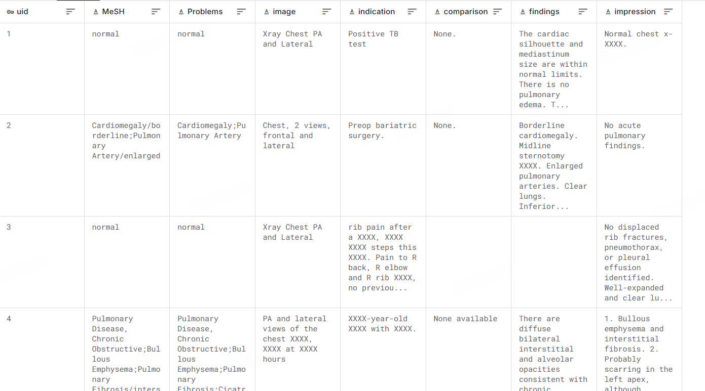
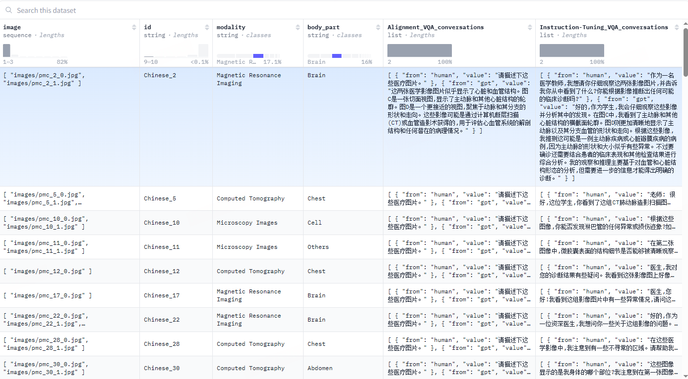
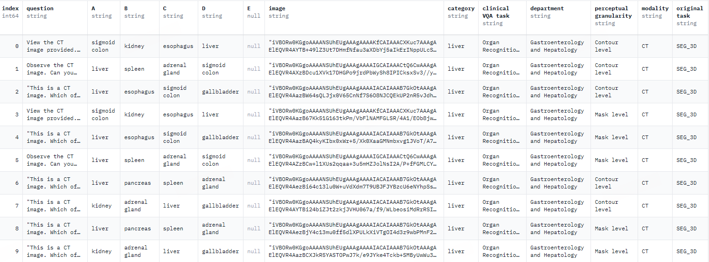
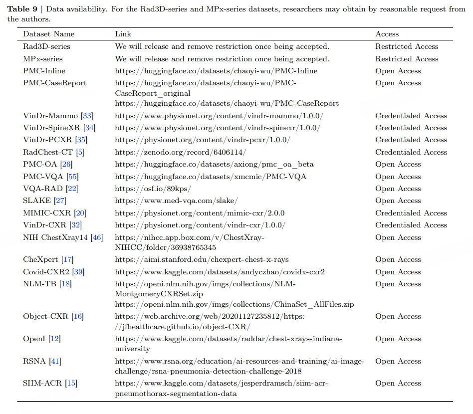
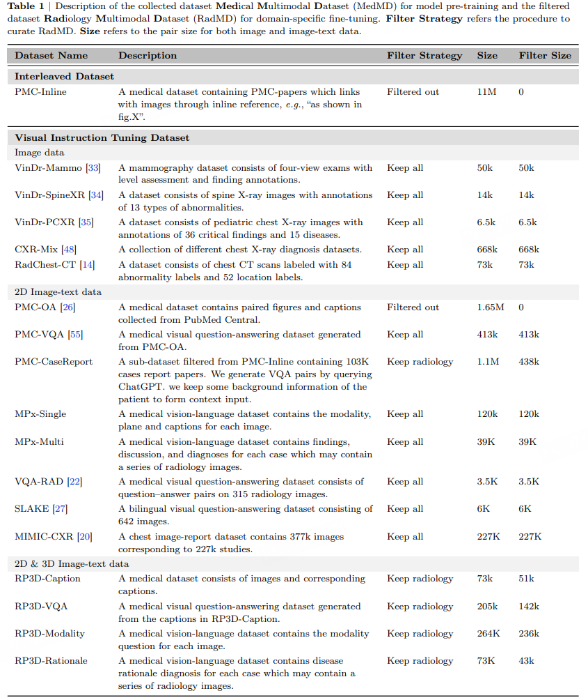

# 医疗多模态数据集搜集

## 图像-文本数据集

- [axiong/pmc_oa · Datasets at Hugging Face](https://huggingface.co/datasets/axiong/pmc_oa)：图片-caption对，无标签

- [Chest X-rays (Indiana University) | Kaggle](https://www.kaggle.com/datasets/raddar/chest-xrays-indiana-university/data)：X光图像、医生报告，无标签



> 绘制解剖领域。CS17 标本中中枢神经系统的 14 个区域已被定义和绘制。前脑、红色（次级脑）、深橙色（前体 3 包括腹侧丘脑）、浅橙色（前体 2 包括背丘脑）和黄色（前体 1 包括前盖）;中脑，浅绿色;后脑;峡部，深绿色;各种深浅不一的蓝色和紫色表示菱形 1-6 和尾髓 oblongata;脊髓，深红色。（一;附加文件 2） 在 Mpeg 影片中，显示了绘制模型的矢状面和横向视图，以及 3D 域的表示。首先在横向平面中对模型进行剖切。该切片平面与图 2 中所示的组织学切片相匹配。当截面在模型中移动时，相应的位置将显示在 3D 框中，并在矢状截面上显示一条线。然后，模型通过矢状面移动，位置由......



## 图像-文本-标签数据集

[MIMIC-CXR-JPG - chest radiographs with structured labels v2.1.0](https://www.physionet.org/content/mimic-cxr-jpg/2.1.0/)

[MIMIC-CXR Database v2.1.0](https://physionet.org/content/mimic-cxr/2.1.0/)

放射图像-文本报告-标签

------

优点：

- 适合任务：从图片和文本综合判断的分类任务

风险

- 标签是由CheXpert、NegBio贴标机生成的（基于医生报告找规律的偏规则的贴标机），并且只基于文本

- 整理数据集需要一些时间

------

一个包含377,110张胸部X光片的大型数据集，与227,827项影像学研究相关联，图像附带了14个标签，是通过两种开源标注工具得出的；NegBio和CheXpert

MIMIC-CXR-JPG完全源自MIMIC-CXR数据库，旨在提供MIMIC-CXR的便捷处理版本，并为数据分割和图像标签提供标准参考。

数据集格式

- 一组 10 个文件夹，每个文件夹有 ~6,500 个子文件夹，对应于单个患者的所有 JPG 格式图像

- mimic-cxr-2.0.0-metadata.csv.gz - 一个压缩的 CSV 文件，为图像提供有用的元数据，包括视图位置、患者方向和图像采集时间的匿名日期，允许按时间顺序排列图像

- mimic-cxr-2.0.0-split.csv.gz - 一个压缩的 CSV 文件，提供建议的训练/验证/测试数据拆分

- mimic-cxr-2.0.0-chexpert.csv.gz - 一个压缩的 CSV 文件，其中列出了所有带有 CheXpert 贴标机生成的标签的研究

- mimic-cxr-2.0.0-negbio.csv.gz - 一个压缩的 CSV 文件，其中列出了所有带有 NegBio 贴标机生成的标签的研究

- mimic-cxr-2.1.0-test-set-labeled.csv - 用于评估 CheXpert 和 NegBio 的手动整理标签

- IMAGE_FILENAMES - 一个纯文本文件，具有所有图像的相对路径

图像在各个文件夹中提供。单个患者图像的文件夹结构示例如下：

```
files/
  p10/
    p10000032/
      s50414267/
        02aa804e-bde0afdd-112c0b34-7bc16630-4e384014.jpg
        174413ec-4ec4c1f7-34ea26b7-c5f994f8-79ef1962.jpg
      s53189527/
        2a2277a9-b0ded155-c0de8eb9-c124d10e-82c5caab.jpg
        e084de3b-be89b11e-20fe3f9f-9c8d8dfe-4cfd202c.jpg
      s53911762/
        68b5c4b1-227d0485-9cc38c3f-7b84ab51-4b472714.jpg
        fffabebf-74fd3a1f-673b6b41-96ec0ac9-2ab69818.jpg
      s56699142/
        ea030e7a-2e3b1346-bc518786-7a8fd698-f673b44c.jpg
```

我们有一个患者 `p10000032`，文件夹位于 `p10/` 文件夹中

- 该患者有四项影像学研究：`s50414267`、`s53189527`、`s53911762` 和 `s56699142`。（它们的顺序对实际研究的时间顺序没有影响）

- 每项研究都有1或2项与之相关的胸部 X 光检查

- 与每项研究相对应的自由文本放射学报告和原始 DICOM 格式图像可在 [MIMIC-CXR](https://doi.org/10.13026/C2JT1Q) 数据库中获得

## 图像-边界框-标签数据集

- [VinDr-CXR](https://physionet.org/content/vindr-cxr/1.0.0/)：X 光数据集、边界框、标签

- [VinDr-PCXR](https://physionet.org/content/vindr-pcxr/1.0.0/)：儿科胸部 X 光数据集、边界框、标签

- [VinDr-SpineXR](https://www.physionet.org/content/vindr-spinexr/1.0.0/)：脊柱病变图像、边界框、标签

- [VinDr-Mammo](https://www.physionet.org/content/vindr-mammo/1.0.0/)：乳腺影像、边界框、标签

- [RSNA](https://www.rsna.org/rsnai/ai-image-challenge/rsna-pneumonia-detection-challenge-2018)（[Kaggle](https://www.kaggle.com/competitions/rsna-pneumonia-detection-challenge/data)）：图像、肺炎预测标签，边界框

- [object-CXR](https://web.archive.org/web/20201127235812/https://jfhealthcare.github.io/object-CXR/) ：X光图像、形状标签、异物边界框

## 图像-标签数据集

- CheXpert：胸部X光片，任务是预测多视图胸部X光片的14种不同观察结果的概率（标签由不公开的原始报告提取）

- MedMNIST：轻量级 2D 和 3D 图像分类任务，包括 12 个 2D 数据集和 6 个 3D 数据集。所有图像都经过预处理成 28x28 （2D） 或 28x28x28 （3D） 并带有相应的分类标签

- [MedMNIST+](https://github.com/MedMNIST/MedMNIST/blob/main/on_medmnist_plus.md) 更大的尺寸

- [COVIDx CXR-4 | Kaggle](https://www.kaggle.com/datasets/andyczhao/covidx-cxr2)：肺炎X光图像、阴性阳性分类

- [Tuberculosis (TB) Chest X-ray Database | Kaggle](https://www.kaggle.com/datasets/tawsifurrahman/tuberculosis-tb-chest-xray-dataset)：结核病 X 光图像、标签

- [NIH Chest X-rays | Kaggle](https://www.kaggle.com/datasets/nih-chest-xrays/data)：X光图像、标签（标签由不公开的原始报告提取）

- [ChestX-ray14 Dataset ](https://paperswithcode.com/dataset/chestx-ray14): X 射线图像，这些图像带有文本挖掘的 14 种常见疾病标签

## VQA 数据集

可能是研究人员根据每个标签对应的问题和选项池生成了问答对。每个问题必须包含图像模态、任务提示和对应的标注粒度信息

- GMAI-MMBench 由来自全球的 284 个下游任务数据集构建而成，涵盖 38 种医学影像模态、18 项临床相关任务、18 个科室以及视觉问题解答 (VQA) 格式的 4 种感知粒度（图像、框、掩模和轮廓），具有完善的数据结构分类和多感知粒度。即使是性能最优的模型 GPT-4o，虽达到了临床实际应用的要求，但准确率也仅为 53.96%，大多数医学专用模型难以达到通用 LVLMs 的一般性能水平（约 30% 的准确率），但 MedDr 除外，其准确率达到 43.69%

- PubMedVision：采用视觉大模型 (GPT-4V) 对图片进行重新描述，并构建了 10 个场景的对话，将图文数据改写为问答形式，增强了医疗视觉知识的学习

- OmniMedVQA：包含 118,010 张不同的图片，涵盖 12 种不同的模态，涉及超过 20 个人体不同的器官和部位

- Medical-Diff-VQA[105]、PathVQA[96]、Cholec80-VQA[222]和Cholec80。。。。比较多





## 文本数据集

MMedC 是一个由上海交通大学人工智能学院智慧医疗团队于 2024 年构建的多语言医疗语料库，它包含了约 255 亿个 tokens，涵盖了 6 种主要语言：英语、中文、日语、法语、俄语和西班牙语。

研究团队还开源了多语言医疗基座模型 MMed-Llama 3，该模型在多项基准测试中表现卓越，显著超越了现有的开源模型，特别适用于医学垂直领域的定制微调。

## 其他参考

- [ANDI](https://andysbrainbook.readthedocs.io/en/latest/CAT12/CAT12_02_DownloadingADNIData.html)：（需要申请，大约一周）阿尔茨海默病神经影像计划 ( [ADNI](https://adni.loni.usc.edu/) ) 是一个大型的开放数据库，其中包含数百张来自健康对照者和阿尔茨海默病患者的脑部扫描图。除了影像数据外，还为每个受试者收集了几个协变量：除了年龄和上学年限等基本测量值外，还有认知能力、焦虑、抑郁和基因型（例如 APOE4 等位基因的存在与否）的测量值。临床认知评估文本。

- [MedMD&RadMD](https://www.aizws.net/news/detail/115)：提出了一个新的评估基准RadBench，其中包括五个任务， 包括模态识别、疾病诊断、视觉问答、报告生成和推理诊断，旨在全面评估基础模型处理实际临床问题的能力





## 其他非医疗数据集

[Multimodal-datasets](https://github.com/drmuskangarg/Multimodal-datasets)

- [MELD](https://github.com/declare-lab/MELD)：文本、美剧视频（音频）、情绪识别标签

- [The Caltech-UCSD Birds-200-2011 Dataset](https://authors.library.caltech.edu/records/cvm3y-5hh21)：11,788张200种鸟类的图片，每张图片都用边界框、部位位置、属性标签。[CUB-200-2011 | Kaggle](https://www.kaggle.com/datasets/wenewone/cub2002011)，[alkzar90/CC6204-Hackaton-Cub-Dataset · Datasets at Hugging Face](https://huggingface.co/datasets/alkzar90/CC6204-Hackaton-Cub-Dataset)

- 

```
{'image': <PIL.JpegImagePlugin.JpegImageFile image mode=RGB size=334x500 at 0x7F59DE348AF0>,
 'description': 'this bird has a short orange bill, white breast and body and white eyes.\na medium sized bird with a orange bill and a black crown and white eyes\nthis white-breasted bird has a short, squat, orange bill, a black head and wings, and small white eyes above a white stripe.\nthis bird has a white breast, a black head, a short red beak, and webbed feet.\nthis bird is white with black on its neck and has a long, pointy beak.\nthis bird has wings that are black and has a white belly\nthis bird has wings that are black and has a long bill\nthis is a medium sized bird, with a white belly, and a grey head and wings, with a short yellow bill.\nthis bird is white and gray in color, and has a bright orange beak.\nthis bird has a blunt orange beak with mostly black above the neck, the belly is solid white.\n',
 'label': 6,
 'file_name': 'Parakeet_Auklet_0048_795980.jpg'}
```

其他感觉不太适合的多模态任务：Machine Translation、Information Retrieval、Question Answering、Summarization、Image Captions